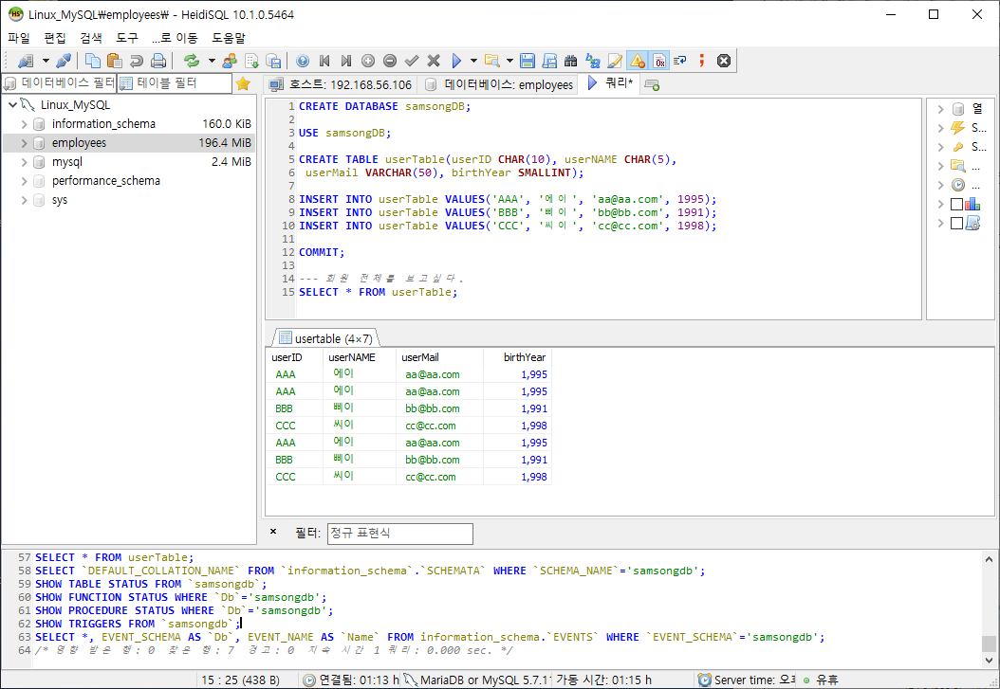

# 2일차 리뷰

* Host PC가 Client로 가상머신 DB에 접근하기 위해 HeidiSQL 설치 (client : 웹 브라우저 역할)
  * 만약 실무에서 SQL Server를 사용하면 SSMS 설치, MySQL은 Workbench 설치 


### 데이터베이스 이론

파이썬 교재 p.421~ 참고

* 데이터베이스(DB) : 데이터 저장소
* 데이터를 저장하기 위해 테이블을 만들고 데이터는 행으로 한 줄씩 저장됨
* 행의 개수는 데이터 개수이고 행 = Row = 레코드 = 튜플
* 데이터베이스는 엑셀이나 아래한글보다 용량이 훨씬 크므로 DB를 사용함
* 데이터베이스는 여러개 만들 수 있고 그 안에 테이블이 있음
* 여러 개의 데이터베이스를 관리하는 것을 DBMS(Database Management System) 라고함 

* 테이블의 열 = 컬럼 = 필드, 열에는 이름이 있고 필드 name = 컬럼 name = 열 name 이라 함
  * 각 열에는 어떤 데이터를 입력하느냐에 따라 데이터 형식(타입)이 결정됨 ex) 이름-문자, 나이-숫자 

* 프라이머리 키(Primary Key)=기본키 : 중복 X, NULL X ==> 테이블은 반드시 기본키 1개만 할 수 있음
  ex) ID, 주민등록번호, 휴대폰 번호 ==> 후보키라고 하며 이 중에서 기본키로 1개만 선택 
* 유니크 키 : 기본키랑 비슷하지만 중복만 안됨 (휴대폰번호와 주소는 유니크 키로 위험함)
* 데이터 조작 3가지 :  입력, 삭제, 수정(업데이트) 
* Select : 데이터 선택, 데이터 변경X <---> Insert : 데이터 변경 O
* SQL : DBMS와 소통하는 언어


### Host pc에서 Linux  MySQL 연결

* 로그인하고 IP 확인


* IP 확인하고 HeidiSQL 로 연결


* 데이터베이스 생성(쿼리 생성)


* 테이블 생성
  * DB 선택 후 테이블 생성 (USE ~;)
  * 각 열 이름 및 데이터 타입 지정
  * 절대 한글 이름으로 쓰지 말 것!!
  * 권장 사항 : 예약어를 쓰지말 것! (예약어를 쓸 수 없는 프로그램이 있을 수 있음) 
  * CHAR가 VARCHAR(가변길이 문자열)보다 빠름
  * INT : 4byte , SMALLINT : 2byte


* 데이터 입력
  * 문자, 날짜 ' ', 숫자 X
  * insert는 임시로 저장하는 것으로 commit을 해야 저장됨
  * rollback은 insert 취소 


* 저장된 데이터 보기




* 조건에 맞는 데이터 출력


##  미션(3일차)

퀴즈 1. Windows Server의 MariaDB 또는 MySQL에 P423 구현하기

퀴즈 2. SQL Server에 p423 구현하기 

테이블 삭제 : DROP TABLE userTable ...

테이블 변경 : ALTER TABLE...

퀴즈 1. MariaDB


퀴즈 2. SQL Server


### 파이썬에서 데이터 입력과 조회

파이썬 교재 p.429~

* 커서 :  데이터 담아서 이동시켜주는 것 

* 파이썬에서 문자열은 " ", ' ' 모두 쓸 수 있지만 DB에서는 " " 쓰기. => SQL문에서 ' ' 쓰기 때문에


* TABLE 생성시 테이블이 있으면 만들지 말고 없으면 만들라는 명령어

```python
sql = "CREATE TABLE IF NOT EXISTS userTable(userId INT, userName CHAR(5))" 
```


* Code 03-01 SQLite 데이터 입력

```python
conn = sqlite3.connect("samsongDB") # 1. DB D연결
cur = conn.cursor() #2. 커서 생성 (트럭, 연결로프)
sql = "CREATE TABLE IF NOT EXISTS userTable(userId INT, userName CHAR(5))"
cur.execute(sql)


sql = "INSERT INTO userTable VALUES(1 , '홍길동')";
cur.execute(sql)
sql= "INSERT INTO userTable VALUES(2 , '이순신')";
cur.execute(sql)


cur.close() # 커서 닫기
conn.commit() # 적용시키기 위해서 커밋하기
conn.close() # 6. DB 닫기 (=연결 해제)
print('OK~') # 잘 돌아가면 'OK~' 라고 출력되기
```


* Code 03-02 SQLite 데이터 조회

```python
import sqlite3

conn = sqlite3.connect("samsongDB") # 1. DB D연결
cur = conn.cursor() #2. 커서 생성 (트럭, 연결로프)
sql = "SELECT * FROM userTable" #sql에 명령
cur.execute(sql)

rows = cur.fetchall() #select 한 데이터 모두 가져오기

print(rows)

cur.close() # 커서 닫기
conn.close() # 6. DB 닫기 (=연결 해제)
print('OK~') # 잘 돌아가면 'OK~' 라고 출력되기
```


## Python

* Python Console 설정


* 변수 :  무엇을 받는 저장 공간

  * Left-V (변수) = Right-V (다 올 수 있음)
  * = : 대입연산자 

  

* Data Type : 문자, 숫자, 날짜 p.68

  * 정수 (Integer)
  * 실수 (float)
  * 문자열 (String)
  * 불 (bool)


* 파이썬은 데이터타입을 지정안해줘도(변수 선언) 값을 넣어주면 타입이 정해짐
  * 인터프리터 언어 단점 :  유연하고 편하지만 버그가 생길 가능성이 있음

```python
a = 'ㅋㅋㅋㅋ'
type(a)
<class 'str'>
```


* Code 03-01 계산기1

```python
a = int(input("숫자1->"))  # input은 무조건 문자열로 받음
b = int(input("숫자2->"))  # 숫자로 변환해줘야함

result = a + b
print(a , "+" , b , "=", result)

result = a - b
print(a , "-" , b , "=", result)
```

```python
숫자1->55
숫자2->44
55 + 44 = 99
55 - 44 = 11
```


* print 함수 p.65 
  * 보는 형태이지 값에 영향을 주지 X

```python
print("%d %d" % (100,200))
100 200

print("%f %f" % (100,200))
100.000000 200.000000

print("{} {}" .format(100,200)) # format 함수는 {}에 값을 끼워넣으라는 의미
100 200

print("{0} {1}" .format(100,200)) # 0번째, 1번째 자리에 넣으라는 의미
100 200

print("{1} {0}" .format(100,200))
200 100

print("{1:d} {0:f}" .format(100,200))
200 100.000000
```


* 이스케이프 문자 p.66

```python
print("안녕? \n 하세요")
안녕? 
 하세요
```


* 연속된 값을 대입하는 방식 p.71

```python
a = b = 100 #a,b 모두 100 들어감
```


* 산술 연산자
  * 곱하기, 나누기 우선

```python
10//3 #나누기(몫)
3

10%3 #나머지
1

10**3 #제곱
1000
```


* 산술 연산을 하는 문자열과 숫자의 상호 변환 p.95\

```python
a = '100'
str(a)
'100'

a = 100
str(a)
'100'
```

* 대입 연산자 p.96

```python
a = 100
a = a + 1
a
101

a += 1  # a + 1 과 같음
a
102

a =+ 1 # a = +1
a
1
```


* 동전 교환 p.96 

```python
## 함수 선언부 ##

## 변수 선언부 ##
money, c500, c100, c50, c10 = [0] * 5 # 돈, 동전 500, 동전 100 ...

## 메인 코드부 ##
if __name__ == '__main__' :
    money = int(input('바꿀 돈-->'))
    c500 = money // 500; money %= 500 # money = money % 500
    c100 = money // 100; money %= 100
    c50 = money // 50; money %= 50
    c10 = money // 10; money %= 10

    print('500원:', c500,', 100원:', c100, 
          ', 50원:', c50, ', 10원:', c10, ', 나머지:', money)


```

### 코드 작성 시 신경쓸 것

1. 주석 많이 달기
2. 범용적으로 작성
3. 우선 순위 헷갈릴 수 있으므로 가로치기 ()


#### 퀴즈 3. 입력한 돈을 최소한의 지폐 ~ 동전까지 바꾸기

```python
## 입력한 돈을 최소한의 지폐 ~ 동전까지 바꾸기

## 변수 선언
money, p50000, p10000, p5000, p1000, p500, p100, p50, p10 = [0] * 9

## 메인 코드 부분 ##
if __name__ == '__main__' :
    money = int(input('바꿀 돈 -->'))
    p50000 = money // 50000; money %= 50000
    p10000 = money // 10000; money %= 10000
    p5000 = money // 5000; money %= 5000
    p1000 = money // 1000; money %= 1000
    c500 = money // 500; money %= 500
    c100 = money // 100; money %= 100
    c50 = money // 50; money %= 50
    c10 = money // 10; money %= 10

    print('50000원:', p50000, ', 10000원:', p10000,
          ', 5000원:', p5000, ', 1000원:', p1000,
          ', 500원:', c500, ', 100원:', c100, ', 50원:', c50 ,
          ', 10원:', c10, ', 나머지:', money)
```


* if  문 p.119

```python
if(a <= b) :
    print('a가 작다')
    
a가 작다
```


* if-else 문

```python
if a < b :
    print('a가 작다')
else :
    print('a가 크다')
    
a가 작다
```


* if~elif~else 문 p.126

```python
if a < b :
    print('a가 작다')
elif a > b :
    print('a가 크다')
else :
    print('a,b가 같다')
```


* 리스트와 함께 사용
* 파이썬에서 리스트가 매우 중요!

```python
fruit = ['사과','배','딸기','포도']
fruit
['사과', '배', '딸기', '포도']

if '딸기' in fruit : # 리스트 안에 데이터를 찾는 명령어
    print('딸기줘요')    
딸기줘요
```


* Code 03-05 if 문 응용
  * if 문은 변수없이 10번만 돌리고 싶을 때는 _를 쓸 수 있음 

```python
import random

numbers = []

for _ in range(0,10) : # for (i=0; i<=10; i++)
    numbers.append(random.randint(0,9))

print(numbers)

## num 써먹기
for num in range(0,10) :
    if num not in numbers :
        print(num, '없어요')
        
[4, 5, 8, 8, 2, 0, 3, 0, 0, 7]
1 없어요
6 없어요
9 없어요

```


* Code 03-06 for 문

```python
### 1부터 100까지의 합계

hap = 0

for i in range(0,101,1) : # range(0,101), range(101)
    hap += i

print(hap)


"""
퀴즈 4-1. 1부터 100까지 홀수의 합계
퀴즈 4-2. 1부터 100까지 7의 배수의 합계
퀴즈 4-3. 12345부터 100000까지 7878의 배수의 합계 
"""


### 퀴즈 4-1. 1부터 100까지 홀수의 합계
hap = 0

for i in range(1,101,2) : # range(0,101), range(101)
        hap += 1

print(hap)


### 퀴즈 4-2. 1부터 100까지 7의 배수의 합계
hap = 0

for i in range(7,101,7) : # range(0,101), range(101)
        hap += 1

print(hap)


### 퀴즈 4-3. 12345부터 100000까지 7878의 배수의 합계
hap = 0

for i in range(12345,100001,1) : # range(0,101), range(101)
        if i % 7878 == 0 :
            hap += i

print(hap)
```


* Code 03-09 MySQL 데이터 입력


* 데이터 입력

```python
import pymysql

conn = pymysql.connect(host="", user="root",password="",db="samsongDB", charset = "utf8") # 1. DB D연결
cur = conn.cursor() #2. 커서 생성 (트럭, 연결로프)
sql = "CREATE TABLE IF NOT EXISTS userTable2(userId INT, userName CHAR(5))"
cur.execute(sql)


sql = "INSERT INTO userTable2 VALUES(1 , '홍길동')";
cur.execute(sql)
sql= "INSERT INTO userTable2 VALUES(2 , '이순신')";
cur.execute(sql)


cur.close() # 커서 닫기
conn.commit() # 적용시키기 위해서 커밋하기
conn.close() # 6. DB 닫기 (=연결 해제)
print('OK~') # 잘 돌아가면 'OK~' 라고 출력되기
```

* 데이터 조회

```python
import pymysql

conn = pymysql.connect(host="192.168.56.106", user="root",password="1234",db="samsongDB", charset = "utf8") # 1. DB D연결
cur = conn.cursor() #2. 커서 생성 (트럭, 연결로프)
sql = "SELECT * FROM userTable2" #sql에 명령
cur.execute(sql)

rows = cur.fetchall() #select 한 데이터 모두 가져오기

print(rows)

cur.close() # 커서 닫기
conn.close() # 6. DB 닫기 (=연결 해제)
print('OK~') # 잘 돌아가면 'OK~' 라고 출력되기
```


* Heisql에서 확인


## 미션(3일차)

Windows의 MariaDB 또는 MySQL 에 작업

먼저 Heisql로 데이터베이스 생성 : mission03

(1) Python으로 테이블을 생성하고 데이터를 무한 입력.

​	테이블 : missionTable (사번, 이름, 입사연도)

​	데이터는 사번을 0으로 입력할 때까지 무한 입력 됨.

예) 사번 --> 100    이름 --> 홍길동    입사연도 --> 2012

​	  사번 --> 200    이름 --> 이순신     입사연도 --> 2018

​	  사번 --> 0

​	   종료됨~~~~

(2) 위 테이블을 조회해서 출력하는 프로그램

​	  단 fetchone() 함수로 한행씩 접근해서 출력

예)

| 사번 |  이름  | 입사연도 |
| ---- | :----: | -------- |
| 100  | 홍길동 | 2012     |
| 200  | 이순신 | 2018     |

제출은 결과화면 캡처와 Python 파일을 함께 제출할 것~

```python
import pymysql

conn = pymysql.connect(host="192.168.56.103", user="root", password="1234", db="mission03", charset="utf8")
cur = conn.cursor()
sql = "CREATE TABLE IF NOT EXISTS missionTable(userID INT(5), userName CHAR(5), employYear INT(5))"
cur.execute(sql)

while True :
    data1 = input("사번 -->")
    if data1 == '0':
        break;
    data2 = input("이름 -->")
    data3 = input("입사연도 -->")
    data = "INSERT INTO missionTable VALUES("+ data1 +",'"+ data2 +"',"+data3+")"
    cur.execute(data)

conn.commit()

sql = "SELECT * FROM missionTable" #sql에 명령
cur.execute(sql)

print("  사번      이름     입사연도")
print(" -----------------------------")

while True :
    row = cur.fetchone()

    if row == None:
        break;
    data1 = row[0]
    data2 = row[1]
    data3 = row[2]
    print("%5d     %5s     %5d" % (data1, data2, data3))

conn.close()
```

