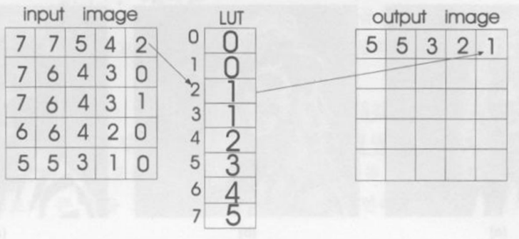

# Day 6

day 1~5 :  파이썬/기초통계 --> 데이터베이스, 서버환경, 파이썬 연동, 파이썬 기본

day 6~10 :  파이썬 데이터 시각화 --> matplotlib, 컴퓨터 비젼(영상처리) -> 딥러닝 

day 11~ : 머신러닝 라이브러리 --> 컴퓨터비전을 위한 Library...

마지막 3일 정도는 미니 프로젝트


## 파일 종류

* 텍스트 파일
* 이진 파일 : 이미지 데이터 (JPG, PNG,... )
  * RAW 데이터는 단순한 사진 파일 형태
  * 픽셀 1개를 표현하기 위해서 필요한 색 : RGBA(Red Green Blue Alpha(투명도))
  * 하나의 색은 0~255(=FF) 로 표현 가능 
  * 색 하나의  256개(0~255)는 1 바이트로 표현 가능하고 픽셀 하나를 위한 RGBA를 표현하기 위해서는 4바이트가 필요함. 
  * Gray Scale : 흑백을 표현하기 위해서는 RGB를 동일한 색으로 정해야하므로 픽셀 하나당 1바이트가 필요.
    * 따라서, 512바이트*512바이트  = 256KB


## 객체지향 프로그래밍

* 절차 -> 구조적(모듈, 함수) -> 객체지향

* 설계도 = 클래스 (예, 자동차 설계도), 설계도 만드는게 중요함!
* 클래스 이름은 대문자로 시작
* 객체지향의 객체는 사물(자동차)로 2가지 속성(자동차 속성(색깔,가격,생산자 등), 자동차 행위(액셀 밟기, 출발 등))을 뽑아내야함. 
* 함수를 메서드라고 함. List.sort()를 메서드라 함
* 객체지향은 현실세계를 표현하기 위한 프로그래밍 
* 인스턴스 : 클래스를 통해서 찍어내는 것

```python
class Car : #클래스 생성, 클래스 이름은 대문자로 시작
    #자동차 속성
    color = None
    speed = 0 # 속성, 변수X

    #자동차의 행위(--> 함수, 기능) , 함수 대신 메서드라고 한다.
    def upSpeed(self,value):
        self.speed += value #speed는 class 속성이므로 함부로 바꾸면 안됨.
                            # 속성을 바꿔주기 위해서는 self.speed로 써줘야함.
    def downSpeed(self,value):
        self.speed -= value

########################################
myvalue = 0 # 변수
#인스턴스 생성
car1 = Car() #클래스를 활용하여 찍어냄(메모리에 저장)
car2 = Car()

car1.color = "빨강"
car1.speed = 50
car1.upSpeed(100)

print(car1.speed)

from tkinter import *
button1 = Button() # Button() : 클래스 
```


## 컴퓨터 비전 전체적인 틀

```python
from tkinter import *
from tkinter.simpledialog import *
from tkinter.filedialog import *
import math
import os
import os.path

#####################
#### 함수 선언부 ####
#####################
# 메모리를 할당해서 리스트(참조)를 반환하는 함수
def melloc(h,w) :
    retMemory = []
    for _ in range(h) :
        tmpList=[]
        for _ in range(w) :
            tmpList.append(0)
        retMemory.append(tmpList)
    return retMemory

# 파일을 메모리로 로딩하는 함수
def loadImage(fname) :
    global window, canvas, paper, filename, inImage,outImage, inW, inH, outW, outH
    fsize = os.path.getsize(fname) # 파일의 크기(바이트)
    inH =inW = int(math.sqrt(fsize)) # 핵심 코드 (메모리를 확보하기 위한 파일의 크기 확인)

    ## 입력영상 메모리 확보 ##
    inImage= [] # 이미지가 누적되지 않고 새롭게 불러올 수 있도록 초기화
    inImage = melloc(inH, inW)

    # 파일 --> 메모리
    with open(filename,'rb') as rFp :
        for i in range(inH) :
            for k in range(inW) :
                inImage[i][k] = int(ord(rFp.read(1))) #1바이트씩 읽힘
    # print(inH,inW)
    # print(int(ord(inImage[100][100])))


# 파일을 선택해서 메모리로 로딩하는 함수
# p.353
def openImage() :
    global window, canvas, paper, filename, inImage,outImage, inW, inH, outW, outH
    filename = askopenfilename(parent=window,filetypes=(("RAW 파일", "*.raw"), ("모든파일", "*.*")))
    loadImage(filename)
    eqaulImage()


def saveImage() :
    global window, canvas, paper, filename, inImage,outImage, inW, inH, outW, outH
    pass

def displayImage() :
    global window, canvas, paper, filename, inImage,outImage, inW, inH, outW, outH
    if canvas!= None : # 예전에 실행한 적이 있다.
        canvas.destroy() # 캔버스를 뜯어내는 것
    ## 화면 크기를 조절
    window.geomtry(str(outH) + 'x' + str(outW)) # 벽
    canvas = Canvas(window, heiht = outH, width = outW) # 보드
    paper = PhotoImage(heiht = outH, width = outW) # 빈 종이
    canvas.create_image((outH//2, outW//2), image=paper, state='normal') # state는 보통 normal 씀
    ## 출력영상 ---> 화면에 한점씩 찍자
    for i in range(outH) :
        for k in range(outW) :
            r = g = b = outImage[i][k]
            paper.put("#%02x%02x%02x" % (r, g, b),(k, i)) # RRGGBB 16진수로 표현한 것, x는 16진수

    canvas.pack(expand=1,anchor=CENTER)


#################################################
####컴퓨터 비전(영상처리) 알고리즘 함수 모음 ####
#################################################

# 동일영상 알고리즘
def eqaulImage() :
    global window, canvas, paper, filename, inImage,outImage, inW, inH, outW, outH
    ## 중요! 코드, 출력영상 크기 결정##
    outH = inH
    outW = inW
    ###### 메모리 할당 ###########################
    outImage = []
    outImage = melloc(outH, outW)
    ###### 진짜 컴퓨터 비전 알고리즘 #####
    for i in range(inH) :
        for k in range(inW) :
            outImage[i][k] = inImage[i][k]
    ## 출력
    displayImage()


#########################
#### 전역변수 선언부 ####
#########################
inImage,outImage = [],[]
inW, inH, outW, outH = [0]*4
window, canvas, paper = None, None, None
filename = ""


#####################
#### 메인 코드부 ####
#####################
window = Tk()
window.title('컴퓨터 비젼(딥러닝 기법) ve 0.01')
window.geometry("500x500")

mainMenu = Menu(window)
window.config(menu=mainMenu)

fileMenu = Menu(mainMenu)
mainMenu.add_cascade(label='파일', menu=fileMenu)
fileMenu.add_command(label='파일 열기', command=openImage)
fileMenu.add_separator()
fileMenu.add_command(label='파일 저장', command=saveImage)

comVisionMenu1 = Menu(mainMenu)
mainMenu.add_cascade(label='알고리즘A', menu=comVisionMenu1)
comVisionMenu1.add_command(label='알고리즘1', command=None)
comVisionMenu1.add_command(label='알고리즘2', command=None)


window.mainloop()
```


## 컴퓨터 비전(영상처리) 알고리즘 함수 모음

### 화소점 처리

* 밝게 하기

```python
def addImage() :
    global window, canvas, paper, filename, inImage,outImage, inW, inH, outW, outH
    ## 중요! 코드, 출력영상 크기 결정##
    outH = inH
    outW = inW
    ###### 메모리 할당 ###########################
    outImage = []
    outImage = melloc(outH, outW)
    ###### 진짜 컴퓨터 비전 알고리즘 #####
    value = askinteger("밝게하기","밝게할 값 -->",minvalue=1,maxvalue=255)
    for i in range(inH) :
        for k in range(inW) :
            outImage[i][k] = inImage[i][k] + value
            if outImage[i][k] > 255 :
                outImage[i][k] = 255

    ## 출력
    displayImage()
```


* 어둡게하기

```python
def minusImage() :
    global window, canvas, paper, filename, inImage,outImage, inW, inH, outW, outH
    ## 중요! 코드, 출력영상 크기 결정##
    outH = inH
    outW = inW
    ###### 메모리 할당 ###########################
    outImage = []
    outImage = melloc(outH, outW)
    ###### 진짜 컴퓨터 비전 알고리즘 #####
    value = askinteger("어둡게하기","어둡게할 값 -->",minvalue=1,maxvalue=255)
    for i in range(inH) :
        for k in range(inW) :
            outImage[i][k] = inImage[i][k] - value
            if outImage[i][k] < 1 :
                outImage[i][k] = 1

    ## 출력
    displayImage()
```


* 영상 곱셈

```python
def multiplyImage() :
    global window, canvas, paper, filename, inImage,outImage, inW, inH, outW, outH
    ## 중요! 코드, 출력영상 크기 결정##
    outH = inH
    outW = inW
    ###### 메모리 할당 ###########################
    outImage = []
    outImage = melloc(outH, outW)
    ###### 진짜 컴퓨터 비전 알고리즘 #####
    value = askinteger("영상 곱셈","곱할 값 -->",minvalue=1,maxvalue=255)
    for i in range(inH) :
        for k in range(inW) :
            outImage[i][k] = inImage[i][k] * value
            if outImage[i][k] > 255 :
                outImage[i][k] = 255

    ## 출력
    displayImage()
```


* 영상 나눗셈

```python
def divisionImage() :
    global window, canvas, paper, filename, inImage,outImage, inW, inH, outW, outH
    ## 중요! 코드, 출력영상 크기 결정##
    outH = inH
    outW = inW
    ###### 메모리 할당 ###########################
    outImage = []
    outImage = melloc(outH, outW)
    ###### 진짜 컴퓨터 비전 알고리즘 #####
    value = askinteger("영상 나눗셈","나눌 값 -->",minvalue=1,maxvalue=255)
    for i in range(inH) :
        for k in range(inW) :
            outImage[i][k] = inImage[i][k] // value
            if outImage[i][k] < 1 :
                outImage[i][k] = 1

    ## 출력
    displayImage()
```


* 화소값 반전

```python
def reversedImage() :
    global window, canvas, paper, filename, inImage,outImage, inW, inH, outW, outH
    ## 중요! 코드, 출력영상 크기 결정##
    outH = inH
    outW = inW
    ###### 메모리 할당 ###########################
    outImage = []
    outImage = melloc(outH, outW)
    ###### 진짜 컴퓨터 비전 알고리즘 #####
    for i in range(inH) :
        for k in range(inW) :
            outImage[i][k] = 255 - inImage[i][k]

    ## 출력
    displayImage()
```


* 이진화

```python
def binaryImage() :
    global window, canvas, paper, filename, inImage,outImage, inW, inH, outW, outH
    ## 중요! 코드, 출력영상 크기 결정##
    outH = inH
    outW = inW
    ###### 메모리 할당 ###########################
    outImage = []
    outImage = melloc(outH, outW)
    ###### 진짜 컴퓨터 비전 알고리즘 #####
    ##영상의 평균 구하기
    sum = 0
    for i in range(inH) :
        for k in range(inW) :
            sum += inImage[i][k]
    avg = sum // (inW * inH)

    for i in range(inH) :
        for k in range(inW) :
            if inImage[i][k] > avg :
                outImage[i][k] = 255
            else :
                outImage[i][k] = 0

    ## 출력
    displayImage()
```


* 화소점 처리 알고리즘(입출력 영상의 평균값 구하기)

```python
def averageImage() :
    global window, canvas, paper, filename, inImage,outImage, inW, inH, outW, outH
    ## 중요! 코드, 출력영상 크기 결정##
    outH = inH
    outW = inW
    ###### 메모리 할당 ###########################
    outImage = []
    outImage = melloc(outH, outW)
    ###### 진짜 컴퓨터 비전 알고리즘 #####
    hap = 0
    for i in range(inH) :
        for k in range(inW) :
            outImage[i][k] = inImage[i][k]
            hap += outImage[i][k]
        average = hap / (outH * outW)
    print(average)

    ## 출력
    messagebox.showinfo('입출력 영상 평균값', '%7.4f' % average)
```


* 파라볼라 알고리즘 with LUT

```python
# Out = 255 - 255*(Input/128-1)^2
# 입체 형태로 출력
def paraImage() :
    global window, canvas, paper, filename, inImage,outImage, inW, inH, outW, outH
    ## 중요! 코드, 출력영상 크기 결정##
    outH = inH
    outW = inW
    ###### 메모리 할당 ###########################
    outImage = []
    outImage = melloc(outH, outW)
    ###### 진짜 컴퓨터 비전 알고리즘 #####
    LUT = [0 for _ in range(256)]
    for input in range(256) :
        LUT[input] = int(255 - 255 * math.pow(input / 128 - 1, 2))

    for i in range(inH) :
        for k in range(inW) :
            input = inImage[i][k]
            outImage[i][k] = LUT[inImage[i][k]]
    ## 출력
    displayImage()
```


* Lookup Table
  * 산술 연산의 고속 수행을 위해 사용
  * LUT 배열을 미리 생성함에 의해 반복 산술연산의 회피가 가능함
  * 점처리 기법에서 가장 효과적으로 사용됨




### 퀴즈(6일차)

퀴즈1. [화소점 처리]에 다음 메뉴를 추가하고, 구현하시오.

​	(1) 밝게하기

​	(2) 어둡게하기

​	(3) 영상 곱셈

​	(4) 영상 나눗셈

​	(5) 화소값 반전  : 0 --> 255, 1 -->254~~~~

​	(6) 이진화(=흑백영상) : black/white 2값으로만 구성된 영상

​	(7) 입력/출력 영상의 평균값 구하기 : 출력은 messagebox로 

​	(8) <선택> Posterizing, Gamma 보정, 명암 대비 스트레칭


## 미션 (6일차)

(1) 기하학 처리

- 오른쪽 90도 회전

```python
def rotationImage() :
    global window, canvas, paper, filename, inImage,outImage, inW, inH, outW, outH
    ## 중요! 코드, 출력영상 크기 결정##
    outH = inH
    outW = inW
    ###### 메모리 할당 ###########################
    outImage = []
    outImage = melloc(outH, outW)
    ###### 진짜 컴퓨터 비전 알고리즘 #####
    for i in range(inH) :
        for k in range(inW) :
            outImage[k][inW-i-1] = inImage[i][k]
    ## 출력
    displayImage()
```


- 키보드 화면이동 

```python
def updownMoveImage(event) :
    global window, canvas, paper, filename, inImage,outImage, inW, inH, outW, outH
    ## 중요! 코드, 출력영상 크기 결정##
    outH = inH
    outW = inW
    ###### 메모리 할당 ###########################
    outImage = []
    outImage = melloc(outH, outW)
    ###### 진짜 컴퓨터 비전 알고리즘 #####
    value = askinteger("이동 값을 입력하세요.","이동할 값 -->")

    # 위로 이동
    if event == 1 :
        for i in range(inH) :
            for k in range(inW) :
                if i - value > 0 :
                    outImage[i-value][k] = inImage[i][k]
    elif event == 2 :
        for i in range(inH) :
            for k in range(inW) :
                if i - value > 0 :
                    outImage[i][k] = inImage[i-value][k]
    elif event == 3 :
        for i in range(inH) :
            for k in range(inW) :
                if k - value > 0 :
                    outImage[i][k-value] = inImage[i][k]
    else :
        for i in range(inH) :
            for k in range(inW) :
                if k - value > 0 :
                    outImage[i][k] = inImage[i][k-value]

    ## 출력
    displayImage()
```


* 마우스 화면이동 

```python
def moveImage() :
    global panYN
    panYN = True
    canvas.configure(cursor = 'mouse')

def mouseClick(event) :
    global window, canvas, paper, filename, inImage,outImage, inW, inH, outW, outH,sx,sy,ex,ey,panYN
    if panYN == False :
        return
    sx = event.x
    sy = event.y

def mouseDrop(event) :
    global window, canvas, paper, filename, inImage,outImage, inW, inH, outW, outH,sx,sy,ex,ey,panYN
    if panYN == False :
        return
    ex = event.x
    ey = event.y
    ## 중요! 코드, 출력영상 크기 결정##
    outH = inH
    outW = inW
    ###### 메모리 할당 ###########################
    outImage = []
    outImage = melloc(outH, outW)
    ###### 진짜 컴퓨터 비전 알고리즘 #####
    mx = sx - ex
    my = sy - ey
    for i in range(inH) :
        for k in range(inW) :
            if 0 <= i-my < outW and 0 <= k-mx < outH :
                outImage[i-my][k-mx] = inImage[i][k]
    panYN = False
    ## 출력
    displayImage()

```


- 축소 --> 배율 (2/4/8.....)

```python
# 영상 축소 알고리즘
def zoomOutImage() :
    global window, canvas, paper, filename, inImage,outImage, inW, inH, outW, outH
    scale = askinteger("축소","값 -->",minvalue=2,maxvalue=16)
    ## 중요! 코드, 출력영상 크기 결정##
    outH = inH//scale
    outW = inW//scale
    ###### 메모리 할당 ###########################
    outImage = []
    outImage = melloc(outH, outW)
    ###### 진짜 컴퓨터 비전 알고리즘 #####
    ##대표값을 가져와서 축소하므로 영상이 아닌 경우 모양이 이상할 수 있음.
    ## 이때는 축소할 값들의 평균값 또는 중위수를 이용해서 축소. 성능이 떨어질 수 있음
    # 전방향
    # for i in range(inH) :
    #     for k in range(inW) :
    #         outImage[i//scale][k//scale] = inImage[i][k]
    ## 성능개선 (역방향)
    for i in range(outH) :
        for k in range(outW) :
            outImage[i][k] = inImage[i*scale][k*scale]
    ## 출력
    displayImage()

```


* 축소 --> 배율 (2/4/8.....)
  * 영상 축소 알고리즘 (평균변환)

```python
def zoomOutImage2() :
    global window, canvas, paper, filename, inImage,outImage, inW, inH, outW, outH
    scale = askinteger("축소","값 -->",minvalue=2,maxvalue=16)
    ## 중요! 코드, 출력영상 크기 결정##
    outH = inH//scale
    outW = inW//scale
    ###### 메모리 할당 ###########################
    outImage = []
    outImage = melloc(outH, outW)
    ###### 진짜 컴퓨터 비전 알고리즘 #####
    for i in range(inH) :
        for k in range(inW) :
            outImage[i // scale][k // scale] += inImage[i][k]
    for i in range(outH) :
        for k in range(outW) :
            outImage[i][k] //= (scale * scale)
    ## 출력
    displayImage()
```


- 확대 --> 배율(2/4)

```python
# 영상 확대 알고리즘
def zoomInImage() :
    global window, canvas, paper, filename, inImage,outImage, inW, inH, outW, outH
    scale = askinteger("확대","값 -->",minvalue=2,maxvalue=4)
    ## 중요! 코드, 출력영상 크기 결정##
    outH = inH*scale
    outW = inW*scale
    ###### 메모리 할당 ###########################
    outImage = []
    outImage = melloc(outH, outW)
    ###### 진짜 컴퓨터 비전 알고리즘 #####
    #전방향
    # for i in range(inH) :
    #     for k in range(inW) :
    #         outImage[i*scale][k*scale] = inImage[i][k]

    #역방향
    for i in range(outH) :
        for k in range(outW) :
            outImage[i][k] = inImage[i//scale][k//scale]

    ## 출력
    displayImage()
```


* 확대 --> 배율(2/4)
  * 영상 확대 알고리즘(양선형 보간)

```python
# 영상 확대 알고리즘(양선형 보간)
# 깨끗하게 확대되기 때문에 추후에 딥러닝하면 좋은 결과가 나올 수 있음
def zoomInImage2() :
    global window, canvas, paper, filename, inImage,outImage, inW, inH, outW, outH
    scale = askinteger("확대","값 -->",minvalue=2,maxvalue=4)
    ## 중요! 코드, 출력영상 크기 결정##
    outH = inH*scale
    outW = inW*scale
    ###### 메모리 할당 ###########################
    outImage = []
    outImage = melloc(outH, outW)
    ###### 진짜 컴퓨터 비전 알고리즘 #####
    rH,rW,iH, iW = [0]*4 # 실수 위치 및 정수 위치
    x,y = 0,0 # 실수와 정수의 차이값
    C1,C2,C3,C4 = [0] * 4 # 결정할 위치(N)의 상하좌우 픽셀
    for i in range(outH) :
        for k in range(outW) :
            rH = i / scale
            rW = k / scale
            iH = int(rH)
            iW = int(rW)
            x = rW - iW
            y = rH - iH
            if 0 <= iH < inH-1 and 0 <= iW < inW-1 :
                C1 = inImage[iH][iW]
                C2 = inImage[iH][iW+1]
                C3 = inImage[iH+1][iW+1]
                C4 = inImage[iH+1][iW]
                newValue = C1 * (1-y) * (1-x) + C2 * (1-y) * x + C3*y*x + C4 * y * (1-x)
                outImage[i][k] = int(newValue)
    ## 출력
    displayImage()
```


- (선택) 회전 --> 각도 입력

```python
# 영상 회전 알고리즘
def rotateImage() :
    global window, canvas, paper, filename, inImage,outImage, inW, inH, outW, outH
    angle = askinteger("회전","값 -->",minvalue=1,maxvalue=360)
    ## 중요! 코드, 출력영상 크기 결정##
    outH = inH
    outW = inW
    ###### 메모리 할당 ###########################
    outImage = []
    outImage = melloc(outH, outW)
    ###### 진짜 컴퓨터 비전 알고리즘 #####
    radian = angle * math.pi / 180 # radian degree 수식
    for i in range(inH) :
        for k in range(inW) :
            xs = i
            ys = k
            xd = int(math.cos(radian) * xs - math.sin(radian) * ys)
            yd = int(math.sin(radian) * xs + math.cos(radian) * ys)
            if 0<= xd < inH and 0 <= yd < inW :
                outImage[xd][yd] = inImage[i][k]

    ## 출력
    displayImage()
```


#### 전체 코드

```python
from tkinter import *
from tkinter.simpledialog import *
from tkinter.filedialog import *
import math
import os
import os.path
from tkinter import messagebox


#####################
#### 함수 선언부 ####
#####################
# 메모리를 할당해서 리스트(참조)를 반환하는 함수
def melloc(h,w) :
    retMemory = []
    for _ in range(h) :
        tmpList=[]
        for _ in range(w) :
            tmpList.append(0)
        retMemory.append(tmpList)
    return retMemory

# 파일을 메모리로 로딩하는 함수
def loadImage(fname) :
    global window, canvas, paper, filename, inImage,outImage, inW, inH, outW, outH
    fsize = os.path.getsize(fname) # 파일의 크기(바이트)
    inH =inW = int(math.sqrt(fsize)) # 핵심 코드 (메모리를 확보하기 위한 파일의 크기 확인)

    ## 입력영상 메모리 확보 ##
    inImage= [] # 이미지가 누적되지 않고 새롭게 불러올 수 있도록 초기화
    inImage = melloc(inH, inW)

    # 파일 --> 메모리
    with open(filename,'rb') as rFp :
        for i in range(inH) :
            for k in range(inW) :
                inImage[i][k] = int(ord(rFp.read(1))) #1바이트씩 읽힘
    # print(inH,inW)
    # print(int(ord(inImage[100][100])))


# 파일을 선택해서 메모리로 로딩하는 함수
# p.353
def openImage() :
    global window, canvas, paper, filename, inImage,outImage, inW, inH, outW, outH
    filename = askopenfilename(parent=window,filetypes=(("RAW 파일", "*.raw"), ("모든파일", "*.*")))
    loadImage(filename)
    eqaulImage()


def saveImage() :
    global window, canvas, paper, filename, inImage,outImage, inW, inH, outW, outH
    pass

def displayImage() :
    global window, canvas, paper, filename, inImage,outImage, inW, inH, outW, outH
    if canvas!= None : # 예전에 실행한 적이 있다.
        canvas.destroy() # 캔버스를 뜯어내는 것
    ## 화면 크기를 조절
    window.geometry(str(outH) + 'x' + str(outW)) # 벽
    canvas = Canvas(window, height = outH, width = outW) # 보드
    paper = PhotoImage(height = outH, width = outW) # 빈 종이
    canvas.create_image((outH//2, outW//2), image=paper, state='normal') # state는 보통 normal 씀
    ## 출력영상 ---> 화면에 한점씩 찍자
    for i in range(outH) :
        for k in range(outW) :
            r = g = b = outImage[i][k]
            paper.put("#%02x%02x%02x" % (r, g, b),(k, i)) # RRGGBB 16진수로 표현한 것, x는 16진수

    canvas.pack(expand=1,anchor=CENTER)


#################################################
####컴퓨터 비전(영상처리) 알고리즘 함수 모음 ####
#################################################

# 동일영상 알고리즘
def eqaulImage() :
    global window, canvas, paper, filename, inImage,outImage, inW, inH, outW, outH
    ## 중요! 코드, 출력영상 크기 결정##
    outH = inH
    outW = inW
    ###### 메모리 할당 ###########################
    outImage = []
    outImage = melloc(outH, outW)
    ###### 진짜 컴퓨터 비전 알고리즘 #####
    for i in range(inH) :
        for k in range(inW) :
            outImage[i][k] = inImage[i][k]
    ## 출력
    displayImage()

# 화소점 처리 알고리즘(밝게하기)
def addImage() :
    global window, canvas, paper, filename, inImage,outImage, inW, inH, outW, outH
    ## 중요! 코드, 출력영상 크기 결정##
    outH = inH
    outW = inW
    ###### 메모리 할당 ###########################
    outImage = []
    outImage = melloc(outH, outW)
    ###### 진짜 컴퓨터 비전 알고리즘 #####
    value = askinteger("밝게하기","밝게할 값 -->",minvalue=1,maxvalue=255)
    for i in range(inH) :
        for k in range(inW) :
            outImage[i][k] = inImage[i][k] + value
            if outImage[i][k] > 255 :
                outImage[i][k] = 255

    ## 출력
    displayImage()

# 화소점 처리 알고리즘(어둡게하기)
def minusImage() :
    global window, canvas, paper, filename, inImage,outImage, inW, inH, outW, outH
    ## 중요! 코드, 출력영상 크기 결정##
    outH = inH
    outW = inW
    ###### 메모리 할당 ###########################
    outImage = []
    outImage = melloc(outH, outW)
    ###### 진짜 컴퓨터 비전 알고리즘 #####
    value = askinteger("어둡게하기","어둡게할 값 -->",minvalue=1,maxvalue=255)
    for i in range(inH) :
        for k in range(inW) :
            outImage[i][k] = inImage[i][k] - value
            if outImage[i][k] < 1 :
                outImage[i][k] = 1

    ## 출력
    displayImage()

# 화소점 처리 알고리즘(영상 곱셈)
def multiplyImage() :
    global window, canvas, paper, filename, inImage,outImage, inW, inH, outW, outH
    ## 중요! 코드, 출력영상 크기 결정##
    outH = inH
    outW = inW
    ###### 메모리 할당 ###########################
    outImage = []
    outImage = melloc(outH, outW)
    ###### 진짜 컴퓨터 비전 알고리즘 #####
    value = askinteger("영상 곱셈","곱할 값 -->",minvalue=1,maxvalue=255)
    for i in range(inH) :
        for k in range(inW) :
            outImage[i][k] = inImage[i][k] * value
            if outImage[i][k] > 255 :
                outImage[i][k] = 255

    ## 출력
    displayImage()

# 화소점 처리 알고리즘(영상 나눗셈)
def divisionImage() :
    global window, canvas, paper, filename, inImage,outImage, inW, inH, outW, outH
    ## 중요! 코드, 출력영상 크기 결정##
    outH = inH
    outW = inW
    ###### 메모리 할당 ###########################
    outImage = []
    outImage = melloc(outH, outW)
    ###### 진짜 컴퓨터 비전 알고리즘 #####
    value = askinteger("영상 나눗셈","나눌 값 -->",minvalue=1,maxvalue=255)
    for i in range(inH) :
        for k in range(inW) :
            outImage[i][k] = inImage[i][k] // value
            if outImage[i][k] < 1 :
                outImage[i][k] = 1

    ## 출력
    displayImage()

# 화소점 처리 알고리즘(화소값 반전)
def reversedImage() :
    global window, canvas, paper, filename, inImage,outImage, inW, inH, outW, outH
    ## 중요! 코드, 출력영상 크기 결정##
    outH = inH
    outW = inW
    ###### 메모리 할당 ###########################
    outImage = []
    outImage = melloc(outH, outW)
    ###### 진짜 컴퓨터 비전 알고리즘 #####
    for i in range(inH) :
        for k in range(inW) :
            outImage[i][k] = 255 - inImage[i][k]

    ## 출력
    displayImage()

# 화소점 처리 알고리즘(이진화)
def binaryImage() :
    global window, canvas, paper, filename, inImage,outImage, inW, inH, outW, outH
    ## 중요! 코드, 출력영상 크기 결정##
    outH = inH
    outW = inW
    ###### 메모리 할당 ###########################
    outImage = []
    outImage = melloc(outH, outW)
    ###### 진짜 컴퓨터 비전 알고리즘 #####
    ##영상의 평균 구하기
    sum = 0
    for i in range(inH) :
        for k in range(inW) :
            sum += inImage[i][k]
    avg = sum // (inW * inH)

    for i in range(inH) :
        for k in range(inW) :
            if inImage[i][k] > avg :
                outImage[i][k] = 255
            else :
                outImage[i][k] = 0

    ## 출력
    displayImage()

# 화소점 처리 알고리즘(입출력 영상의 평균값 구하기)
def averageImage() :
    global window, canvas, paper, filename, inImage,outImage, inW, inH, outW, outH
    ## 중요! 코드, 출력영상 크기 결정##
    outH = inH
    outW = inW
    ###### 메모리 할당 ###########################
    outImage = []
    outImage = melloc(outH, outW)
    ###### 진짜 컴퓨터 비전 알고리즘 #####
    hap = 0
    for i in range(inH) :
        for k in range(inW) :
            outImage[i][k] = inImage[i][k]
            hap += outImage[i][k]
        average = hap / (outH * outW)
    print(average)

    ## 출력
    messagebox.showinfo('입출력 영상 평균값', '%7.4f' % average)

# 파라볼라 알고리즘 with LUT
# Out = 255 - 255*(Input/128-1)^2
# 입체 형태로 출력
def paraImage() :
    global window, canvas, paper, filename, inImage,outImage, inW, inH, outW, outH
    ## 중요! 코드, 출력영상 크기 결정##
    outH = inH
    outW = inW
    ###### 메모리 할당 ###########################
    outImage = []
    outImage = melloc(outH, outW)
    ###### 진짜 컴퓨터 비전 알고리즘 #####
    LUT = [0 for _ in range(256)]
    for input in range(256) :
        LUT[input] = int(255 - 255 * math.pow(input / 128 - 1, 2))

    for i in range(inH) :
        for k in range(inW) :
            input = inImage[i][k]
            outImage[i][k] = LUT[inImage[i][k]]
    ## 출력
    displayImage()


# 상하반전 알고리즘
def upDownImage() :
    global window, canvas, paper, filename, inImage,outImage, inW, inH, outW, outH
    ## 중요! 코드, 출력영상 크기 결정##
    outH = inH
    outW = inW
    ###### 메모리 할당 ###########################
    outImage = []
    outImage = melloc(outH, outW)
    ###### 진짜 컴퓨터 비전 알고리즘 #####
    for i in range(inH) :
        for k in range(inW) :
            outImage[inH-i-1][k] = inImage[i][k]
    ## 출력
    displayImage()

# 오른쪽 90도 회전 알고리즘
def rotationImage() :
    global window, canvas, paper, filename, inImage,outImage, inW, inH, outW, outH
    ## 중요! 코드, 출력영상 크기 결정##
    outH = inH
    outW = inW
    ###### 메모리 할당 ###########################
    outImage = []
    outImage = melloc(outH, outW)
    ###### 진짜 컴퓨터 비전 알고리즘 #####
    for i in range(inH) :
        for k in range(inW) :
            outImage[k][inW-i-1] = inImage[i][k]
    ## 출력
    displayImage()


# 상하 이동 알고리즘
def updownMoveImage(event) :
    global window, canvas, paper, filename, inImage,outImage, inW, inH, outW, outH
    ## 중요! 코드, 출력영상 크기 결정##
    outH = inH
    outW = inW
    ###### 메모리 할당 ###########################
    outImage = []
    outImage = melloc(outH, outW)
    ###### 진짜 컴퓨터 비전 알고리즘 #####
    value = askinteger("이동 값을 입력하세요.","이동할 값 -->")

    # 위로 이동
    if event == 1 :
        for i in range(inH) :
            for k in range(inW) :
                if i - value > 0 :
                    outImage[i-value][k] = inImage[i][k]
    elif event == 2 :
        for i in range(inH) :
            for k in range(inW) :
                if i - value > 0 :
                    outImage[i][k] = inImage[i-value][k]
    elif event == 3 :
        for i in range(inH) :
            for k in range(inW) :
                if k - value > 0 :
                    outImage[i][k-value] = inImage[i][k]
    else :
        for i in range(inH) :
            for k in range(inW) :
                if k - value > 0 :
                    outImage[i][k] = inImage[i][k-value]

    ## 출력
    displayImage()


#########################
#### 전역변수 선언부 ####
#########################
inImage,outImage = [],[]
inW, inH, outW, outH = [0]*4
window, canvas, paper = None, None, None
filename = ""


#####################
#### 메인 코드부 ####
#####################
window = Tk()
window.title('컴퓨터 비젼(딥러닝 기법) ve 0.02')
window.geometry("500x500")

mainMenu = Menu(window)
window.config(menu=mainMenu)

fileMenu = Menu(mainMenu)
mainMenu.add_cascade(label='파일', menu=fileMenu)
fileMenu.add_command(label='파일 열기', command=openImage)
fileMenu.add_separator()
fileMenu.add_command(label='파일 저장', command=saveImage)

comVisionMenu1 = Menu(mainMenu)
mainMenu.add_cascade(label='화소점 처리', menu=comVisionMenu1)
comVisionMenu1.add_command(label='밝게하기', command=addImage)
comVisionMenu1.add_command(label='어둡게하기', command=minusImage)
comVisionMenu1.add_command(label='영상 곱셈', command=multiplyImage)
comVisionMenu1.add_command(label='영상 나눗셈', command=divisionImage)
comVisionMenu1.add_command(label='화소값 반전', command=reversedImage)
comVisionMenu1.add_command(label='입출력 영상 평균값', command=averageImage)
comVisionMenu1.add_command(label='파라볼라', command=paraImage)


comVisionMenu2 = Menu(mainMenu)
mainMenu.add_cascade(label='화소(통계)', menu=comVisionMenu2 )
comVisionMenu2.add_command(label='이진화', command=binaryImage)

comVisionMenu3 = Menu(mainMenu)
mainMenu.add_cascade(label='기하학 처리', menu=comVisionMenu3)
comVisionMenu3.add_command(label='상하반전', command=upDownImage)
comVisionMenu3.add_command(label='오른쪽 90도 회전', command=rotationImage)

conVisionMenu4 = Menu(comVisionMenu3)
comVisionMenu3.add_cascade(label='이동', menu=conVisionMenu4)
conVisionMenu4.add_command(label='위', command=lambda  : updownMoveImage(1))
conVisionMenu4.add_command(label='아래', command=lambda  : updownMoveImage(2))
conVisionMenu4.add_command(label='좌', command=lambda  : updownMoveImage(3))
conVisionMenu4.add_command(label='우', command=lambda  : updownMoveImage(4))
window.mainloop()
```

