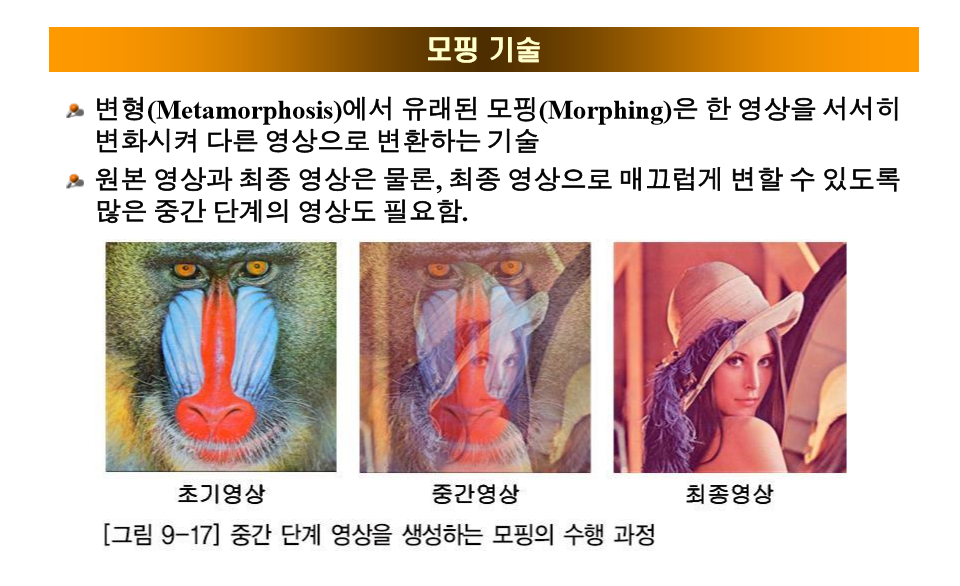
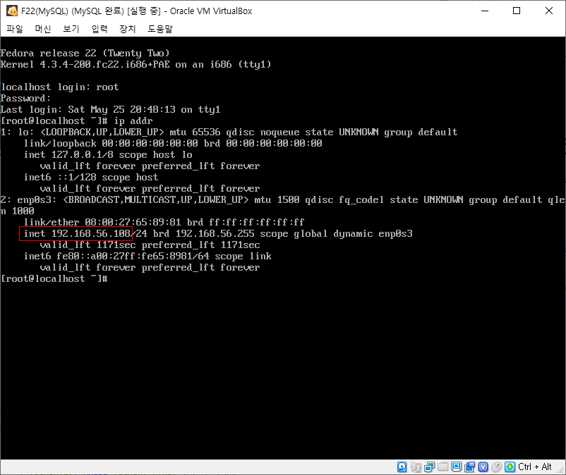
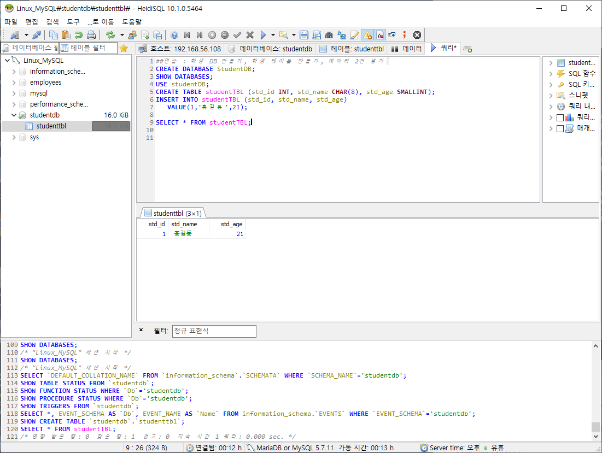

* 프로젝트 : 지금까지 해왔던 컴퓨터 비전 정리해서 발표
* 데이터베이스와 컴퓨터 비전을 연결해서 같이 하면 데이터 저장과 데이터 공유를 할 수 있다는 장점이 있음.
* 딥러닝, AI 분석 시, 영상처리를 활용한 전처리 시 결과가 좋게 나올 수 있음

※ 권장사항 : 추후에 고급 데이터 베이스 공부하기 


## 컴퓨터 비전(영상처리) 알고리즘 함수

* 회전2 (중심, 역방향)
  - 정방향 회전 시, 홀 문제 발생 

```python
def rotateImage2() :
    global window, canvas, paper, filename, inImage,outImage, inW, inH, outW, outH
    angle = askinteger("회전","값 -->",minvalue=1,maxvalue=360)
    ## 중요! 코드, 출력영상 크기 결정##
    outH = inH
    outW = inW
    ###### 메모리 할당 ###########################
    outImage = []
    outImage = melloc(outH, outW)
    ###### 진짜 컴퓨터 비전 알고리즘 #####
    radian = angle * math.pi / 180 # radian degree 수식
    cx = inW/2 # x축의 중심점
    cy = inH/2 # y축의 중심점
    for i in range(outH) :
        for k in range(outW) :
            xs = i
            ys = k
            xd = int((xs - cx) * math.cos(radian) - (ys - cy) * math.sin(radian) + cx) # 회전 시킨 후 다시 원상태로 돌려 놓아야 하므로 다시 중심점 만큼 더해줌
            yd = int((xs - cx) * math.sin(radian) + (ys - cy) * math.cos(radian) + cy)
            if 0<= xd < outH and 0 <= yd < outW :
                outImage[xs][ys] = inImage[xd][yd]
            else : # 빈 공간 하얀색으로 채워줌
                outImage[xs][ys] = 255
    ## 출력
    displayImage()
```


* 모핑 알고리즘



```python
def morphImage() :
    global window, canvas, paper, filename, inImage,outImage, inW, inH, outW, outH
    ## 중요! 코드, 출력영상 크기 결정##
    outH = inH
    outW = inW
    ##추가 영상 선택
    filename2 = askopenfilename(parent=window, filetypes=(("RAW 파일", "*.raw"), ("모든파일", "*.*")))
    if filename2 == '' or filename2 == None:
        return
    fsize = os.path.getsize(filename2)  # 파일의 크기(바이트)
    inH2 = inW2 = int(math.sqrt(fsize))  # 핵심 코드 (메모리를 확보하기 위한 파일의 크기 확인)

    ## 입력영상 메모리 확보 ##
    inImage2 = []  # 이미지가 누적되지 않고 새롭게 불러올 수 있도록 초기화
    inImage2 = melloc(inH2, inW2)

    # 파일 --> 메모리
    with open(filename2, 'rb') as rFp:
        for i in range(inH2):
            for k in range(inW2):
                inImage2[i][k] = int(ord(rFp.read(1)))  # 1바이트씩 읽힘

    ###### 메모리 할당 ###########################
    outImage = []
    outImage = melloc(outH, outW)
    ###### 진짜 컴퓨터 비전 알고리즘 #####
    w1 = askinteger("원영상 가중치","가중치(%) -->",minvalue=0,maxvalue=100)
    w2 = 1 - (w1/100)
    w1 = 1 - w2
    for i in range(inH) :
        for k in range(inW) :
            newValue = int(inImage[i][k]*w1 + inImage2[i][k]*w2)
            if newValue > 255 :
                newValue = 255
            elif newValue < 0 :
                newValue = 0
            outImage[i][k] = newValue
    ## 출력
    displayImage()

```


## 컴퓨터 비전과 데이터베이스 연동

* CLOB : 사이즈가 큰 데이터를 외부 파일로 저장하기 위한 데이터 타입
  문자열 데이터를 DB 외부에 저장하기 위한 타입

* BLOB : 바이너리 데이터를 DB 외부에 저장하기 위한 타입
  BLOB 데이터의 최대 길이는 외부 저장소에서 생성 가능한 파일 크기

  == > 4GB 까지 저장 가능

* 가상머신 F22(MySQL) 시작

* IP 확인



* HeidiSQL 시작
* Linux_MySQL에서 학생 DB 만들기, 학생 테이블 만들기, 데이터 2건 넣기

```mysql
##연습 : 학생 DB 만들기, 학생 테이블 만들기, 데이터 2건 넣기
CREATE DATABASE StudentDB;
SHOW DATABASES;
USE studentDB;
CREATE TABLE studentTBL (std_id INT, std_name CHAR(8), std_age SMALLINT);
INSERT INTO studentTBL (std_id, std_name, std_age)
	VALUE(1,'홍길동',21);
	
SELECT * FROM studentTBL;
```




1. 데이터베이스 설계
   * 데이터베이스와 테이블 설계
   * 메타데이터 : 데이터의 정보 
   * raw_id INT AUTO_INCREMENT PRIMARY KEY : 값이 자동으로 들어감, 이때는 프라이머리 키로 설정해줘야함

```mysql
-- 컴퓨터 비전용 데이터 통합 관리 시스템 --
-- 데이터베이스 설계 (테이블 설계)
-- DB : BigData_DB
-- Table : rawImage_TBL (아이디, 가로크기, 세로크기, 파일명,메타데이터, 평균값, 
-- 업로드 일자, 업로더, 이미지 파일) ==> 논리적 설계
-- (raw_id int, raw_height smallint, raw_width smallint, raw_fname VARCHAR(30), raw_updata DATE,
-- raw_uploader VARCHAR(20), raw_data LONGBLOB) 

CREATE DATABASE BigData_DB;
USE BigData_DB;
CREATE TABLE rawImage_TBL
(raw_id INT AUTO_INCREMENT PRIMARY KEY, raw_height smallint, raw_width smallint, raw_fname VARCHAR(30), 
 raw_updata DATE, raw_uploader VARCHAR(20),raw_avg SMALLINT, raw_data LONGBLOB);
```


### 8일차 통합 미션

미션 1. [컴퓨터 비전] 툴의 기능을 완성하기

- 선택 기능 1 : 대용량 파일의 경우, 일정크기가 보이도록 하기
  예로 2048 x 2048 이더라도 최대 512 x 512 크기로만 보이기.		
  대용량 파일이 2048x 2048일 경우 512x512로 보이기 위해서는 4칸 씩 띄어서 출력하면 됨.
- 선택 기능 2 : 히스토그램 데이터 시각화 기능을 matplotlib 없이, 직접 구현하기


미션 2. 이미지 데이터를 DB에 업로드하는 프로그램 제작

- 선택 기능 1 : 특정 폴더를 선택하면 해당 폴더의 RAW 파일이 모두 업로드 되기
- 선택 기능 2 : RAW 파일의 평균, 최대값, 최소값도 계산되어 업로드


미션 3. [컴퓨터 비전] 툴이 데이터베이스에서 처리되도록 하기


```python
from tkinter import *
from tkinter.simpledialog import *
from tkinter.filedialog import *
import math
import os
import os.path

####################
#### 함수 선언부 ####
####################
# 메모리를 할당해서 리스트(참조)를 반환하는 함수
def malloc(h, w, initValue=0) :
    retMemory= []
    for _ in range(h) :
        tmpList = []
        for _ in range(w) :
            tmpList.append(initValue)
        retMemory.append(tmpList)
    return retMemory


# 파일을 메모리로 로딩하는 함수
def loadImage(fname) :
    global window, canvas, paper, filename, inImage, outImage, inH, inW, outH, outW
    fsize = os.path.getsize(fname) # 파일의 크기(바이트)
    inH = inW = int(math.sqrt(fsize)) # 핵심 코드
    ## 입력영상 메모리 확보 ##
    inImage=[]
    inImage=malloc(inH,inW)
    # 파일 --> 메모리
    with open(filename, 'rb') as rFp:
        for i in range(inH) :
            for k in range(inW) :
                inImage[i][k] = int(ord(rFp.read(1)))

# 파일을 선택해서 메모리로 로딩하는 함수
def openImage() :
    global window, canvas, paper, filename, inImage, outImage,inH, inW, outH, outW
    filename = askopenfilename(parent=window,
                filetypes=(("RAW 파일", "*.raw"), ("모든 파일", "*.*")))
    if filename == '' or filename == None :
        return
    loadImage(filename)
    equalImage()

import struct
def saveImage() :
    global window, canvas, paper, filename, inImage, outImage, inH, inW, outH, outW
    saveFp = asksaveasfile(parent=window, mode='wb',
        defaultextension='*.raw', filetypes=(("RAW 파일", "*.raw"), ("모든 파일", "*.*")))
    if saveFp == '' or saveFp == None :
        return
    for i in range(outH) :
        for k in range(outW) :
            saveFp.write(struct.pack('B', outImage[i][k]))
    saveFp.close()

def displayImage() :
    global window, canvas, paper, filename, inImage, outImage, inH, inW, outH, outW
    if canvas != None : # 예전에 실행한 적이 있다.
        canvas.destroy()
    ## 화면 크기를 조절
    window.geometry(str(outH) + 'x' + str(outW)) # 벽
    canvas = Canvas(window, height=outH, width=outW) # 보드
    paper = PhotoImage(height=outH, width=outW) # 빈 종이
    canvas.create_image((outH//2, outW//2), image=paper, state='normal')
    ## 출력영상 --> 화면에 한점씩 찍자.
    # for i in range(outH) :
    #     for k in range(outW) :
    #         r = g = b = outImage[i][k]
    #         paper.put("#%02x%02x%02x" % (r, g, b), (k, i))
    ## 성능 개선
    rgbStr = '' # 전체 픽셀의 문자열을 저장
    for i in range(outH) :
        tmpStr = ''
        for k in range(outW) :
            r = g = b = outImage[i][k]
            tmpStr += ' #%02x%02x%02x' % (r,g,b)
        rgbStr += '{' + tmpStr + '} '
    paper.put(rgbStr)

    canvas.bind('<Button-1>', mouseClick)
    canvas.bind('<ButtonRelease-1>', mouseDrop)
    canvas.pack(expand=1, anchor=CENTER)

###############################################
##### 컴퓨터 비전(영상처리) 알고리즘 함수 모음 #####
###############################################
# 동일영상 알고리즘
def  equalImage() :
    global window, canvas, paper, filename, inImage, outImage, inH, inW, outH, outW
    ## 중요! 코드. 출력영상 크기 결정 ##
    outH = inH;  outW = inW;
    ###### 메모리 할당 ################
    outImage = [];    outImage = malloc(outH, outW)
    ####### 진짜 컴퓨터 비전 알고리즘 #####
    for i in range(inH) :
        for k in range(inW) :
            outImage[i][k] = inImage[i][k]

    displayImage()

# 동일영상 알고리즘
def  addImage() :
    global window, canvas, paper, filename, inImage, outImage, inH, inW, outH, outW
    ## 중요! 코드. 출력영상 크기 결정 ##
    outH = inH;  outW = inW;
    ###### 메모리 할당 ################
    outImage = [];    outImage = malloc(outH, outW)
    ####### 진짜 컴퓨터 비전 알고리즘 #####
    value = askinteger("밝게/어둡게", "값-->", minvalue=-255, maxvalue=255)
    for i in range(inH) :
        for k in range(inW) :
            v = inImage[i][k] + value
            if v > 255 :
                v = 255
            elif v < 0 :
                v = 0
            outImage[i][k] = v

    displayImage()

# 반전영상 알고리즘
def  revImage() :
    global window, canvas, paper, filename, inImage, outImage, inH, inW, outH, outW
    ## 중요! 코드. 출력영상 크기 결정 ##
    outH = inH;  outW = inW;
    ###### 메모리 할당 ################
    outImage = [];    outImage = malloc(outH, outW)
    ####### 진짜 컴퓨터 비전 알고리즘 #####
    for i in range(inH) :
        for k in range(inW) :
            outImage[i][k] = 255 - inImage[i][k]
    displayImage()

# 이진화 알고리즘
def  bwImage() :
    global window, canvas, paper, filename, inImage, outImage, inH, inW, outH, outW
    ## 중요! 코드. 출력영상 크기 결정 ##
    outH = inH;  outW = inW;
    ###### 메모리 할당 ################
    outImage = [];    outImage = malloc(outH, outW)
    ####### 진짜 컴퓨터 비전 알고리즘 #####
    ## 영상의 평균 구하기.
    sum = 0
    for i in range(inH) :
        for k in range(inW) :
            sum += inImage[i][k]
    avg = sum // (inW * inH)

    for i in range(inH) :
        for k in range(inW) :
            if inImage[i][k] > avg :
                outImage[i][k] = 255
            else :
                outImage[i][k] = 0

    displayImage()

# 파라볼라 알고리즘 with LUT
def  paraImage() :
    global window, canvas, paper, filename, inImage, outImage, inH, inW, outH, outW
    ## 중요! 코드. 출력영상 크기 결정 ##
    outH = inH;  outW = inW;
    ###### 메모리 할당 ################
    outImage = [];    outImage = malloc(outH, outW)
    ####### 진짜 컴퓨터 비전 알고리즘 #####
    LUT = [0 for _ in range(256)]
    for input in range(256) :
        LUT[input]  = int(255 - 255 * math.pow(input/128 -1, 2))

    for i in range(inH) :
        for k in range(inW) :
            input = inImage[i][k]
            outImage[i][k] = LUT[inImage[i][k]]
    displayImage()

# 상하반전 알고리즘
def  upDownImage() :
    global window, canvas, paper, filename, inImage, outImage, inH, inW, outH, outW
    ## 중요! 코드. 출력영상 크기 결정 ##
    outH = inH;  outW = inW;
    ###### 메모리 할당 ################
    outImage = [];    outImage = malloc(outH, outW)
    ####### 진짜 컴퓨터 비전 알고리즘 #####
    for i in range(inH) :
        for k in range(inW) :
            outImage[inH-i-1][k] = inImage[i][k]

    displayImage()

# 화면이동 알고리즘
def moveImage() :
    global panYN
    panYN = True
    canvas.configure(cursor='mouse')

def mouseClick(event) :
    global window, canvas, paper, filename, inImage, outImage, inH, inW, outH, outW
    global sx,sy,ex,ey, panYN
    if panYN == False :
        return
    sx = event.x; sy = event.y

def mouseDrop(event) :
    global window, canvas, paper, filename, inImage, outImage, inH, inW, outH, outW
    global sx, sy, ex, ey, panYN
    if panYN == False :
        return
    ex = event.x;    ey = event.y
    ## 중요! 코드. 출력영상 크기 결정 ##
    outH = inH;  outW = inW;
    ###### 메모리 할당 ################
    outImage = [];    outImage = malloc(outH, outW)
    ####### 진짜 컴퓨터 비전 알고리즘 #####
    mx = sx - ex; my = sy - ey
    for i in range(inH) :
        for k in range(inW) :
            if  0 <= i-my < outW and 0 <= k-mx < outH :
                outImage[i-my][k-mx] = inImage[i][k]
    panYN = False
    displayImage()

# 영상 축소 알고리즘
def  zoomOutImage() :
    global window, canvas, paper, filename, inImage, outImage, inH, inW, outH, outW
    scale = askinteger("축소", "값-->", minvalue=2, maxvalue=16)
    ## 중요! 코드. 출력영상 크기 결정 ##
    outH = inH//scale;  outW = inW//scale;
    ###### 메모리 할당 ################
    outImage = [];    outImage = malloc(outH, outW)
    ####### 진짜 컴퓨터 비전 알고리즘 #####
    for i in range(outH) :
        for k in range(outW) :
            outImage[i][k] = inImage[i*scale][k*scale]

    displayImage()


# 영상 축소 알고리즘 (평균변환)
def  zoomOutImage2() :
    global window, canvas, paper, filename, inImage, outImage, inH, inW, outH, outW
    scale = askinteger("축소", "값-->", minvalue=2, maxvalue=16)
    ## 중요! 코드. 출력영상 크기 결정 ##
    outH = inH//scale;  outW = inW//scale;
    ###### 메모리 할당 ################
    outImage = [];    outImage = malloc(outH, outW)
    ####### 진짜 컴퓨터 비전 알고리즘 #####
    for i in range(inH) :
        for k in range(inW) :
            outImage[i//scale][k//scale] += inImage[i][k]
    for i in range(outH):
        for k in range(outW):
            outImage[i][k] //= (scale*scale)

    displayImage()

# 영상 확대 알고리즘
def  zoomInImage() :
    global window, canvas, paper, filename, inImage, outImage, inH, inW, outH, outW
    scale = askinteger("확대", "값-->", minvalue=2, maxvalue=8)
    ## 중요! 코드. 출력영상 크기 결정 ##
    outH = inH*scale;  outW = inW*scale;
    ###### 메모리 할당 ################
    outImage = [];    outImage = malloc(outH, outW)
    ####### 진짜 컴퓨터 비전 알고리즘 #####
    for i in range(outH) :
        for k in range(outW) :
            outImage[i][k] = inImage[i//scale][k//scale]

    displayImage()

# 영상 확대 알고리즘 (양선형 보간)
def  zoomInImage2() :
    global window, canvas, paper, filename, inImage, outImage, inH, inW, outH, outW
    scale = askinteger("확대", "값-->", minvalue=2, maxvalue=8)
    ## 중요! 코드. 출력영상 크기 결정 ##
    outH = inH*scale;  outW = inW*scale;
    ###### 메모리 할당 ################
    outImage = [];    outImage = malloc(outH, outW)
    ####### 진짜 컴퓨터 비전 알고리즘 #####
    rH, rW, iH, iW = [0] * 4 # 실수위치 및 정수위치
    x, y = 0, 0 # 실수와 정수의 차이값
    C1,C2,C3,C4 = [0] * 4 # 결정할 위치(N)의 상하좌우 픽셀
    for i in range(outH) :
        for k in range(outW) :
            rH = i / scale ; rW = k / scale
            iH = int(rH) ;  iW = int(rW)
            x = rW - iW; y = rH - iH
            if 0 <= iH < inH-1 and 0 <= iW < inW-1 :
                C1 = inImage[iH][iW]
                C2 = inImage[iH][iW+1]
                C3 = inImage[iH+1][iW+1]
                C4 = inImage[iH+1][iW]
                newValue = C1*(1-y)*(1-x) + C2*(1-y)* x+ C3*y*x + C4*y*(1-x)
                outImage[i][k] = int(newValue)

    displayImage()

# 영상 회전 알고리즘
def  rotateImage() :
    global window, canvas, paper, filename, inImage, outImage, inH, inW, outH, outW
    angle = askinteger("회전", "값-->", minvalue=1, maxvalue=360)
    ## 중요! 코드. 출력영상 크기 결정 ##
    outH = inH;  outW = inW;
    ###### 메모리 할당 ################
    outImage = [];    outImage = malloc(outH, outW)
    ####### 진짜 컴퓨터 비전 알고리즘 #####
    radian = angle * math.pi / 180
    for i in range(inH) :
        for k in range(inW) :
            xs = i ; ys = k;
            xd = int(math.cos(radian) * xs - math.sin(radian) * ys)
            yd = int(math.sin(radian) * xs + math.cos(radian) * ys)
            if 0<= xd < inH and 0 <= yd < inW :
                outImage[xd][yd] = inImage[i][k]

    displayImage()

# 영상 회전 알고리즘 - 중심, 역방향
def  rotateImage2() :
    global window, canvas, paper, filename, inImage, outImage, inH, inW, outH, outW
    angle = askinteger("회전", "값-->", minvalue=1, maxvalue=360)
    ## 중요! 코드. 출력영상 크기 결정 ##
    outH = inH;  outW = inW;
    ###### 메모리 할당 ################
    outImage = [];    outImage = malloc(outH, outW)
    ####### 진짜 컴퓨터 비전 알고리즘 #####
    radian = angle * math.pi / 180
    cx = inW//2; cy = inH//2
    for i in range(outH) :
        for k in range(outW) :
            xs = i ; ys = k;
            xd = int(math.cos(radian) * (xs-cx) - math.sin(radian) * (ys-cy)) + cx
            yd = int(math.sin(radian) * (xs-cx) + math.cos(radian) * (ys-cy)) + cy
            if 0<= xd < outH and 0 <= yd < outW :
                outImage[xs][ys] = inImage[xd][yd]
            else :
                outImage[xs][ys] = 255

    displayImage()
# 히스토그램
import matplotlib.pyplot as plt
def  histoImage() :
    global window, canvas, paper, filename, inImage, outImage, inH, inW, outH, outW
    inCountList = [0] * 256
    outCountList = [0] * 256

    for i in range(inH) :
        for k in range(inW) :
            inCountList[inImage[i][k]] += 1

    for i in range(outH) :
        for k in range(outW) :
            outCountList[outImage[i][k]] += 1

    plt.plot(inCountList)
    plt.plot(outCountList)
    plt.show()

# 스트레칭 알고리즘
def  stretchImage() :
    global window, canvas, paper, filename, inImage, outImage, inH, inW, outH, outW
    ## 중요! 코드. 출력영상 크기 결정 ##
    outH = inH;  outW = inW;
    ###### 메모리 할당 ################
    outImage = [];    outImage = malloc(outH, outW)
    ####### 진짜 컴퓨터 비전 알고리즘 #####
    maxVal = minVal = inImage[0][0]
    for i in range(inH) :
        for k in range(inW) :
            if inImage[i][k] < minVal :
                minVal = inImage[i][k]
            elif inImage[i][k] > maxVal :
                maxVal = inImage[i][k]
    for i in range(inH) :
        for k in range(inW) :
            outImage[i][k] = int(((inImage[i][k] - minVal) / (maxVal - minVal)) * 255)

    displayImage()


# 스트레칭 알고리즘
def  endinImage() :
    global window, canvas, paper, filename, inImage, outImage, inH, inW, outH, outW
    ## 중요! 코드. 출력영상 크기 결정 ##
    outH = inH;  outW = inW;
    ###### 메모리 할당 ################
    outImage = [];    outImage = malloc(outH, outW)
    ####### 진짜 컴퓨터 비전 알고리즘 #####
    maxVal = minVal = inImage[0][0]
    for i in range(inH) :
        for k in range(inW) :
            if inImage[i][k] < minVal :
                minVal = inImage[i][k]
            elif inImage[i][k] > maxVal :
                maxVal = inImage[i][k]

    minAdd = askinteger("최소", "최소에서추가-->", minvalue=0, maxvalue=255)
    maxAdd = askinteger("최대", "최대에서감소-->", minvalue=0, maxvalue=255)
    #
    minVal += minAdd
    maxVal -= maxAdd

    for i in range(inH) :
        for k in range(inW) :
            value = int(((inImage[i][k] - minVal) / (maxVal - minVal)) * 255)
            if value < 0 :
                value = 0
            elif value > 255 :
                value = 255
            outImage[i][k] = value

    displayImage()


# 평활화 알고리즘
def  equalizeImage() :
    global window, canvas, paper, filename, inImage, outImage, inH, inW, outH, outW
    ## 중요! 코드. 출력영상 크기 결정 ##
    outH = inH;  outW = inW;
    ###### 메모리 할당 ################
    outImage = [];    outImage = malloc(outH, outW)
    ####### 진짜 컴퓨터 비전 알고리즘 #####
    histo = [0] * 256; sumHisto = [0]*256; normalHisto = [0] * 256
    ## 히스토그램
    for i in range(inH) :
        for k in range(inW) :
            histo[inImage[i][k]] += 1
    ## 누적히스토그램
    sValue = 0
    for i in range(len(histo)) :
        sValue += histo[i]
        sumHisto[i] = sValue
    ## 정규화 누적 히스토그램
    for i in range(len(sumHisto)):
        normalHisto[i] = int(sumHisto[i] / (inW*inH) * 255)
    ## 영상처리
    for i in range(inH) :
        for k in range(inW) :
            outImage[i][k] = normalHisto[inImage[i][k]]
    displayImage()

## 엠보싱 처리
def  embossImage() :
    global window, canvas, paper, filename, inImage, outImage, inH, inW, outH, outW
    ## 중요! 코드. 출력영상 크기 결정 ##
    outH = inH;  outW = inW;
    ###### 메모리 할당 ################
    outImage = [];    outImage = malloc(outH, outW)
    ####### 진짜 컴퓨터 비전 알고리즘 #####
    MSIZE = 3
    mask = [ [-1, 0, 0],
             [ 0, 0, 0],
             [ 0, 0, 1] ]
    ## 임시 입력영상 메모리 확보
    tmpInImage = malloc(inH+MSIZE-1, inW+MSIZE-1, 127)
    tmpOutImage = malloc(outH, outW)
    ## 원 입력 --> 임시 입력
    for i in range(inH) :
        for k in range(inW) :
            tmpInImage[i+MSIZE//2][k+MSIZE//2] = inImage[i][k]
    ## 회선연산
    for i in range(MSIZE//2, inH + MSIZE//2) :
        for k in range(MSIZE//2, inW + MSIZE//2) :
            # 각 점을 처리.
            S = 0.0
            for m in range(0, MSIZE) :
                for n in range(0, MSIZE) :
                    S += mask[m][n]*tmpInImage[i+m-MSIZE//2][k+n-MSIZE//2]
            tmpOutImage[i-MSIZE//2][k-MSIZE//2] = S
    ## 127 더하기 (선택)
    for i in range(outH) :
        for k in range(outW) :
            tmpOutImage[i][k] += 127
    ## 임시 출력 --> 원 출력
    for i in range(outH):
        for k in range(outW):
            value = tmpOutImage[i][k]
            if value > 255 :
                value = 255
            elif value < 0 :
                value = 0
            outImage[i][k] = int(value)

    displayImage()

# 모핑 알고리즘
def  morphImage() :
    global window, canvas, paper, filename, inImage, outImage, inH, inW, outH, outW
    ## 중요! 코드. 출력영상 크기 결정 ##
    outH = inH;  outW = inW;
    ## 추가 영상 선택
    filename2 = askopenfilename(parent=window,
                               filetypes=(("RAW 파일", "*.raw"), ("모든 파일", "*.*")))
    if filename2 == '' or filename2 == None:
        return

    fsize = os.path.getsize(filename2)  # 파일의 크기(바이트)
    inH2 = inW2 = int(math.sqrt(fsize))  # 핵심 코드
    ## 입력영상 메모리 확보 ##
    inImage2 = []
    inImage2 = malloc(inH2, inW2)
    # 파일 --> 메모리
    with open(filename2, 'rb') as rFp:
        for i in range(inH2):
            for k in range(inW2):
                inImage2[i][k] = int(ord(rFp.read(1)))
    ###### 메모리 할당 ################
    outImage = [];    outImage = malloc(outH, outW)
    ####### 진짜 컴퓨터 비전 알고리즘 #####
    #w1 = askinteger("원영상 가중치", "가중치(%)->", minvalue=0, maxvalue=100)
    #w2 = 1- (w1/100);    w1 = 1-w2

    import threading
    import time
    def morpFunc() :
        w1 = 1;        w2 = 0
        for _ in range(20) :
            for i in range(inH) :
                for k in range(inW) :
                    newValue = int(inImage[i][k]*w1 + inImage2[i][k]*w2)
                    if newValue > 255 :
                        newValue = 255
                    elif newValue < 0 :
                        newValue = 0
                    outImage[i][k] =newValue
            displayImage()
            w1 -= 0.05;        w2 += 0.05
            time.sleep(0.5)

    threading.Thread(target=morpFunc).start()


####################
#### 전역변수 선언부 ####
####################
inImage, outImage = [], [] ; inH, inW, outH, outW = [0] * 4
window, canvas, paper = None, None, None
filename = ""
panYN = False
sx,sy,ex,ey = [0] * 4
####################
#### 메인 코드부 ####
####################
window = Tk()
window.geometry("500x500")
window.title("컴퓨터 비전(딥러닝 기법) ver 0.03")

## 마우스 이벤트


mainMenu = Menu(window)
window.config(menu=mainMenu)

fileMenu = Menu(mainMenu)
mainMenu.add_cascade(label="파일", menu=fileMenu)
fileMenu.add_command(label="파일 열기", command=openImage)
fileMenu.add_separator()
fileMenu.add_command(label="파일 저장", command=saveImage)

comVisionMenu1 = Menu(mainMenu)
mainMenu.add_cascade(label="화소점 처리", menu=comVisionMenu1)
comVisionMenu1.add_command(label="덧셈/뺄셈", command=addImage)
comVisionMenu1.add_command(label="반전하기", command=revImage)
comVisionMenu1.add_command(label="파라볼라", command=paraImage)
comVisionMenu1.add_separator()
comVisionMenu1.add_command(label="모핑", command=morphImage)

comVisionMenu2 = Menu(mainMenu)
mainMenu.add_cascade(label="통계", menu=comVisionMenu2)
comVisionMenu2.add_command(label="이진화", command=bwImage)
comVisionMenu2.add_command(label="축소(평균변환)", command=zoomOutImage2)
comVisionMenu2.add_command(label="확대(양선형보간)", command=zoomInImage2)
comVisionMenu2.add_separator()
comVisionMenu2.add_command(label="히스토그램", command=histoImage)
comVisionMenu2.add_command(label="명암대비", command=stretchImage)
comVisionMenu2.add_command(label="End-In탐색", command=endinImage)
comVisionMenu2.add_command(label="평활화", command=equalizeImage)

comVisionMenu3 = Menu(mainMenu)
mainMenu.add_cascade(label="기하학 처리", menu=comVisionMenu3)
comVisionMenu3.add_command(label="상하반전", command=upDownImage)
comVisionMenu3.add_command(label="이동", command=moveImage)
comVisionMenu3.add_command(label="축소", command=zoomOutImage)
comVisionMenu3.add_command(label="확대", command=zoomInImage)
comVisionMenu3.add_command(label="회전1", command=rotateImage)
comVisionMenu3.add_command(label="회전2(중심,역방향)", command=rotateImage2)

comVisionMenu4 = Menu(mainMenu)
mainMenu.add_cascade(label="화소영역 처리", menu=comVisionMenu4)
comVisionMenu4.add_command(label="엠보싱", command=embossImage)

window.mainloop()

```

