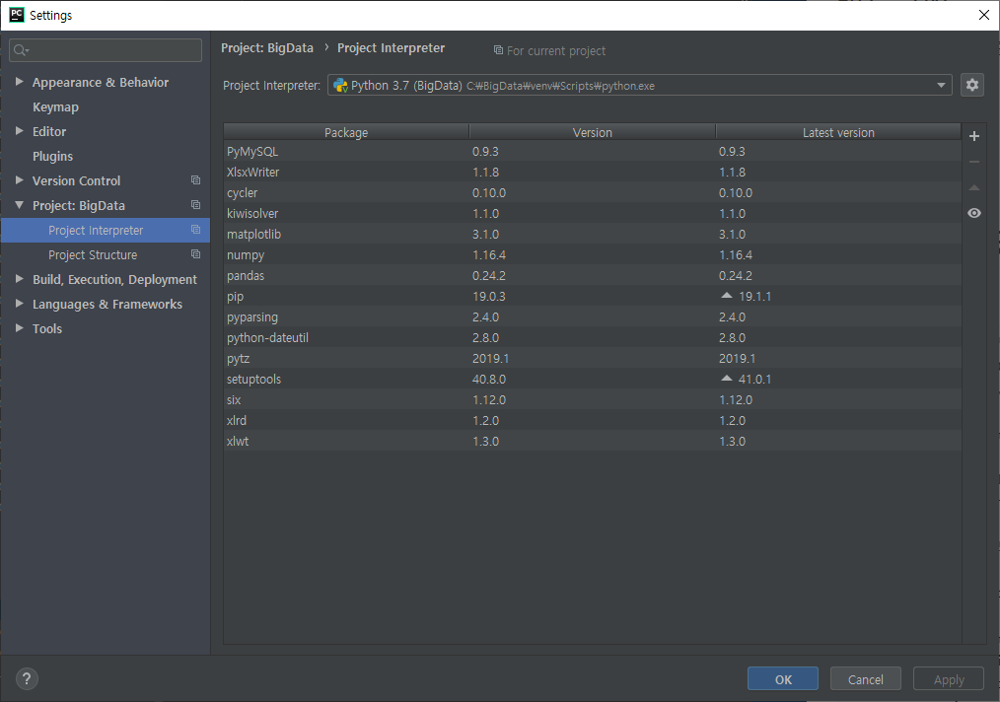

#### 미니 프로젝트 : 컴퓨터 비전 방향으로 준비 

excel : xlrd, xlwt 설치

excel art : xlsxWriter

* 현재까지 설치한 인터프리터




## 컴퓨터 비전(영상처리) 알고리즘 함수

* csv 파일 열기

```python
# 파일을 메모리로 로딩하는 함수
def loadCSV(fname) :
    global window, canvas, paper, filename, inImage, outImage, inH, inW, outH, outW
    fsize = 0
    fp = open(fname,'r')
    for _ in fp :
        fsize += 1
    inH = inW = int(math.sqrt(fsize)) # 핵심 코드
    fp.close()
    ## 입력영상 메모리 확보 ##
    inImage=[]
    inImage=melloc(inH,inW)
    # 파일 --> 메모리
    with open(fname, 'r') as rFp:
        for row_list in rFp :
            row, col, value = list(map(int,row_list.strip().split(',')))
            inImage[row][col] = value

# 파일을 선택해서 메모리로 로딩하는 함수
def openCSV() :
    global window, canvas, paper, filename, inImage, outImage,inH, inW, outH, outW
    filename = askopenfilename(parent=window,
                filetypes=(("CSV 파일", "*.csv"), ("모든 파일", "*.*")))
    if filename == '' or filename == None :
        return
    loadCSV(filename)
    eqaulImage()
```


* csv 파일 저장

```python
import csv
def saveCSV() :
    global window, canvas, paper, filename, inImage, outImage, inW, inH, outW, outH
    saveFp = asksaveasfile(parent=window, mode='wb', defaultextension='*.csv'
                           , filetypes=(("CSV 파일", "*.csv"), ("모든파일", "*.*")))
    if saveFp == '' or saveFp == None:
        return
    with open (saveFp.name,'w',newline='') as wFp :
        csvWriter = csv.writer(wFp)
        for i in range(outH):
            for k in range(outW):
               row_list = [i, k, outImage[i][k]]
               csvWriter.writerow(row_list)

    print('csv.save ok~')
```


* 엑셀 파일 저장

```python
import xlwt
def saveExcel() :
    global window, canvas, paper, filename, inImage, outImage, inW, inH, outW, outH
    saveFp = asksaveasfile(parent=window, mode='wb', defaultextension='*.csv'
                           , filetypes=(("XLS 파일", "*.xls"), ("모든파일", "*.*")))
    if saveFp == '' or saveFp == None:
        return
    xlsName = saveFp.name
    sheetName = os.path.basename(filename)
    wb = xlwt.Workbook()
    ws = wb.add_sheet(sheetName)

    for i in range(outH) :
        for k in range(outW) :
            ws.write(i, k, outImage[i][k])

    wb.save(xlsName)
    print('excel.save ok~')
```


* 엑셀 파일 열기

```python
# 파일을 메모리로 로딩하는 함수
import xlrd
def loadExcel(fname) :
    global window, canvas, paper, filename, inImage, outImage, inH, inW, outH, outW
    fsize = 0
    workbook = xlrd.open_workbook(filename)
    wsList = workbook.sheets()
    for _ in wsList :
        fsize += 1
    inH = inW = int(math.sqrt(fsize)) # 핵심 코드
    workbook.close()
    ## 입력영상 메모리 확보 ##
    inImage=[]
    inImage=melloc(inH,inW)
    # 파일 --> 메모리
    with open(fname, 'r') as rFp:
        for row_list in rFp :
            row, col, value = list(map(int,row_list.strip().split(',')))
            inImage[row][col] = value


def openExcel() :
    global window, canvas, paper, filename, inImage, outImage,inH, inW, outH, outW
    filename = askopenfilename(parent=window,
                               filetypes=(("엑셀 파일", "*.xls;*.xlsx"), ("모든 파일", "*.*")))
    if filename == '' or filename == None :
        return
    loadExcel(filename)
    eqaulImage()

```


* 엑셀 아트 저장

```python
import xlsxwriter
def saveExcelArt() :
    global window, canvas, paper, filename, inImage, outImage, inW, inH, outW, outH
    saveFp = asksaveasfile(parent=window, mode='wb', defaultextension='*.csv'
                           , filetypes=(("XLS 파일", "*.xls"), ("모든파일", "*.*")))
    if saveFp == '' or saveFp == None:
        return
    xlsName = saveFp.name
    sheetName = os.path.basename(filename)

    wb = xlsxwriter.Workbook(xlsName)
    ws = wb.add_worksheet(sheetName)

    ws.set_column(0, outW-1,1.0) # 폭 조절 (약 0.34)
    for i in range(outH) :
        ws.set_row(i, 9.5) # 약 0.35

    for i in range(outH) :
        for k in range(outW) :
            data = outImage[i][k]
            # data 값으로 셀의 배경색을 조절 #000000 ~ #FFFFFF
            if data > 15 :
                hexStr = '#' + hex(data)[2:] *3 # 앞의 2글자를 떼기 위해
            else :
                hexStr = '#' + ('0' + hex(data)[2:]) * 3  # 앞의 2글자를 떼기 위해
            # 셀의 포맷 준비
            cell_format = wb.add_format()
            cell_format.set_bg_color(hexStr)
            ws.write(i, k,'',cell_format)
    wb.close()
    print('Excel Art.save ok~')
```


## 퀴즈 (10일차)

퀴즈 1. 숫자로 지정된 엑셀을 읽어서 영상으로 출력하기

​	엑셀 파일 열기 부문 참조

퀴즈 2. List와 Numpy의 영상 밝게하기 성능 비교

​	List --> 2중 for 문

```python
# 화소점 처리 알고리즘(밝게하기)
import time
def addImage() :
    global window, canvas, paper, filename, inImage,outImage, inW, inH, outW, outH
    ## 중요! 코드, 출력영상 크기 결정##
    outH = inH
    outW = inW
    ###### 메모리 할당 ###########################
    outImage = []
    outImage = melloc(outH, outW)
    ###### 진짜 컴퓨터 비전 알고리즘 #####
    start = time.time()
    value = askinteger("밝게하기","밝게할 값 -->",minvalue=1,maxvalue=255)
    for i in range(inH) :
        for k in range(inW) :
            outImage[i][k] = inImage[i][k] + value
            if outImage[i][k] > 255 :
                outImage[i][k] = 255

    seconds = time.time() - start
    displayImage()
    status.configure(text=status.cget("text")+ "\t\t 시간(초):"
                     + "{0:.2f}".format(seconds))
    print('밝게하기-->', time.time()-start)

```


​	Numpy --> 형 변환 --> iterator

```python
import time
def addImage() :
    global window, canvas, paper, filename, inImage,outImage, inW, inH, outW, outH
    ## 중요! 코드, 출력영상 크기 결정##
    outH = inH
    outW = inW
    ###### 진짜 컴퓨터 비전 알고리즘 #####
    value = askinteger("밝게하기","밝게할 값 -->",minvalue=1,maxvalue=255)
    start = time.time()
    inImage = inImage.astype(np.int16)
    outImage = inImage + value
    # 조건으로 범위 지정
    outImage = np.where(outImage > 255, 255, outImage)
    outImage = np.where(outImage < 0, 0 , outImage)

    ##Iterator 활용
    # iter = np.nditer(outImage, floags = ['multi_index'], op_flags=['readwrite'])
    # while not iter.finished :
    #     idx = iter.multi_index
    #     if outImage[idx] > 255 :
    #         outImage[idx] = 255
    #     elif outImage[idx] < 0 :
    #         outImage[idx] = 0
    #     iter.iternext()

    seconds = time.time() - start
    displayImage()
    status.configure(text=status.cget("text")+ "\t\t시간(초): {0:.2f}".format(seconds))

    print('밝게하기-->', time.time()-start)
```


퀴즈 3. 영상반전을 역시 비교...

```python
# 화소점 처리 알고리즘(화소값 반전)
def reversedImage() :
    global window, canvas, paper, filename, inImage,outImage, inW, inH, outW, outH
    ## 중요! 코드, 출력영상 크기 결정##
    outH = inH
    outW = inW
    ###### 진짜 컴퓨터 비전 알고리즘 #####
    inImage = inImage.astype(np.int16)
    outImage = 255 - inImage

    displayImage()
```


## 미션 (10일차)

모두 순수 NumPy 버전으로


## Numpy

```python
import numpy as np
import random
>>> data = np.random.randn(2,3)
>>> data
array([[-0.35617564, -2.04874565,  0.38191098],
       [ 1.5676283 ,  0.80090988, -0.08784103]])
>>> dataList = [[random.random() for _ in range(3)]for _ in range(2)]
>>> dataList
[[0.6695657738012725, 0.2905950033144019, 0.8545676117403008], [0.6743904496130878, 0.5989911397191358, 0.6197947391971468]]
>>> data[0][1]
-2.0487456535364608
>>> data[0,1]
-2.0487456535364608
>>> dataList[0][1]
0.2905950033144019
>>> dataList[0,1] 
=> error

>>> A = [[10,20],[30,40]]
>>> AA = np.array(A)
>>> AA
array([[10, 20],
       [30, 40]])
>>> A*2
[[10, 20], [30, 40], [10, 20], [30, 40]]
>>> AA*2
array([[20, 40],
       [60, 80]])
>>> AA+2
array([[12, 22],
       [32, 42]])
>>> AA.shape
(2, 2)
>>> AA.dtype
dtype('int32')
>>> v1 = np.array([1,2,3])
>>> v2 = np.array([4,5,6])
>>> v1.shape
(3,)
>>> AA.ndim
2
>>> v1.ndim
1
>>> v1+v2
array([5, 7, 9])
>>> v1*v2
array([ 4, 10, 18])
>>> data.shape
(2, 3)
>>> data.reshape(3,2)
array([[-0.35617564, -2.04874565],
       [ 0.38191098,  1.5676283 ],
       [ 0.80090988, -0.08784103]])
>>> data
array([[-0.35617564, -2.04874565,  0.38191098],
       [ 1.5676283 ,  0.80090988, -0.08784103]])
>>> AA
array([[10, 20],
       [30, 40]])
>>> BB
array([[1, 2],
       [3, 4]])
>>> AA*BB
array([[ 10,  40],
       [ 90, 160]])
>>> CC = np.dot(AA,BB) # 곱행렬
>>> CC
array([[ 70, 100],
       [150, 220]])
>>>data
array([[-0.35617564, -2.04874565,  0.38191098],
       [ 1.5676283 ,  0.80090988, -0.08784103]])
>>> data.T # 역행렬
array([[-0.35617564,  1.5676283 ],
       [-2.04874565,  0.80090988],
       [ 0.38191098, -0.08784103]])
>>> list1 = [ n for n in range(10,70,10)]
>>> list1
[10, 20, 30, 40, 50, 60]
>>> AA = np.array(list1)
>>> AA
array([10, 20, 30, 40, 50, 60])
>>> BB = AA.reshape(3,2)
>>> BB
array([[10, 20],
       [30, 40],
       [50, 60]])
>>> BB[:,0]
array([10, 30, 50])
>>> BB[0:-1,1:2] # -1:마지막 행 전까지 출력하라는 의미
array([[20],
       [40]])
>>> BB[:,:]
array([[10, 20],
       [30, 40],
       [50, 60]])
>>> AA
array([10, 20, 30, 40, 50, 60])
>>> BB
array([[10, 20],
       [30, 40],
       [50, 60]])
>>> CC = BB
>>> CC
array([[10, 20],
       [30, 40],
       [50, 60]])
>>> CC[0,0] = 111111
>>> CC
array([[111111,     20],
       [    30,     40],
       [    50,     60]])
>>> list2 = [n for n in range(10, 90, 10)]
>>> list2
[10, 20, 30, 40, 50, 60, 70, 80]
>>> AA = np.array(list2)
>>> AA = np.array(list2).reshape(2,4)
>>> AA
array([[10, 20, 30, 40],
       [50, 60, 70, 80]])
>>> it = np.nditer(AA, flags=['multi_index'],op_flags=['readwrite'])
>>> while not it.finished : # 데이터베이스에 저장되는 형식으로 출력 
    idx = it.multi_index
    print(AA[idx])
    it.iternext()
    
10
20
30
40
50
60
70
80
>>> AA
array([[10, 20, 30, 40],
       [50, 60, 70, 80]])
>>> data = np.loadtxt('C:/images/csv/cat01.csv',delimiter = ',', dtype=np.int32)
>>> rows=data[:,0:1]
>>> rows[0:5]
array([[0],
       [0],
       [0],
       [0],
       [0]])
>>> np.min(rows)
0
>>> np.max(rows)
127
>>> np.min(data)
0
>>> np.max(data)
250
>>> np.zeros([2,3])
array([[0., 0., 0.],
       [0., 0., 0.]])
>>> np.zeros([2,3],dtype='uint8')
array([[0, 0, 0],
       [0, 0, 0]], dtype=uint8)
>>> np.zeros([2,3],dtype=np.uint8)
array([[0, 0, 0],
       [0, 0, 0]], dtype=uint8)
>>> np.ones([2,3],dtype=np.uint8)
array([[1, 1, 1],
       [1, 1, 1]], dtype=uint8)
```


## 컴퓨터 비전(영상처리) 알고리즘 함수_NumPy 버전

* 동일영상 알고리즘

```python
# 동일영상 알고리즘
def eqaulImage() :
    global window, canvas, paper, filename, inImage,outImage, inW, inH, outW, outH
    ## 중요! 코드, 출력영상 크기 결정##
    outH = inH
    outW = inW
    ###### 진짜 컴퓨터 비전 알고리즘 #####
    outImage = inImage[:,:]

    displayImage()
```


* 밝게하기 알고리즘

```python
# 화소점 처리 알고리즘(밝게 하기)
import time
def addImage() :
    global window, canvas, paper, filename, inImage,outImage, inW, inH, outW, outH
    ## 중요! 코드, 출력영상 크기 결정##
    outH = inH
    outW = inW
    ###### 진짜 컴퓨터 비전 알고리즘 #####
    value = askinteger("밝게하기","밝게할 값 -->",minvalue=1,maxvalue=255)
    start = time.time()
    inImage = inImage.astype(np.int16)
    outImage = inImage + value
    # 조건으로 범위 지정
    outImage = np.where(outImage > 255, 255, outImage)
    outImage = np.where(outImage < 0, 0 , outImage)
    
    seconds = time.time() - start
    displayImage()
    status.configure(text=status.cget("text")+ "\t\t시간(초): {0:.2f}".format(seconds))

    print('밝게하기-->', time.time()-start)
```


* 어둡게하기 알고리즘

```python
# 화소점 처리 알고리즘(어둡게하기)
def minusImage() :
    global window, canvas, paper, filename, inImage,outImage, inW, inH, outW, outH
    ## 중요! 코드, 출력영상 크기 결정##
    outH = inH
    outW = inW
    ###### 진짜 컴퓨터 비전 알고리즘 #####
    value = askinteger("어둡게하기","어둡게할 값 -->",minvalue=1,maxvalue=255)
    start = time.time()
    inImage = inImage.astype(np.int16)
    outImage = inImage - value
    # 조건으로 범위 지정
    outImage = np.where(outImage < 0, 0, outImage)

    seconds = time.time() - start
    displayImage()
    status.configure(text=status.cget("text") + "\t\t시간(초): {0:.2f}".format(seconds))

    print('어둡게하기-->', time.time() - start)
```


* 영상 곱셈 알고리즘

```python
# 화소점 처리 알고리즘(영상 곱셈)
def multiplyImage() :
    global window, canvas, paper, filename, inImage,outImage, inW, inH, outW, outH
    ## 중요! 코드, 출력영상 크기 결정##
    outH = inH
    outW = inW
    ###### 진짜 컴퓨터 비전 알고리즘 #####
    value = askinteger("영상 곱셈","곱할 값 -->",minvalue=1,maxvalue=255)
    inImage = inImage.astype(np.int16)
    outImage = inImage * value
    outImage = np.where(outImage > 255, 255, outImage)

    displayImage()
```


* 영상 나눗셈 알고리즘

```python
# 화소점 처리 알고리즘(영상 나눗셈)
def divisionImage() :
    global window, canvas, paper, filename, inImage,outImage, inW, inH, outW, outH
    ## 중요! 코드, 출력영상 크기 결정##
    outH = inH
    outW = inW
    ###### 진짜 컴퓨터 비전 알고리즘 #####
    value = askinteger("영상 나눗셈","나눌 값 -->",minvalue=1,maxvalue=255)
    inImage = inImage.astype(np.int16)
    outImage = inImage // value
    outImage = np.where(outImage < 1, 1, outImage)

    displayImage()
```


* 화소값 반전 알고리즘

```python
# 화소점 처리 알고리즘(화소값 반전)
def reversedImage() :
    global window, canvas, paper, filename, inImage,outImage, inW, inH, outW, outH
    ## 중요! 코드, 출력영상 크기 결정##
    outH = inH
    outW = inW
    ###### 진짜 컴퓨터 비전 알고리즘 #####
    inImage = inImage.astype(np.int16)
    outImage = 255 - inImage

    displayImage()
```

