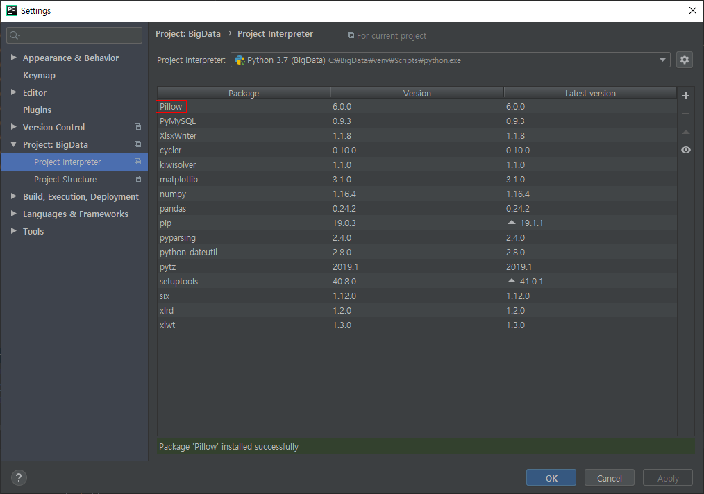

## 컴퓨터 비전 (NumPy)

```python
from tkinter import *
from tkinter.simpledialog import *
from tkinter.filedialog import *
import math
import os
import os.path
from tkinter import messagebox
import numpy as np

#####################
#### 함수 선언부 ####
#####################
# 메모리를 할당해서 리스트(참조)를 반환하는 함수
def melloc(h,w,initValue=0, dataType=np.uint8) :
    retMemory = np.zeros((h,w),dtype=dataType) # zeros 해당 배열에 모두 0을 집어 넣음
    retMemory += initValue
    return retMemory

# 파일을 메모리로 로딩하는 함수
def loadImage(fname) :
    global window, canvas, paper, filename, inImage,outImage, inW, inH, outW, outH
    fsize = os.path.getsize(fname) # 파일의 크기(바이트)
    inH =inW = int(math.sqrt(fsize)) # 핵심 코드 (메모리를 확보하기 위한 파일의 크기 확인)

    ## 입력영상 메모리 확보 ##
    inImage= [] # 이미지가 누적되지 않고 새롭게 불러올 수 있도록 초기화
    inImage = np.fromfile(fname, dtype=np.uint8) # 해당 이미지의 모든 픽셀을 매트릭스에 넣음, 한줄로 읽어서 1차원 벡터로 모든 픽셀이 읽힘
    inImage = inImage.reshape(inH,inW) # 한줄로 읽혔으므로 배열의 크기 정해줌

# 파일을 선택해서 메모리로 로딩하는 함수
import time
# p.353
def openImage() :
    global window, canvas, paper, filename, inImage,outImage, inW, inH, outW, outH
    filename = askopenfilename(parent=window,filetypes=(("RAW 파일", "*.raw"), ("모든파일", "*.*")))
    if filename == '' or filename == None :
        return
    start=time.time()
    loadImage(filename)
    eqaulImage()
    print(time.time()-start)

import struct
def saveImage() :
    global window, canvas, paper, filename, inImage,outImage, inW, inH, outW, outH
    saveFp = asksaveasfile(parent=window,mode='wb',defaultextension='*.raw'
                           ,filetypes=(("RAW 파일", "*.raw"), ("모든파일", "*.*")))
    if saveFp == '' or saveFp == None :
        return
    for i in range(outH) :
        for k in range(outW) :
            saveFp.wirte(struct.pack('B',outImage[i][k]))
    saveFp.close()

def displayImage() :
    global window, canvas, paper, filename, inImage,outImage, inW, inH, outW, outH
    global VIEW_X, VIEW_Y
    if canvas!= None : # 예전에 실행한 적이 있다.
        canvas.destroy() # 캔버스를 뜯어내는 것

    ## 고정된 화면 크기
    if outH <= VIEW_Y or outW <= VIEW_X :
        VIEW_X = outW
        VIEW_Y = outH
        step = 1 # 출력시 건너뛸 값
    else :
        VIEW_X = 512
        VIEW_Y = 512
        step = outW / VIEW_X # 맞아떨어지지 않은 값은 실수로 출력

    window.geometry(str(int(VIEW_Y*1.2)) + 'x' + str(int(VIEW_X*1.2))) # 좀 더 이쁘게 보이기 위해 x1.2
    canvas = Canvas(window, height=VIEW_Y, width=VIEW_X)
    paper = PhotoImage(height=VIEW_Y, width=VIEW_X)  # 빈 종이
    canvas.create_image((VIEW_Y // 2, VIEW_X // 2), image=paper, state='normal')

    ## 성능 개선
    import  numpy
    rgbStr = '' #전체 픽셀의 문자열을 저장
    for i in numpy.arange(0,outH,step) : #numpy는 실수값도 범위로 설정 가능
        tmpStr = ''
        for k in numpy.arange(0,outW,step) :
            i = int(i)
            k = int(k)
            r = g = b = int(outImage[i][k])
            tmpStr += ' #%02x%02x%02x' % (r,g,b) # 문자열은 한칸씩 띄기
        rgbStr += '{' + tmpStr + '} ' # 마지막 중괄호 뒤에 한칸 띄기
    paper.put(rgbStr)

    ## 마우스 이벤트
    canvas.bind("<Button-1>", mouseClick)
    canvas.bind("<ButtonRelease-1>",mouseDrop)
    canvas.pack(expand=1,anchor=CENTER)
    status.configure(text = '이미지 정보 :' + str(outW) + 'x' + str(outH))


#################################################
####컴퓨터 비전(영상처리) 알고리즘 함수 모음 ####
#################################################

# 동일영상 알고리즘
def eqaulImage() :
    global window, canvas, paper, filename, inImage,outImage, inW, inH, outW, outH
    ## 중요! 코드, 출력영상 크기 결정##
    outH = inH
    outW = inW
    ###### 진짜 컴퓨터 비전 알고리즘 #####
    outImage = inImage[:,:] # 복사해서 outImage에 넣어줌
    #outImage = inImage.copy()

    displayImage()

# 화소점 처리 알고리즘(밝게 하기)
import time
def addImage() :
    global window, canvas, paper, filename, inImage,outImage, inW, inH, outW, outH
    ## 중요! 코드, 출력영상 크기 결정##
    outH = inH
    outW = inW
    ###### 진짜 컴퓨터 비전 알고리즘 #####
    value = askinteger("밝게하기","밝게할 값 -->",minvalue=1,maxvalue=255)
    start = time.time()
    inImage = inImage.astype(np.int16) # int8:최댓값 255이므로 더하면 그 값을 초과할 수 있게 데이터타입 변환
    outImage = inImage + value
    # 조건으로 범위 지정
    outImage = np.where(outImage > 255, 255, outImage)
    outImage = np.where(outImage < 0, 0 , outImage)
    seconds = time.time() - start
    displayImage()
    status.configure(text=status.cget("text")+ "\t\t시간(초): {0:.2f}".format(seconds))

    print('밝게하기-->', time.time()-start)


# 화소점 처리 알고리즘(어둡게하기)
def minusImage() :
    global window, canvas, paper, filename, inImage,outImage, inW, inH, outW, outH
    ## 중요! 코드, 출력영상 크기 결정##
    outH = inH
    outW = inW
    ###### 진짜 컴퓨터 비전 알고리즘 #####
    value = askinteger("어둡게하기","어둡게할 값 -->",minvalue=1,maxvalue=255)
    start = time.time()
    inImage = inImage.astype(np.int16)
    outImage = inImage - value
    # 조건으로 범위 지정
    outImage = np.where(outImage < 0, 0, outImage)

    seconds = time.time() - start
    displayImage()
    status.configure(text=status.cget("text") + "\t\t시간(초):{0:.2f}".format(seconds))

    print('어둡게하기-->', time.time() - start)


# 화소점 처리 알고리즘(영상 곱셈)
def multiplyImage() :
    global window, canvas, paper, filename, inImage,outImage, inW, inH, outW, outH
    ## 중요! 코드, 출력영상 크기 결정##
    outH = inH
    outW = inW
    ###### 진짜 컴퓨터 비전 알고리즘 #####
    value = askinteger("영상 곱셈","곱할 값 -->",minvalue=1,maxvalue=255)
    inImage = inImage.astype(np.int16)
    outImage = inImage * value
    outImage = np.where(outImage > 255, 255, outImage)

    displayImage()

# 화소점 처리 알고리즘(영상 나눗셈)
def divisionImage() :
    global window, canvas, paper, filename, inImage,outImage, inW, inH, outW, outH
    ## 중요! 코드, 출력영상 크기 결정##
    outH = inH
    outW = inW
    ###### 진짜 컴퓨터 비전 알고리즘 #####
    value = askinteger("영상 나눗셈","나눌 값 -->",minvalue=1,maxvalue=255)
    inImage = inImage.astype(np.int16)
    outImage = inImage // value
    outImage = np.where(outImage < 1, 1, outImage)

    displayImage()

# 화소점 처리 알고리즘(화소값 반전)
def reversedImage() :
    global window, canvas, paper, filename, inImage,outImage, inW, inH, outW, outH
    ## 중요! 코드, 출력영상 크기 결정##
    outH = inH
    outW = inW
    ###### 진짜 컴퓨터 비전 알고리즘 #####
    inImage = inImage.astype(np.int16)
    outImage = 255 - inImage

    displayImage()

# 화소점 처리 알고리즘(이진화)
def binaryImage() :
    global window, canvas, paper, filename, inImage,outImage, inW, inH, outW, outH
    ## 중요! 코드, 출력영상 크기 결정##
    outH = inH
    outW = inW
    ###### 진짜 컴퓨터 비전 알고리즘 #####
    ##영상의 평균 구하기
    start = time.time()
    avg = np.average(inImage)
    outImage = np.where(outImage>avg, 255,0)

    seconds = time.time() - start
    displayImage()
    status.configure(text=status.cget("text")+ "\t\t 시간(초):"
                     + "{0:.2f}".format(seconds))
    print('이진화-->', time.time()-start)

# 화소점 처리 알고리즘(입출력 영상의 평균값 구하기)
def averageImage() :
    global window, canvas, paper, filename, inImage,outImage, inW, inH, outW, outH
    ## 중요! 코드, 출력영상 크기 결정##
    outH = inH
    outW = inW
    ###### 진짜 컴퓨터 비전 알고리즘 #####
    inImage = inImage.astype(np.int16)
    avg = inImage.mean()

    ## 출력
    messagebox.showinfo('입출력 영상 평균값', '%7.4f' % avg)

# 화소점 처리 알고리즘(감마보정)
# 감마값이 1보다 크면 영상이 어두워지고, 1보다 작으면 영상이 밝아짐
def gammaImage() :
    global window, canvas, paper, filename, inImage,outImage, inW, inH, outW, outH
    ## 중요! 코드, 출력영상 크기 결정##
    outH = inH
    outW = inW
    ###### 진짜 컴퓨터 비전 알고리즘 #####
    gamma = askfloat("감마 보정", "감마 값 -->", minvalue=0, maxvalue=3)
    inImage = inImage.astype(np.int16)
    invGamma = 1 / gamma
    outImage = int(((inImage / 255.0) ** invGamma) * 255)

    displayImage()

# 파라볼라 알고리즘 with LUT
# Out = 255 - 255*(Input/128-1)^2
# 입체 형태로 출력
def paraImage() :
    global window, canvas, paper, filename, inImage,outImage, inW, inH, outW, outH
    ## 중요! 코드, 출력영상 크기 결정##
    outH = inH
    outW = inW
    ###### 진짜 컴퓨터 비전 알고리즘 #####
    LUT = np.arange(256)
    LUT = 255 - 255 * np.power(LUT / 128 - 1,2)
    # LUT = 255 - 255 * (LUT/128-1)**2
    LUT=LUT.astype(np.uint8)
    outImage = LUT[inImage]

    displayImage()

# 상하반전 알고리즘
def upDownImage() :
    global window, canvas, paper, filename, inImage,outImage, inW, inH, outW, outH
    ## 중요! 코드, 출력영상 크기 결정##
    outH = inH
    outW = inW
    ###### 진짜 컴퓨터 비전 알고리즘 #####
    inImage = inImage.astype(np.int16)
    outImage = np.flip(inImage)
    # outImage = inImage[::-1,:] #(start:end:step) step의 기본값 : 1

    ## 출력
    displayImage()

# 오른쪽 90도 회전 알고리즘
def rotationImage() :
    global window, canvas, paper, filename, inImage,outImage, inW, inH, outW, outH
    ## 중요! 코드, 출력영상 크기 결정##
    outH = inH
    outW = inW
    ###### 진짜 컴퓨터 비전 알고리즘 #####
    inImage = inImage.astype(np.int16)
    inImage.T


    ## 출력
    displayImage()


## 마우스 화면이동 알고리즘
def moveImage() :
    global panYN
    panYN = True
    canvas.configure(cursor = 'mouse')

def mouseClick(event) :
    global window, canvas, paper, filename, inImage,outImage, inW, inH, outW, outH,sx,sy,ex,ey,panYN
    if panYN == False :
        return
    sx = event.x
    sy = event.y

def mouseDrop(event) : # 다시해보기
    global window, canvas, paper, filename, inImage,outImage, inW, inH, outW, outH,sx,sy,ex,ey,panYN
    if panYN == False :
        return
    ex = event.x
    ey = event.y
    ## 중요! 코드, 출력영상 크기 결정##
    outH = inH
    outW = inW
    ###### 진짜 컴퓨터 비전 알고리즘 #####
    mx = sx - ex
    my = sy - ey
   if mx < 0 and my < 0 :
        outImage[-mx:inH, -my:inW] = inImage[0:inH+mx,0:inW+my]
    elif mx >=0 and my >= 0 :
        outImage[0:inH-mx, 0:inW-my] = inImage[mx:inH,my:inW]
    elif mx < 0 and my >= 0:
        outImage[0:inH-mx, -my:inW] = inImage[mx:inH, my:inW+my]
    elif mx >= 0 and my < 0:
        outImage[-mx:inH, 0:inW-my] = inImage[0:inH+mx, my:inW]

    panYN = False
    displayImage()

# 영상 축소 알고리즘
def zoomOutImage() :
    global window, canvas, paper, filename, inImage,outImage, inW, inH, outW, outH
    scale = askinteger("축소","값 -->",minvalue=2,maxvalue=16)
    ## 중요! 코드, 출력영상 크기 결정##
    outH = inH//scale
    outW = inW//scale
    ###### 메모리 할당 ###########################
    outImage = []
    outImage = melloc(outH, outW)
    ###### 진짜 컴퓨터 비전 알고리즘 #####
    ##대표값을 가져와서 축소하므로 영상이 아닌 경우 모양이 이상할 수 있음.
    ## 이때는 축소할 값들의 평균값 또는 중위수를 이용해서 축소. 성능이 떨어질 수 있음
    # outImage = inImage.copy()
    outImage = inImage[::scale,::scale]
    displayImage()

# 영상 확대 알고리즘
def zoomInImage() :
    global window, canvas, paper, filename, inImage,outImage, inW, inH, outW, outH
    scale = askinteger("확대","값 -->",minvalue=2,maxvalue=4)
    ## 중요! 코드, 출력영상 크기 결정##
    outH = inH*scale
    outW = inW*scale
    ###### 진짜 컴퓨터 비전 알고리즘 #####
    outImage = np.kron(inImage, np.ones((scale,scale)))
    displayImage()

#########################
#### 전역변수 선언부 ####
#########################
inImage,outImage = [],[]
inW, inH, outW, outH = [0]*4
window, canvas, paper = None, None, None
filename = ""
panYN = False
sx,sy,ex,ey = [0] * 4
VIEW_X, VIEW_Y = 512,512 #화면에 보일 크기 (출력용)


#####################
#### 메인 코드부 ####
#####################
window = Tk()
window.title('컴퓨터 비젼(Numpy) ver 0.05')
window.geometry("500x500")

status = Label(window, text = '이미지 정보',bd = 1 , relief = SUNKEN, anchor = W)
status.pack(side = BOTTOM,fill=X)

mainMenu = Menu(window)
window.config(menu=mainMenu)

fileMenu = Menu(mainMenu)
mainMenu.add_cascade(label='파일', menu=fileMenu)
fileMenu.add_command(label='파일 열기', command=openImage)
fileMenu.add_separator()
fileMenu.add_command(label='파일 저장', command=saveImage)

comVisionMenu1 = Menu(mainMenu)
mainMenu.add_cascade(label='화소점 처리', menu=comVisionMenu1)
comVisionMenu1.add_command(label='밝게하기', command=addImage)
comVisionMenu1.add_command(label='어둡게하기', command=minusImage)
comVisionMenu1.add_command(label='영상 곱셈', command=multiplyImage)
comVisionMenu1.add_command(label='영상 나눗셈', command=divisionImage)
comVisionMenu1.add_command(label='화소값 반전', command=reversedImage)
comVisionMenu1.add_command(label='입출력 영상 평균값', command=averageImage)
comVisionMenu1.add_command(label='감마보정', command=gammaImage)
comVisionMenu1.add_command(label='파라볼라', command=paraImage)

comVisionMenu2 = Menu(mainMenu)
mainMenu.add_cascade(label='통계', menu=comVisionMenu2 )
comVisionMenu2.add_command(label='이진화', command=binaryImage)
comVisionMenu2.add_command(label='축소(평균변환)', command=zoomOutImage2

comVisionMenu3 = Menu(mainMenu)
mainMenu.add_cascade(label='기하학 처리', menu=comVisionMenu3)
comVisionMenu3.add_command(label='상하반전', command=upDownImage)
comVisionMenu3.add_command(label='오른쪽 90도 회전', command=rotationImage)
comVisionMenu3.add_command(label='축소', command=zoomOutImage)
comVisionMenu3.add_command(label='확대', command=zoomInImage)
comVisionMenu3.add_command(label='이동', command=moveImage)
comVisionMenu3.add_command(label='회전1', command=rotateImage)
comVisionMenu3.add_command(label='회전2(중심, 역방향)', command=rotateImage2)

window.mainloop()
```


## 컴퓨터 비전 칼라 (pillow)

- pillow 설치




```python
from tkinter import *
from tkinter.simpledialog import *
from tkinter.filedialog import *
import math
import os
import os.path
from tkinter import messagebox
from PIL import Image, ImageFilter, ImageEnhance, ImageOps

# 파일을 선택해서 메모리로 로딩하는 함수
import time
def openImagePIL() :
    global window, canvas, paper, filename, inImage,outImage, inW, inH, outW, outH
    filename = askopenfilename(parent=window,filetypes=(("칼라 파일", "*.jpg;*.png;*.bmp;*.tif"), ("모든파일", "*.*")))
    if filename == '' or filename == None :
        return

    inImage = Image.open(filename)
    inW = inImage.width
    inH = inImage.height

    outImage = inImage.copy()
    outW = outImage.width
    outH = outImage.height

    displayImagePIL()

    # equalImage()

def displayImagePIL() :
    global window, canvas, paper, filename, inImage,outImage, inW, inH, outW, outH
    if canvas!= None : # 예전에 실행한 적이 있다.
        canvas.destroy() # 캔버스를 뜯어내는 것
    VIEW_X = outW
    VIEW_Y = outH
    step = 1

    window.geometry(str(int(VIEW_Y*1.2)) + 'x' + str(int(VIEW_X*1.2))) # 좀 더 이쁘게 보이기 위해 x1.2
    canvas = Canvas(window, height=VIEW_Y, width=VIEW_X)
    paper = PhotoImage(height=VIEW_Y, width=VIEW_X)  # 빈 종이
    canvas.create_image((VIEW_Y // 2, VIEW_X // 2), image=paper, state='normal')

    import numpy
    rgbImage = outImage.convert('RGB') #rgb 형식으로 바꿔줌
    rgbStr = '' #전체 픽셀의 문자열을 저장
    for i in numpy.arange(0,outH,step) : #numpy는 실수값도 범위로 설정 가능
        tmpStr = ''
        for k in numpy.arange(0,outW,step) :
            i = int(i)
            k = int(k)
            r, g, b = rgbImage.getpixel((k,i))
            tmpStr += ' #%02x%02x%02x' % (r,g,b) # 문자열은 한칸씩 띄기
        rgbStr += '{' + tmpStr + '} ' # 마지막 중괄호 뒤에 한칸 띄기
    paper.put(rgbStr)

    canvas.pack(expand=1,anchor=CENTER)
    status.configure(text = '이미지 정보 :' + str(outW) + 'x' + str(outH))


def saveImagePIL() :
    global window, canvas, paper, filename, inImage,outImage, inW, inH, outW, outH
    if outImage == None :
        return
    saveFp = asksaveasfile(parent=window, mode='wb', defaultextension='*.jpg'
                               , filetypes=(("JPG 파일", "*.jpg"), ("모든파일", "*.*")))
    if saveFp == '' or saveFp == None:
        return
    outImage.save(saveFp.name)
    print('Save~')

def addImagePIL() :
    global window, canvas, paper, filename, inImage,outImage, inW, inH, outW, outH
    value = askfloat("밝게하기","값(0~16) -->",minvalue=0.0,maxvalue=16.0)
    outImage = inImage.copy()
    outImage = ImageEnhance.Brightness(outImage).enhance(value)
    outW = outImage.width
    outH = outImage.height
    displayImagePIL()

def blurImagePIL() :
    global window, canvas, paper, filename, inImage,outImage, inW, inH, outW, outH
    outImage = inImage.copy()
    outImage = outImage.filter(ImageFilter.BLUR)
    outW = outImage.width
    outH = outImage.height
    displayImagePIL()

def zoominImagePIL():
    global window, canvas, paper, filename, inImage, outImage, inW, inH, outW, outH
    scale = askinteger("확대", "값(0~8) -->", minvalue=2, maxvalue=8)
    outImage = inImage.copy()
    outImage = outImage.resize((inH*scale, inW*scale))
    outW = outImage.width
    outH = outImage.height
    displayImagePIL()

def zoomoutImagePIL():
    global window, canvas, paper, filename, inImage, outImage, inW, inH, outW, outH
    scale = askinteger("축소", "값(2~8) -->", minvalue=2, maxvalue=8)
    outImage = inImage.copy()
    outImage = outImage.resize((inH//scale, inW//scale))
    outW = outImage.width
    outH = outImage.height
    displayImagePIL()

# def paraImagePIL() :
#     global window, canvas, paper, filename, inImage,outImage, inW, inH, outW, outH
#     value = askfloat("밝게하기","값(0~16) -->",minvalue=0.0,maxvalue=16.0)
#     outImage = inImage.copy()
#     outImage = ImageEnhance.Brightness(outImage).enhance(value)
#     outW = outImage.width
#     outH = outImage.height
#     displayImagePIL()

def rotateImagePIL() :
    global window, canvas, paper, filename, inImage,outImage, inW, inH, outW, outH
    angle = askinteger("회전","값 -->",minvalue=1,maxvalue=360)
    outImage = inImage.copy()
    outImage = outImage.rotate(angle)
    outW = outImage.width
    outH = outImage.height
    displayImagePIL()

import numpy as np
def upDownImagePIL() :
    global window, canvas, paper, filename, inImage,outImage, inW, inH, outW, outH
    outImage = inImage.copy()
    outImage = inImage.transpose(Image.FLIP_TOP_BOTTOM)
    outW = outImage.width
    outH = outImage.height
    displayImagePIL()

def sharpImagePIL() :
    global window, canvas, paper, filename, inImage,outImage, inW, inH, outW, outH
    outImage = inImage.copy()
    outImage = outImage.filter(ImageFilter.UnsharpMask)
    outW = outImage.width
    outH = outImage.height
    displayImagePIL()

def embossImagePIL() :
    global window, canvas, paper, filename, inImage,outImage, inW, inH, outW, outH
    outImage = inImage.copy()
    outImage = outImage.filter(ImageFilter.EMBOSS)
    outW = outImage.width
    outH = outImage.height
    displayImagePIL()

def boundaryImagePIL() :
    global window, canvas, paper, filename, inImage,outImage, inW, inH, outW, outH
    outImage = inImage.copy()
    outImage = outImage.filter(ImageFilter.FIND_EDGES)
    outW = outImage.width
    outH = outImage.height
    displayImagePIL()

def gaussianImagePIL() :
    global window, canvas, paper, filename, inImage,outImage, inW, inH, outW, outH
    outImage = inImage.copy()
    outImage = outImage.filter(ImageFilter.GaussianBlur)
    outW = outImage.width
    outH = outImage.height
    displayImagePIL()

def morphImagePIL() :
    global window, canvas, paper, filename, inImage,outImage, inW, inH, outW, outH
    filename1 = askopenfilename(parent=window,filetypes=(("칼라 파일", "*.jpg;*.png;*.bmp;*.tif"), ("모든파일", "*.*")))
    if filename1 == '' or filename1 == None :
        return

    inImage1 = Image.open(filename1)
    outImage = inImage.copy()

    inImage.putalpha(1)
    inImage1.putalpha(1)

    outImage = Image.alpha_composite(inImage,inImage1)
    outW = outImage.width
    outH = outImage.height

    displayImagePIL()

import matplotlib.pyplot as plt
def histoImagePIL() :
    global window, canvas, paper, filename, inImage,outImage, inW, inH, outW, outH
    r,g,b = inImage.split()
    print(r.histogram())
    bins = list(range(256))
    plt.plot(bins, r.histogram(), 'r')
    plt.plot(bins, g.histogram(), 'g')
    plt.plot(bins, b.histogram(), 'b')

    plt.show()

#######################
#### 전역변수 선언부 ####
#######################
inImage,outImage = None,None
inW, inH, outW, outH = [0]*4
window, canvas, paper = None, None, None
filename = ""
VIEW_X, VIEW_Y = 512,512 #화면에 보일 크기 (출력용)


####################
#### 메인 코드부 ####
####################
window = Tk()
window.title('컴퓨터 비젼(칼라 라이브러리) ver 0.01')
window.geometry("500x500")

status = Label(window, text = '이미지 정보:',bd = 1 , relief = SUNKEN, anchor = W)
status.pack(side = BOTTOM,fill=X)

mainMenu = Menu(window)
window.config(menu=mainMenu)

fileMenu = Menu(mainMenu)
mainMenu.add_cascade(label='파일', menu=fileMenu)
fileMenu.add_command(label='파일 열기', command=openImagePIL)
fileMenu.add_separator()
fileMenu.add_command(label='파일 저장', command=saveImagePIL)

comVisionMenu1 = Menu(mainMenu)
mainMenu.add_cascade(label='화소점 처리', menu=comVisionMenu1)
comVisionMenu1.add_command(label='덧셈/뺄셈', command=addImagePIL)
# comVisionMenu1.add_command(label='파라볼라', command=paraImagePIL)
comVisionMenu1.add_command(label='모핑', command=morphImagePIL)

comVisionMenu2 = Menu(mainMenu)
mainMenu.add_cascade(label='화소영역 처리', menu=comVisionMenu2)
comVisionMenu2.add_command(label='블러링', command= blurImagePIL)
comVisionMenu2.add_command(label='샤프닝', command= sharpImagePIL)
comVisionMenu2.add_command(label='엠보싱', command= embossImagePIL)
comVisionMenu2.add_command(label='경계선 검출', command= boundaryImagePIL)
comVisionMenu2.add_command(label='가우시안 필터링', command=gaussianImagePIL)

comVisionMenu3= Menu(mainMenu)
mainMenu.add_cascade(label='기하학적 처리', menu=comVisionMenu3)
comVisionMenu3.add_command(label='확대', command= zoominImagePIL)
comVisionMenu3.add_command(label='축소', command= zoomoutImagePIL)
comVisionMenu3.add_command(label='회전', command= rotateImagePIL)
comVisionMenu3.add_command(label='상하반전', command= upDownImagePIL)

comVisionMenu4 = Menu(mainMenu)
mainMenu.add_cascade(label='통계', menu=comVisionMenu4)
comVisionMenu4.add_command(label='히스토그램', command=histoImagePIL)

window.mainloop()
```


## 컴퓨터 비전 칼라 (딥러닝) 직접 구현

```python
from tkinter import *
from tkinter.simpledialog import *
from tkinter.filedialog import *
import math
import os
import os.path
from tkinter import messagebox
from PIL import Image, ImageFilter, ImageEnhance, ImageOps

# 메모리를 할당해서 리스트(참조)를 반환하는 함수
def malloc(h,w,initValue=0) :
    retMemory = []
    for _ in range(h) :
        tmpList=[]
        for _ in range(w) :
            tmpList.append(initValue)
        retMemory.append(tmpList)
    return retMemory

# 파일을 메모리로 로딩하는 함수
def loadImageColor(fname) :
    global window, canvas, paper, filename, inImage,outImage, inW, inH, outW, outH
    inImage=[]
    photo = Image.open(fname) # PIL 객체
    inW = photo.width
    inH = photo.height
    ## 메모리 확보 ##
    for _ in range(3):
        inImage.append(malloc(inH,inW))

    photoRGB = photo.convert('RGB')
    for i in range(inH) :
        for k in range(inW) :
            r, g, b = photoRGB.getpixel((k,i))
            inImage[R][i][k] = r
            inImage[G][i][k] = g
            inImage[B][i][k] = b

# 파일을 선택해서 메모리로 로딩하는 함수
def openImageColor() :
    global window, canvas, paper, filename, inImage,outImage, inW, inH, outW, outH
    filename = askopenfilename(parent=window,filetypes=(("칼라 파일", "*.jpg;*.png;*.bmp;*.tif"), ("모든파일", "*.*")))
    if filename == '' or filename == None :
        return
    loadImageColor(filename)
    equalImageColor()

    displayImageColor()

def displayImageColor() :
    global window, canvas, paper, filename, inImage,outImage, inW, inH, outW, outH
    if canvas!= None : # 예전에 실행한 적이 있다.
        canvas.destroy() # 캔버스를 뜯어내는 것
    VIEW_X = outW
    VIEW_Y = outH
    step = 1

    window.geometry(str(int(VIEW_X*1.2)) + 'x' + str(int(VIEW_Y*1.2))) # 좀 더 이쁘게 보이기 위해 x1.2
    canvas = Canvas(window, height=VIEW_Y, width=VIEW_X)
    paper = PhotoImage(height=VIEW_Y, width=VIEW_X)  # 빈 종이
    canvas.create_image((VIEW_X // 2, VIEW_Y // 2), image=paper, state='normal')

    import numpy
    rgbStr = '' #전체 픽셀의 문자열을 저장
    for i in numpy.arange(0,outH,step) : #numpy는 실수값도 범위로 설정 가능
        tmpStr = ''
        for k in numpy.arange(0,outW,step) :
            i = int(i)
            k = int(k)
            r, g, b = outImage[R][i][k], outImage[G][i][k], outImage[B][i][k]
            tmpStr += ' #%02x%02x%02x' % (r,g,b) # 문자열은 한칸씩 띄기
        rgbStr += '{' + tmpStr + '} ' # 마지막 중괄호 뒤에 한칸 띄기
    paper.put(rgbStr)

    ## 마우스 이벤트
    canvas.bind("<Button-1>", mouseClick)
    canvas.bind("<ButtonRelease-1>",mouseDrop)
    canvas.pack(expand=1,anchor=CENTER)
    status.configure(text = '이미지 정보 :' + str(outW) + 'x' + str(outH))


def saveImageColor() :
    global window, canvas, paper, filename, inImage,outImage, inW, inH, outW, outH
    # if outImage == None :
    #     return
    # saveFp = asksaveasfile(parent=window, mode='wb', defaultextension='*.jpg'
    #                            , filetypes=(("JPG 파일", "*.jpg"), ("모든파일", "*.*")))
    # if saveFp == '' or saveFp == None:
    #     return
    # outImage.save(saveFp.name)
    # print('Save~')

# 동일영상 알고리즘
def equalImageColor() :
    global window, canvas, paper, filename, inImage,outImage, inW, inH, outW, outH
    ## 중요! 코드, 출력영상 크기 결정##
    outH = inH
    outW = inW
    ## 메모리 할당 ##
    outImage = []
    for _ in range(3):
        outImage.append(malloc(outH,outW))
    ##############################
    ### 진짜 컴퓨터 비전 알고리즘 ###
    ##############################
    for RGB in range(3):
        for i in range(inH):
            for k in range(inW):
                outImage[RGB][i][k] = inImage[RGB][i][k]
    ######################################

    displayImageColor()


def addImageColor() :
    global window, canvas, paper, filename, inImage,outImage, inW, inH, outW, outH
    ## 중요! 코드, 출력영상 크기 결정##
    outH = inH
    outW = inW
    ## 메모리 할당 ##
    outImage = []
    for _ in range(3):
        outImage.append(malloc(outH,outW))
    ##############################
    ### 진짜 컴퓨터 비전 알고리즘 ###
    ##############################
    value = askinteger("밝게/어둡게","값( -->",minvalue=-255,maxvalue=255)
    for RGB in range(3):
        for i in range(inH):
            for k in range(inW):
                if inImage[RGB][i][k] + value > 255:
                    outImage[RGB][i][k] = 255
                elif inImage[RGB][i][k] + value < 0:
                    outImage[RGB][i][k] = 0
                else :
                    outImage[RGB][i][k] = inImage[RGB][i][k] + value
    ######################################

    displayImageColor()

def revImageColor() :
    global window, canvas, paper, filename, inImage,outImage, inW, inH, outW, outH
    ## 중요! 코드, 출력영상 크기 결정##
    outH = inH
    outW = inW
    ## 메모리 할당 ##
    outImage = []
    for _ in range(3):
        outImage.append(malloc(outH,outW))
    ##############################
    ### 진짜 컴퓨터 비전 알고리즘 ###
    ##############################
    for RGB in range(3):
        for i in range(inH):
            for k in range(inW):
                outImage[RGB][i][k] = 255-inImage[RGB][i][k]
    ######################################

    displayImageColor()

def paraImageColor():
    global window, canvas, paper, filename, inImage,outImage, inW, inH, outW, outH
    ## 중요! 코드, 출력영상 크기 결정##
    outH = inH
    outW = inW
    ## 메모리 할당 ##
    outImage = []
    for _ in range(3):
        outImage.append(malloc(outH,outW))
    ##############################
    ### 진짜 컴퓨터 비전 알고리즘 ###
    ##############################
    LUT = [0 for _ in range(256)]
    for input in range(256) :
        LUT[input] = int(255 - 255 * math.pow(input / 128 - 1, 2))

    for RGB in range(3):
        for i in range(inH):
            for k in range(inW):
                outImage[RGB][i][k] = LUT[inImage[RGB][i][k]]
    ######################################

    displayImageColor()

def morphImageColor():
    global window, canvas, paper, filename, inImage, outImage, inH, inW, outH, outW
    ## 중요! 코드. 출력영상 크기 결정 ##
    outH = inH;
    outW = inW;
    ## 메모리 확보
    outImage = []
    for _ in range(3):
        outImage.append(malloc(outH, outW))
    ############################
    ### 진짜 컴퓨터 비전 알고리즘 ###\
    LUT = [0 for _ in range(256)]
    for input in range(256):
        LUT[input] = int(255 - 255 * math.pow(input / 128 - 1, 2))

    for RGB in range(3):
        for i in range(inH):
            for k in range(inW):
                outImage[RGB][i][k] = LUT[inImage[RGB][i][k]]
    #############################
    displayImageColor()


def morphImageColor():
    global window, canvas, paper, filename, inImage, outImage, inH, inW, outH, outW
    ## 중요! 코드. 출력영상 크기 결정 ##
    outH = inH;
    outW = inW;
    ## 추가 영상 선택
    filename2 = askopenfilename(parent=window,
                                filetypes=(("칼라 파일", "*.jpg;*.png;*.bmp;*.tif"), ("모든 파일", "*.*")))
    if filename2 == '' or filename2 == None:
        return
    inImage2 = []
    photo2 = Image.open(filename2)  # PIL 객체
    inW2 = photo2.width;
    inH2 = photo2.height
    ## 메모리 확보
    for _ in range(3):
        inImage2.append(malloc(inH2, inW2))

    photoRGB2 = photo2.convert('RGB')
    for i in range(inH2):
        for k in range(inW2):
            r, g, b = photoRGB2.getpixel((k, i))
            inImage2[R][i][k] = r
            inImage2[G][i][k] = g
            inImage2[B][i][k] = b

    ## 메모리 확보
    outImage = []
    for _ in range(3):
        outImage.append(malloc(outH, outW))

    import threading
    import time
    def morpFunc():
        w1 = 1;
        w2 = 0
        for _ in range(20):
            for RGB in range(3):
                for i in range(inH):
                    for k in range(inW):
                        newValue = int(inImage[RGB][i][k] * w1 + inImage2[RGB][i][k] * w2)
                        if newValue > 255:
                            newValue = 255
                        elif newValue < 0:
                            newValue = 0
                        outImage[RGB][i][k] = newValue
            displayImageColor()
            w1 -= 0.05;
            w2 += 0.05
            time.sleep(0.5)

    threading.Thread(target=morpFunc).start()

# 상하반전 알고리즘
def upDownImageColor() :
    global window, canvas, paper, filename, inImage,outImage, inW, inH, outW, outH
    ## 중요! 코드, 출력영상 크기 결정##
    outH = inH
    outW = inW
    ###### 메모리 할당 ###########################
    outImage = []
    for _ in range(3):
        outImage.append(malloc(outH, outW))
    ###### 진짜 컴퓨터 비전 알고리즘 #####
    for RGB in range(3) :
        for i in range(inH) :
            for k in range(inW) :
                outImage[RGB][inH-i-1][k] = inImage[RGB][i][k]

    displayImageColor()

# 영상 축소 알고리즘
def zoomOutImageColor() :
    global window, canvas, paper, filename, inImage,outImage, inW, inH, outW, outH
    scale = askinteger("축소","값 -->",minvalue=2,maxvalue=16)
    ## 중요! 코드, 출력영상 크기 결정##
    outH = inH//scale
    outW = inW//scale
    ###### 메모리 할당 ###########################
    outImage = []
    for _ in range(3):
        outImage.append(malloc(outH, outW))
    ###### 진짜 컴퓨터 비전 알고리즘 #####
    for RGB in range(3) :
        for i in range(outH) :
            for k in range(outW) :
                outImage[RGB][i][k] = inImage[RGB][i*scale][k*scale]

    displayImageColor()

# 영상 확대 알고리즘
def zoomInImageColor() :
    global window, canvas, paper, filename, inImage,outImage, inW, inH, outW, outH
    scale = askinteger("확대","값 -->",minvalue=2,maxvalue=4)
    ## 중요! 코드, 출력영상 크기 결정##
    outH = inH*scale
    outW = inW*scale
    ###### 메모리 할당 ###########################
    outImage = []
    for _ in range(3):
        outImage.append(malloc(outH, outW))
    ###### 진짜 컴퓨터 비전 알고리즘 #####
    for RGB in range(3) :
        for i in range(outH) :
            for k in range(outW) :
                outImage[RGB][i][k] = inImage[RGB][i//scale][k//scale]

    displayImageColor()

## 마우스 화면이동 알고리즘
def moveImageColor() :
    global panYN
    panYN = True
    canvas.configure(cursor = 'mouse')

def mouseClick(event) :
    global window, canvas, paper, filename, inImage,outImage, inW, inH, outW, outH,sx,sy,ex,ey,panYN
    if panYN == False :
        return
    sx = event.x
    sy = event.y

def mouseDrop(event) :
    global window, canvas, paper, filename, inImage,outImage, inW, inH, outW, outH,sx,sy,ex,ey,panYN
    if panYN == False :
        return
    ex = event.x
    ey = event.y
    ## 중요! 코드, 출력영상 크기 결정##
    outH = inH
    outW = inW
    ###### 메모리 할당 ###########################
    outImage = []
    for _ in range(3):
        outImage.append(malloc(outH, outW))
    ###### 진짜 컴퓨터 비전 알고리즘 #####
    mx = sx - ex
    my = sy - ey
    for RGB in range(3) :
        for i in range(inH) :
            for k in range(inW) :
                if 0 <= i-my < outH and 0 <= k-mx < outW :
                    outImage[RGB][i-my][k-mx] = inImage[RGB][i][k]
    panYN = False
    ## 출력
    displayImageColor()

# 화소점 처리 알고리즘(이진화)
def binaryImageColor() :
    global window, canvas, paper, filename, inImage,outImage, inW, inH, outW, outH
    ## 중요! 코드, 출력영상 크기 결정##
    outH = inH
    outW = inW
    ###### 메모리 할당 ###########################
    outImage = []
    for _ in range(3):
        outImage.append(malloc(outH, outW))
    ###### 진짜 컴퓨터 비전 알고리즘 #####
    ##영상의 평균 구하기
    grayImage = []
    tmp = []
    sum = 0

    for i in range(inH) :
        tmp = []
        for k in range(inW) :
            gray = int((inImage[R][i][k]+inImage[G][i][k]+inImage[B][i][k])//3)
            if gray > 255 :
                gray = 255
            elif gray < 0 :
                gray = 0
            else :
                gray = gray
            sum += gray
            tmp.append(gray)
        grayImage.append(tmp)
    avg = sum // (inW * inH)

    for RGB in range(3) :
        outImage[RGB] = grayImage

    for GRB in range(3) :
        for i in range(inH) :
            for k in range(inW) :
                if outImage[RGB][i][k] > avg :
                    outImage[RGB][i][k] = 255
                else :
                    outImage[RGB][i][k] = 0

    displayImageColor()

# 오른쪽 90도 회전 알고리즘
def rotationImageColor() :
    global window, canvas, paper, filename, inImage,outImage, inW, inH, outW, outH
    ## 중요! 코드, 출력영상 크기 결정##
    outH = inH
    outW = inW
    ###### 메모리 할당 ###########################
    outImage = []
    for _ in range(3):
        outImage.append(malloc(outH, outW))
    ###### 진짜 컴퓨터 비전 알고리즘 #####
    for RGB in range(3) :
        for i in range(inH) :
            for k in range(inW) :
                outImage[RGB][k][inW-i-1] = inImage[RGB][i][k]
    ## 출력
    displayImageColor()

# 영상 회전 알고리즘
def rotateImageColor() :
    global window, canvas, paper, filename, inImage,outImage, inW, inH, outW, outH
    angle = askinteger("회전","값 -->",minvalue=1,maxvalue=360)
    ## 중요! 코드, 출력영상 크기 결정##
    outH = inH
    outW = inW
    ###### 메모리 할당 ###########################
    outImage = []
    for _ in range(3):
        outImage.append(malloc(outH, outW))
    ###### 진짜 컴퓨터 비전 알고리즘 #####
    radian = angle * math.pi / 180 # radian degree 수식
    for RGB in range(3):
        for i in range(inH) :
            for k in range(inW) :
                xs = i
                ys = k
                xd = int(math.cos(radian) * xs - math.sin(radian) * ys)
                yd = int(math.sin(radian) * xs + math.cos(radian) * ys)
                if 0<= xd < inH and 0 <= yd < inW :
                    outImage[RGB][xd][yd] = inImage[RGB][i][k]

    displayImageColor()

# 영상 회전 알고리즘
def rotateImageColor2() :
    global window, canvas, paper, filename, inImage,outImage, inW, inH, outW, outH
    angle = askinteger("회전","값 -->",minvalue=1,maxvalue=360)
    ## 중요! 코드, 출력영상 크기 결정##
    outH = inH
    outW = inW
    ###### 메모리 할당 ###########################
    outImage = []
    for _ in range(3):
        outImage.append(malloc(outH, outW))
    ###### 진짜 컴퓨터 비전 알고리즘 #####
    radian = angle * math.pi / 180
    cx = inW // 2;
    cy = inH // 2
    for RGB in range(3):
        for i in range(outH):
            for k in range(outW):
                xs = i;
                ys = k;
                xd = int(math.cos(radian) * (xs - cx) - math.sin(radian) * (ys - cy)) + cx
                yd = int(math.sin(radian) * (xs - cx) + math.cos(radian) * (ys - cy)) + cy
                if 0 <= xd < outH and 0 <= yd < outW:
                    outImage[RGB][xs][ys] = inImage[RGB][xd][yd]
                else:
                    outImage[RGB][xs][ys] = 255

    displayImageColor()

# 엠보싱 처리
def embossImageColor() :
    global window, canvas, paper, filename, inImage,outImage, inW, inH, outW, outH
    ## 중요! 코드, 출력영상 크기 결정##
    outH = inH
    outW = inW
    ###### 메모리 할당 ###########################
    outImage = []
    for _ in range(3):
        outImage.append(malloc(outH, outW))
    ###### 진짜 컴퓨터 비전 알고리즘 #####
    MSIZE = 3
    mask = [ [-1, 0, 0],
             [ 0, 0, 0],
             [ 0, 0, 1] ]
    ## 임시 입력영상 메모리 확보
    tmpInImage = []
    for _ in range(3):
        tmpInImage.append(malloc(inH + MSIZE -1, inW + MSIZE -1, 127))
    tmpOutImage = []
    for _ in range(3):
        tmpOutImage .append(malloc(outH, outW))

    ## 원 입력 ---> 임시 입력
    for RGB in range(3):
        for i in range(inH) :
            for k in range(inW) :
                tmpInImage[RGB][i+MSIZE//2][k+MSIZE//2] = inImage[RGB][i][k]
    ## 회선연산 : (1,1)이 중심
    for RGB in range(3):
        for i in range(MSIZE//2,inH+MSIZE//2) :
            for k in range(MSIZE//2,inW+MSIZE//2) :
                # 각 점을 처리
                s = 0.0
                for m in range(0 ,MSIZE) :
                    for n in range(0,MSIZE) :
                        s += mask[m][n]*tmpInImage[RGB][i+m-MSIZE//2][k+n-MSIZE//2] # 마스크와 영상과 자리 맞추기
                tmpOutImage[RGB][i-MSIZE//2][k-MSIZE//2] = s

    ## 127 더하기 (선택)
    for RGB in range(3):
        for i in range(outH) :
            for k in range(outW) :
                tmpOutImage[RGB][i][k] += 127

    ## 임시 출력 --> 원 출력
    for RGB in range(3):
        for i in range(outH) :
            for k in range(outW) :
                value = tmpOutImage[RGB][i][k]
                if value > 255 :
                    value = 255
                elif value < 0 :
                    value = 0
                outImage[RGB][i][k] = int(value)

    ## 출력
    displayImageColor()

# 히스토그램
import matplotlib.pyplot as plt
def histoImageColor() :
    global window, canvas, paper, filename, inImage,outImage, inW, inH, outW, outH
    rCountList = [0] * 256
    gCountList =[0] * 256
    bCountList = [0] * 256

    for i in range(inH) :
        for k in range(inW) :
            rCountList[inImage[R][i][k]] += 1

    for i in range(outH) :
        for k in range(outW) :
            gCountList[inImage[G][i][k]] += 1

    for i in range(outH) :
        for k in range(outW) :
            bCountList[inImage[B][i][k]] += 1

    plt.plot(rCountList)
    plt.plot(gCountList)
    plt.plot(bCountList)
    plt.show()

#######################
#### 전역변수 선언부 ####
#######################
R, G, B = 0,1,2
inImage,outImage = [],[] # 3차원 리스트(배열)
inW, inH, outW, outH = [0]*4
window, canvas, paper = None, None, None
filename = ""
VIEW_X, VIEW_Y = 512,512 #화면에 보일 크기 (출력용)


####################
#### 메인 코드부 ####
####################
window = Tk()
window.title('컴퓨터 비젼 칼라(딥러닝) ver 0.01')
window.geometry("500x500")

status = Label(window, text = '이미지 정보:',bd = 1 , relief = SUNKEN, anchor = W)
status.pack(side = BOTTOM,fill=X)

mainMenu = Menu(window)
window.config(menu=mainMenu)

fileMenu = Menu(mainMenu)
mainMenu.add_cascade(label='파일', menu=fileMenu)
fileMenu.add_command(label='파일 열기', command=openImageColor)
fileMenu.add_separator()
fileMenu.add_command(label='파일 저장', command=saveImageColor)

comVisionMenu1 = Menu(mainMenu)
mainMenu.add_cascade(label='화소점 처리', menu=comVisionMenu1)
comVisionMenu1.add_command(label='덧셈/뺄셈', command=addImageColor)
comVisionMenu1.add_command(label='화소값 반전', command=revImageColor)
comVisionMenu1.add_command(label='파라볼라', command=paraImageColor)
fileMenu.add_separator()
comVisionMenu1.add_command(label='모핑', command=morphImageColor)

comVisionMenu2 = Menu(mainMenu)
mainMenu.add_cascade(label='통계', menu=comVisionMenu2 )
comVisionMenu2.add_command(label='이진화', command=binaryImageColor)
comVisionMenu2.add_separator()
comVisionMenu2.add_command(label='히스토그램', command=histoImageColor)


comVisionMenu3 = Menu(mainMenu)
mainMenu.add_cascade(label='기하학 처리', menu=comVisionMenu3)
comVisionMenu3.add_command(label='상하반전', command=upDownImageColor)
comVisionMenu3.add_command(label='오른쪽 90도 회전', command=rotationImageColor)
comVisionMenu3.add_command(label='축소', command=zoomOutImageColor)
comVisionMenu3.add_command(label='확대', command=zoomInImageColor)
comVisionMenu3.add_command(label='이동', command=moveImageColor)
comVisionMenu3.add_command(label='회전1', command=rotateImageColor)
comVisionMenu3.add_command(label='회전2(중심, 역방향)', command=rotateImageColor2)


comVisionMenu4 = Menu(mainMenu)
mainMenu.add_cascade(label='화소영역 처리', menu=comVisionMenu4)
comVisionMenu4.add_command(label='엠보싱', command=embossImageColor)

window.mainloop()
```


## 퀴즈 (12일차)

퀴즈 1. Pillow를 활용한 컴퓨터 비전

​			--> 기존 컴퓨터 비전 메뉴의 것들 중 가능한 것들 추가하기.

퀴즈 2.(심화) 없는 것도 찾아서 추가하기


## 미션 (12일차)

미션1. 컴퓨터 비전(딥러닝) - 칼라 메뉴를 가능한 부분 완성하기

---> 화소 영역처리는 실행해도 맘에 안들 것임 (해결책?)

미션2. <심화> 화소 영역처리 부분의 해결책? RGB <--> HSI

미션3. <심화> 마우스로 부분을 선택한 후에 해당 부분만 처리되기

