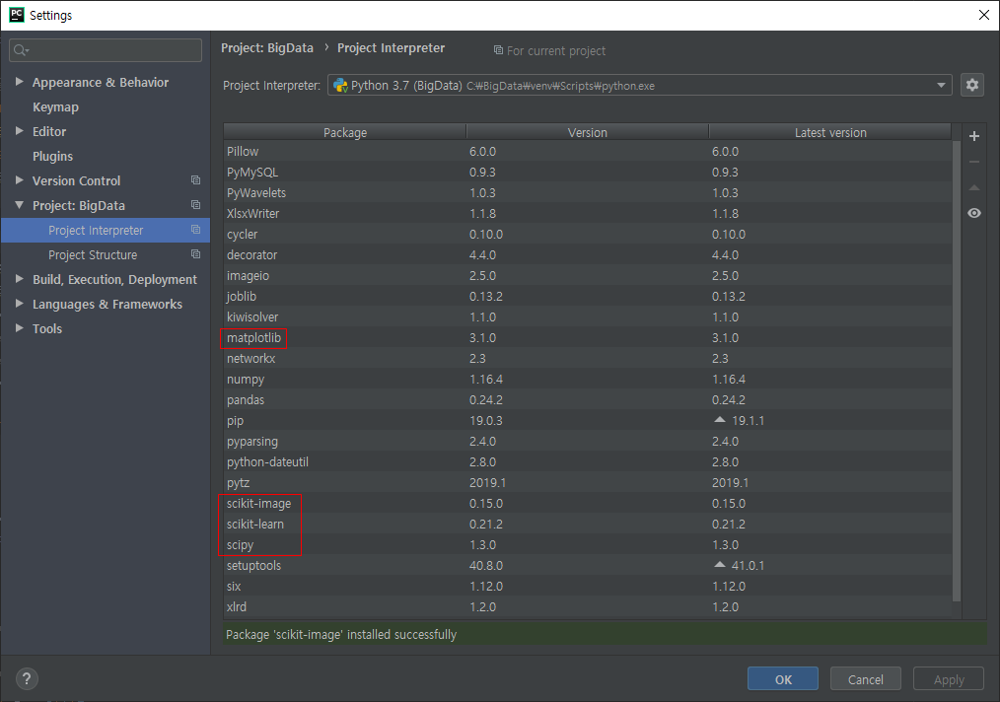

앞으로 공부할 방향

* 인공지능 및 딥러닝 이론 잘 이해하고 툴을 써서 결과 도출해보기
* 툴을 사용하지 않고 직접 구현해보기


#### 머신러닝 / 딥러닝 이론

* 참고자료 : https://blog.naver.com/beyondlegend/221338876143
* 지도학습
  * 입력값(x)과 정답(t, label)을 포함하는 Training Data를 이용하여 학습하고, 그 학습된 결과를 바탕으로  미지의 데이터에 대해 미래 값 예측하는 방법 => 대부분 머신러닝 문제는 지도학습에 해당됨
  * 지도학습은 학습결과를 바탕으로, 미래의 무엇을 예측하느냐에 따라 회귀, 분류 등으로 구분할 수 있음
* 회귀 (Regression)
  *  Training Data를 이용하여 연속적인 (숫자) 값을 예측
* 분류 (Classfication)
  * Training Data를 이용하여 주어진 입력값이 어떤 종류의 값인지 구별


## Pandas 기본 예제

* Data Frame : 표 같은 스프레드 시트 형식의 자료구조, Series 들의 집합
* Series : 일련의 객체를 담을 수 있는 1차원 배열 같은 자료구조 (Array, Vector와 같은 형식)

```python
>>> import pandas as pd
>>> df = pd.read_csv('c:/BigData/csv/01_data.csv')
>>> df
    Name Country  Age        Job
0   John     USA   31    Student
1  Sabre  France   33     Lawyer
2    Kim   Korea   28  Developer
3   Sato   Japan   40       Chef
4    Lee   Korea   36  Professor
5  Smith     USA   55        CEO
6  David     USA   48     Banker
>>> type(df)
<class 'pandas.core.frame.DataFrame'>
>>> sr=df.Name
>>> sr
0     John
1    Sabre
2      Kim
3     Sato
4      Lee
5    Smith
6    David
Name: Name, dtype: object
>>> type(sr)
<class 'pandas.core.series.Series'>
>>> df_Name = df.Name
>>> df_Name = df['Name']
>>> df_Name
0     John
1    Sabre
2      Kim
3     Sato
4      Lee
5    Smith
6    David
Name: Name, dtype: object
>>> df
    Name Country  Age        Job
0   John     USA   31    Student
1  Sabre  France   33     Lawyer
2    Kim   Korea   28  Developer
3   Sato   Japan   40       Chef
4    Lee   Korea   36  Professor
5  Smith     USA   55        CEO
6  David     USA   48     Banker
>>> df_Name_Country = df[ ['Name', 'Country']] # 열 추출
>>> df_Name_Country
    Name Country
0   John     USA
1  Sabre  France
2    Kim   Korea
3   Sato   Japan
4    Lee   Korea
5  Smith     USA
6  David     USA
>>> df
    Name Country  Age        Job
0   John     USA   31    Student
1  Sabre  France   33     Lawyer
2    Kim   Korea   28  Developer
3   Sato   Japan   40       Chef
4    Lee   Korea   36  Professor
5  Smith     USA   55        CEO
6  David     USA   48     Banker
>>> df_row_0 = df.loc[0] # 행 추출
>>> df_row_0
Name          John
Country        USA
Age             31
Job        Student
Name: 0, dtype: object
type(df_row_0)
<class 'pandas.core.series.Series'>
>>> df
    Name Country  Age        Job
0   John     USA   31    Student
1  Sabre  France   33     Lawyer
2    Kim   Korea   28  Developer
3   Sato   Japan   40       Chef
4    Lee   Korea   36  Professor
5  Smith     USA   55        CEO
6  David     USA   48     Banker
>>> df_row0_3 = df.loc[ [0,3] ] # 행 추출
>>> df_row0_3
   Name Country  Age      Job
0  John     USA   31  Student
3  Sato   Japan   40     Chef
type(df_row0_3)
<class 'pandas.core.frame.DataFrame'>
>>> df
    Name Country  Age        Job
0   John     USA   31    Student
1  Sabre  France   33     Lawyer
2    Kim   Korea   28  Developer
3   Sato   Japan   40       Chef
4    Lee   Korea   36  Professor
5  Smith     USA   55        CEO
6  David     USA   48     Banker
>>> df_row_2to5 = df.loc [2:5] #범위 지정
>>> df_row_2to5
    Name Country  Age        Job
2    Kim   Korea   28  Developer
3   Sato   Japan   40       Chef
4    Lee   Korea   36  Professor
5  Smith     USA   55        CEO
>>> df_Con_group = df.groupby('Country')
>>> df_Con_group
<pandas.core.groupby.generic.DataFrameGroupBy object at 0x000001D4E3DB3780>
>>> df_Con_group['Age'].mean()
Country
France    33.000000
Japan     40.000000
Korea     32.000000
USA       44.666667
Name: Age, dtype: float64
>>> import pandas as pd
>>> df = pd.read_csv('c:/BigData/iris.csv')
>>> df.head()
   sepal.length  sepal.width  petal.length  petal.width variety
0           5.1          3.5           1.4          0.2  Setosa
1           4.9          3.0           1.4          0.2  Setosa
2           4.7          3.2           1.3          0.2  Setosa
3           4.6          3.1           1.5          0.2  Setosa
4           5.0          3.6           1.4          0.2  Setosa

```


## scikit-learn

* 참고자료 : 파이썬 라이브러리를 활용한 머신러닝 교재
* scikit-learn 사용자 가이드 : https://scikit-learn.org/stable/user_guide.html
* scikit-learn :  현재 파이썬으로 구현된 가장 유명한 기계 학습 오픈 소스 라이브러리로 오픈소스이며,  Numpy와 SciPy를 기반으로 만들어짐
  * NumPy : 다차원 배열을 위한 기능과 선형 대수 연산과 푸리에 변환 같은 고수준 수학 함수와 유사 난수 생성기를 포함
  * SciPy : 과학 계산용 함수를 모아놓은 파이썬 패키지, 고성능 선형대수, 함수 최적화, 신호 처리, 특수한 수학 함수와 통계 분포 등을 포함한 많은 기능 제공
* NumPy, SciPy, matplotib, Pandas, scikit-learn , scikit-image 설치




* 머신러닝 : scikit-elearn (XOR 게이트 분류 문제)

```python
from sklearn import svm

#1. Classifire 생성 (선택) --> 머신러닝 알고리즘 선택
clf = svm.SVC(gamma='auto') # svm,SVC 알고리즘 선택, svm 안에는 여러 알고리즘 존재
							# gamma = 'auto' 없으면 warning 발생

#2. 데이터로 학습 시키기
#clf.fit( [훈련 데이터],[정답] )
#XOR 데이터
clf.fit ( [ [0,0],
            [0,1],
            [1,0],
            [1,1]] ,
          [0,1,1,0])

#3. 예측하기
# clf.predict( [예측할 데이터] )
result = clf.predict([ [1,0] ])

print(result)
```


* 머신러닝 : scikit-elearn (SVM 분류 후 예측하는 기본적인 예제)

```python
from sklearn import svm
from sklearn import metrics # 정답률 확인

#0. 훈련데이터, 테스트 데이터 준비
train_data = [[0,0],[0,1],[1,0],[1,1]]
train_label = [0, 1, 1, 0]
test_data = [[1,0],[0,0]]
test_laebl = [1,0]

#1. Classifire 생성 (선택) --> 머신러닝 알고리즘 선택
clf = svm.SVC(gamma='auto')

#2. 데이터로 학습 시키기
#clf.fit( [훈련 데이터],[정답] )
clf.fit(train_data, train_label)

#3. 정답률을 확인 (신뢰도)
results = clf.predict(test_data)
score = metrics.accuracy_score(results,test_laebl)
print("정답률 :", score*100, '%')

#4. 예측하기
# clf.predict( [예측할 데이터] )
# result = clf.predict([ [1,0] ])
# print(result)

```


## 붓꽃의 품종 분류 (scikit-learn)

* 파이썬 라이브러리를 활용한 머신러닝 p.40

```python
from sklearn import svm
from sklearn import metrics # 정답률 확인
import pandas as pd
from sklearn.model_selection import train_test_split

#붓꽃 데이터 분류기 (머신러닝)
'''
- 개요 : 150개 붓꽃 정보(꽃받침 길이, 꽃받침 폭, 꽃잎 길이, 꽃잎 폭)
- 종류 : 3개 (Iris-setosa, Iris-versicolor, Iris-virginica)
- csv 파일 : 검색. iris.csv
'''

# 0. 훈련데이터, 테스트 데이터 준비
csv = pd.read_csv('c:/BigData/iris.csv')
data = csv.iloc[:, 0:-1] # iloc : 행의 순번, loc : 행의 이름, -1 : 맨마지막의 그 전까지 출력
label = csv.iloc[:,[-1]] # 열의 맨 끝만 출력

## 학습용, 훈련용 분리
train_data, test_data, train_label, test_label = train_test_split(data, label, train_size=0.3)
# train data, test data 분리

# 1. Classifire 생성 (선택) --> 머신러닝 알고리즘 선택
clf = svm.SVC(gamma='auto')
# clf = svm.NuSVC(gamma='auto') # 70%

# 2. 데이터로 학습 시키기
#clf.fit( [훈련 데이터],[정답] )
clf.fit(train_data, train_label)

# #3. 정답률을 확인 (신뢰도)
results = clf.predict(test_data)
score = metrics.accuracy_score(results,test_label)
print("정답률 :", "{0:.2f}%".format(score*100))


# # #4. 예측하기
# # # clf.predict( [예측할 데이터] )
result = clf.predict([ [4.1, 3.3, 1.5, 0.2] ])
print(result)
```


## MNIST (scikit-learn)

* MINSIT Dataset 다운로드 : http://yann.lecun.com/exdb/mnist/
* MINIST는 0부터 9까지의 숫자 이미지로 구성되며, 60,000개의 트레이닝 데이터와 10,000개의 테스트 데이터로 이루어져 있음
* 한 글자 당 28x28로 그레이 스케일처럼 글이 없는 곳은 0 값을 가짐

```python
from sklearn import svm
from sklearn import metrics # 정답률 확인
import pandas as pd
from sklearn.model_selection import train_test_split
import math

def changeValue(lst) :
    # return [float(v)/255 for v in lst]
    return [math.ceil(float(v)/255)for v in lst] # 소수점 올림

# 0. 훈련데이터, 테스트 데이터 준비
csv = pd.read_csv('c:/BigData/MNIST/train_5K.csv')
train_data = csv.iloc[:, 1:].values
train_data = list(map(changeValue,train_data))
train_label = csv.iloc[:,0].values
csv = pd.read_csv('c:/BigData/MNIST/t10k_0.5K.csv')
test_data = csv.iloc[:, 1:].values
test_data = list(map(changeValue,test_data))
test_label = csv.iloc[:,0].values


# 1. Classifire 생성 (선택) --> 머신러닝 알고리즘 선택
clf = svm.NuSVC(gamma='auto')
# clf = svm.NuSVC(gamma='auto') # 70%

# 2. 데이터로 학습 시키기
#clf.fit( [훈련 데이터],[정답] )
clf.fit(train_data, train_label) # train_data:0~1 사이 값을 받음. 예전 버전에서는 train_label 문자형 안받음

# #3. 정답률을 확인 (신뢰도)
results = clf.predict(test_data)
score = metrics.accuracy_score(results,test_label)
print("정답률 :", "{0:.2f}%".format(score*100))

# ## 그림 사진 보기
# import matplotlib.pyplot as plt
# import numpy as np
# img = np.array(test_data[0]).reshape(28,28)
# plt.imshow(img,cmap = 'gray')
# plt.show()

# # #4. 예측하기
# # # clf.predict( [예측할 데이터] )
# result = clf.predict([ [4.1, 3.3, 1.5, 0.2] ])
# print(result)
```


## MNIST_모델 저장 (scikit-learn)

```python
from sklearn import svm
from sklearn import metrics # 정답률 확인
import pandas as pd
from sklearn.model_selection import train_test_split
import math

def changeValue(lst) :
    return [float(v)/255 for v in lst]
    # return [math.ceil(float(v)/255)for v in lst] # 소수점 올림

# 0. 훈련데이터, 테스트 데이터 준비
csv = pd.read_csv('c:/BigData/MNIST/train_10K.csv')
train_data = csv.iloc[:, 1:].values
train_data = list(map(changeValue,train_data))
train_label = csv.iloc[:,0].values

# 1. Classifire 생성 (선택) --> 머신러닝 알고리즘 선택
clf = svm.SVC(gamma='auto')
# clf = svm.NuSVC(gamma='auto') # 70%

# 2. 데이터로 학습 시키기
clf.fit(train_data, train_label) 

import joblib
# 학습된 모델 저장하기
joblib.dump(clf,'mnist_model_1k.dmp') # 파일을 저장하는 기능

print('저장.ok~')
```


## MNIST_저장 모델 로딩 (scikit-learn)

```python
from sklearn import svm
from sklearn import metrics # 정답률 확인
import pandas as pd
from sklearn.model_selection import train_test_split
import math

def changeValue(lst) :
    return [float(v)/255 for v in lst]
    # return [math.ceil(float(v)/255)for v in lst] # 소수점 올림

# 0. 훈련데이터, 테스트 데이터 준비
test_data = csv.iloc[:, 1:].values
test_data = list(map(changeValue,test_data))
test_label = csv.iloc[:,0].values


# 1. Classifire 생성 (선택) --> 머신러닝 알고리즘 선택
clf = svm.SVC(gamma='auto')
# clf = svm.NuSVC(gamma='auto') # 70%

# 2. 데이터로 학습 시키기

import joblib
# 저장된 모델 로딩하기
clf=joblib.load('mnist_model_1k.dmp')

# #3. 정답률을 확인 (신뢰도)
results = clf.predict(test_data)
score = metrics.accuracy_score(results,test_label)
print("정답률 :", "{0:.2f}%".format(score*100))
```


## MINIST GUI 툴

```python
from sklearn import svm
from sklearn import metrics # 정답률 확인
from tkinter import *
from tkinter.simpledialog import *
from tkinter.filedialog import *
import math
import os
import os.path
from tkinter import messagebox
import time
import pandas as pd
import numpy as np
from sklearn.model_selection import train_test_split
import joblib
import math


def changeValue(lst):
    # return [float(v) / 255 for v in lst]
    return [math.ceil(float(v)/255)for v in lst] # 소수점 올림


def studyCSV():
    global csv, train_data, train_label, test_data, test_label, clf
    global inImage, outImage,inW, inH, outW, outH, window, canvas, paper
    # 0. 훈련데이터, 테스트 데이터 준비
    filename = askopenfilename(parent=window,filetypes=(("CSV 파일", "*.csv"), ("모든파일", "*.*")))
    if filename == '' or filename == None :
        return
    csv = pd.read_csv(filename)
    train_data = csv.iloc[:, 1:].values
    train_data = list(map(changeValue, train_data))
    train_label = csv.iloc[:, 0].values
    # csv = pd.read_csv('c:/BigData/MNIST/t10k_0.5K.csv')
    # test_data = csv.iloc[:, 1:].values
    # test_data = list(map(changeValue,test_data))
    # test_label = csv.iloc[:,0].values

    # 1. Classifire 생성 (선택) --> 머신러닝 알고리즘 선택
    clf = svm.SVC(gamma='auto')
    # clf = svm.NuSVC(gamma='auto') # 70%

    # 2. 데이터로 학습 시키기
    # clf.fit( [훈련 데이터],[정답] )
    clf.fit(train_data, train_label)  # train_data:0~1 사이 값을 받음. 예전 버전에서는 train_label 문자형 안받음
    status.configure(text = '훈련 성공~~~')

def studyDump():
    global csv, train_data, train_label, test_data, test_label, clf
    global inImage, outImage,inW, inH, outW, outH, window, canvas, paper
    clf = joblib.load('mnist_model_1k.dmp')
    filename = askopenfilename(parent=window,filetypes=(("덤프 파일", "*.dmp"), ("모든파일", "*.*")))
    if filename == '' or filename == None :
        return
    clf = joblib.load(filename)
    status.configure(text='모델로딩 성공~~~')

def studySave():
    global csv, train_data, train_label, test_data, test_label, clf
    global inImage, outImage,inW, inH, outW, outH, window, canvas, paper
    saveFp = asksaveasfile(parent=window,mode='wb',defaultextension='*.raw'
                           ,filetypes=(("덤프 파일", "*.dmp"), ("모든파일", "*.*")))
    if saveFp == '' or saveFp == None :
        return
    joblib.dump(clf, saveFp)
    status.configure(text='저장 성공~~~')

def studyScore():
    global csv, train_data, train_label, test_data, test_label, clf
    global inImage, outImage,inW, inH, outW, outH, window, canvas, paper
    if clf == None :
        return
    filename = askopenfilename(parent=window,filetypes=(("CSV 파일", "*.csv"), ("모든파일", "*.*")))
    if filename == '' or filename == None :
        return
    csv = pd.read_csv(filename)
    test_data = csv.iloc[:, 1:].values
    test_data = list(map(changeValue, test_data))
    test_label = csv.iloc[:, 0].values
    results = clf.predict(test_data)
    score = metrics.accuracy_score(results,test_label)
    status.configure(text= '정답률 :' + "{0:.2f}%".format(score*100))

def predictMouse():
    global csv, train_data, train_label, test_data, test_label, clf
    global inImage, outImage,inW, inH, outW, outH, window, canvas, paper
    if clf == None : #학습되지 않으면 의미가 없으므로
        status.configure(text='모델 먼저 생성하세요.')
        return

    VIEW_Y, VIEW_X = 280, 280
    canvas = Canvas(window, height=VIEW_X, width=VIEW_Y, bg='black') # 최대 크기인 28의  보다 조금 더 크게 만들기, 검은색 배경에 흰 글씨 쓰기
    paper = PhotoImage(height=VIEW_X, width=VIEW_Y)  # 빈 종이
    canvas.create_image((VIEW_Y // 2, VIEW_X // 2), image=paper, state='normal')
    canvas.pack(expand=1,anchor=CENTER)
    status.configure(text = '' )
    ## 마우스 이벤트
    canvas.bind("<Button-3>", rightMouseClick)
    canvas.bind("<Button-2>", midMouseClick)
    canvas.bind("<Button-1>", leftMouseClick)
    canvas.bind("<B1-Motion>", leftMouseMove)
    canvas.bind("<ButtonRelease-1>",leftMouseDrop)
    canvas.configure(cursor='mouse')

# 메모리를 할당해서 리스트(참조)를 반환하는 함수
def malloc(h,w,initValue=0) :
    retMemory = []
    for _ in range(h) :
        tmpList=[]
        for _ in range(w) :
            tmpList.append(initValue)
        retMemory.append(tmpList)
    return retMemory

def rightMouseClick(event) :
    global leftMousePressYN
    global csv, train_data, train_label, test_data, test_label, clf
    global inImage, outImage,inW, inH, outW, outH, window, canvas, paper
    inImage = []
    inImage = malloc(280,280)
    ##paper --> inImage
    for i in range(280) :
        for k in range(280) :
            pixel = paper.get(k,i) #(r,g,b)
            if pixel[0] == 0 :
                inImage[i][k] = 0
            else :
                inImage[i][k] = 1

    ## 280 --> 28 축소
    outImage = []
    outImage = malloc(28,28)
    scale = 10
    for i in range(28) :
        for k in range(28) :
            outImage[i][k] = inImage[i*scale][k*scale]

    ## 2차원 --> 1차원
    my_data = []
    for i in range(28) :
        for k in range(28) :
            my_data.append(outImage[i][k])

    ## 예측하기
    result = clf.predict([my_data]) # 숫자 1개
    status.configure(text= '예측 숫자 ======> ' + str(result[0]))

import numpy
def midMouseClick(event) :
    global leftMousePressYN
    global csv, train_data, train_label, test_data, test_label, clf
    global inImage, outImage,inW, inH, outW, outH, window, canvas, paper
    outH, outW = 280,280
    stepX,stepY = 1,1
    rgbStr = ''  # 전체 픽셀의 문자열을 저장
    for i in numpy.arange(0, outH, stepX):  # numpy는 실수값도 범위로 설정 가능
        tmpStr = ''
        for k in numpy.arange(0, outW, stepY):
            i = int(i)
            k = int(k)
            r, g, b = 0, 0, 0
            tmpStr += ' #%02x%02x%02x' % (r, g, b)  # 문자열은 한칸씩 띄기
        rgbStr += '{' + tmpStr + '} '  # 마지막 중괄호 뒤에 한칸 띄기
    paper.put(rgbStr)

leftMousePressYN = False
def leftMouseClick(event) :
    global leftMousePressYN
    leftMousePressYN = True

def leftMouseDrop(event) :
    global leftMousePressYN
    leftMousePressYN = False

def leftMouseMove(event) :
    global leftMousePressYN
    global csv, train_data, train_label, test_data, test_label, clf
    global inImage, outImage,inW, inH, outW, outH, window, canvas, paper
    if leftMousePressYN == False :
        return
    x = event.x ; y = event.y
    # 주위 40x40개를 찍는다.
    for i in range(-15,15,1) : # 중앙에 찍기 위한 범위 지정
        for k in range(-15,15,1) :
            if 0 <= x+i < 280 and 0 <= y+k < 280 :
                paper.put("#%02x%02x%02x" % (255,255,255), (x+i,y+k))


#######################
#### 전역변수 선언부 ####
#######################
inImage,outImage = [],[]
inW, inH, outW, outH = [0]*4
window, canvas, paper = None, None, None
filename = ""
panYN = False
sx,sy,ex,ey = [0] * 4
VIEW_X, VIEW_Y = 512,512 #화면에 보일 크기 (출력용)
# 머신러닝 관련 전역 변수
csv, train_data, train_label, test_data, test_label, clf = [None] * 6


#####################
#### 메인 코드부 ####
#####################
window = Tk()
window.title('머신러닝 툴 (MNIST) ver 0.01')
window.geometry("500x500")

status = Label(window, text = '',bd = 1 , relief = SUNKEN, anchor = W)
status.pack(side = BOTTOM,fill=X)

mainMenu = Menu(window)
window.config(menu=mainMenu)

fileMenu = Menu(mainMenu)
mainMenu.add_cascade(label='학습 시키기', menu=fileMenu)
fileMenu.add_command(label='CSV 파일로 새로 학습', command=studyCSV)
fileMenu.add_command(label='학습된 모델 가져오기', command=studyDump)
fileMenu.add_separator()
fileMenu.add_command(label='정답률 가져오기', command=studyScore)
fileMenu.add_separator()
fileMenu.add_command(label='학습 모델 저장하기', command=studySave)

predictMenu = Menu(mainMenu)
mainMenu.add_cascade(label='예측하기', menu=predictMenu)
predictMenu.add_command(label='그림 파일 불러오기', command=None) # 이전에 배웠던 방법 조합해서 사용
predictMenu.add_separator()
predictMenu.add_command(label='마우스로 직접 쓰기', command=predictMouse)


window.mainloop()
```


______________________________________________________

## 퀴즈 (14일차)

퀴즈 1. And 게이트를 훈련 시키고 결과를 보자.

```python
from sklearn import svm


#1. Classifire 생성 (선택) --> 머신러닝 알고리즘 선택
clf = svm.SVC(gamma='auto') # svm,SVC 알고리즘 선택, svm 안에는 여러 알고리즘 존재

#2. 데이터로 학습 시키기
#clf.fit( [훈련 데이터],[정답] )
#AND 데이터
clf.fit ( [ [0,0],
            [0,1],
            [1,0],
            [1,1]] ,
          [0,0,0,1])

#3. 예측하기
# clf.predict( [예측할 데이터] )
result = clf.predict([ [1,0] ])

print(result)
```


## 미션 (14일차)

미션 1. [MNIST GUI 툴] 완성하기

​     -----> 데이터 개수, 분류기를 선택해서 덤프파일을 골고루 만들고 성능이 좋은 분류기를 고민해보기

​	------> <심화> 분류기도 선택(?)

* 참고자료 : <https://scikit-learn.org/stable/auto_examples/classification/plot_classifier_comparison.html>

미션 2. 미니 프로젝트 계획서 완료