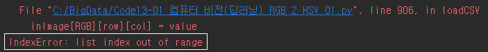

* 2차 리스트 생성 시, 1차 리스트 생성 초기화 해주기.

* Code13-01 컴퓨터 비전(딥러닝) RGB 2 HSV 

  * lodeCSV 함수

  ```python
  # 파일을 메모리로 로딩하는 함수
  def loadCSV(fname) :
      global window, canvas, paper, filename, inImage, outImage, inH, inW, outH, outW
      fsize = 0
      fp = open(fname,'r')
      for _ in fp :
          fsize += 1
      inH = inW = int(math.sqrt(fsize)) # 핵심 코드
      fp.close()
      ## 입력영상 메모리 확보 ##
      inImage=[]
      inImage=malloc(outH, outW)
      # for _ in range(3):
      # inImage.append(malloc(inH, inW))
      # 파일 --> 메모리
      with open(fname, 'r') as rFp:
          for row_list in rFp :
              RGB, row, col, value = list(map(int,row_list.strip().split(',')))
              inImage[RGB][row][col] = value
  
  # 파일을 선택해서 메모리로 로딩하는 함수
  def openCSV() :
      global window, canvas, paper, filename, inImage, outImage,inH, inW, outH, outW
      filename = askopenfilename(parent=window,
                  filetypes=(("CSV 파일", "*.csv"), ("모든 파일", "*.*")))
      if filename == '' or filename == None :
          return
  
      loadCSV(filename)
      equalImageColor()
  
  ```

  * 발생 오류 



​		inImage는 3차원 배열로 먼저 메모리 할당을 해줘야하는데 안해줌.


