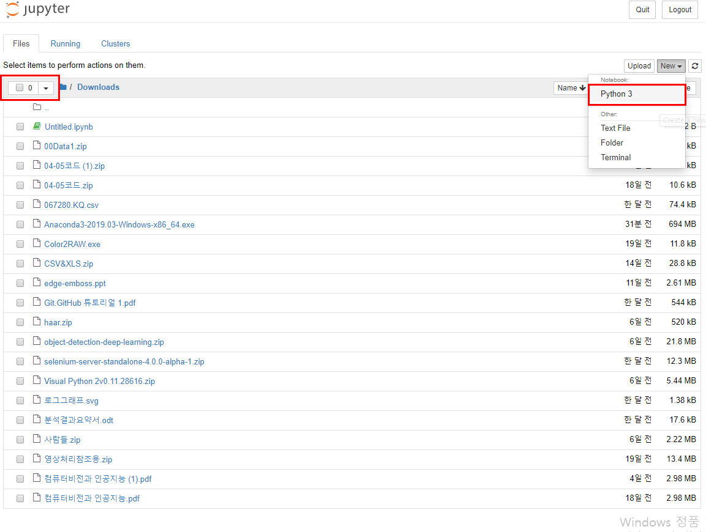

#### 추천강의

* 선형대수학 : <https://www.coursera.org/lecture/linear-algebra-machine-learning/>

* 기계학습 : <https://www.coursera.org/learn/machine-learning>


#### 데이터 분석 과정

* 데이터 수집 (웹(text, 동영상, 음성...), 정형(DB...)) ->

* 데이터 전처리(numpy, 차원축소, 상관분석, scikit-learn, matplotlib, seaborn(시각화) )  :
  * numpy는 벡터단위로 연산되므로 속도가 빠름.
  * numpy는 매우 자주 쓰는 패키지로 잘 사용할 수 있도록 연습을 많이 해야함. 	
  * 벡터는 순서가 매우 중요하며, feature 의 개수가 차원의 수와 같음.

* 데이터 분석 (pandas)

  * pandas :  데이터프레임(Dataframe), seriese 기반 (피봇테이블 중요)

* 머신러닝(교사학습, 비교사학습, 강화학습)

  * 교사학습 : 답이 있는 문제로 훈련
  * 비교사학습 : 답 없이 훈련시켜 의미있는 결과를 도출. 답이 없으므로 스스로 학습 
  * 강화학습 : 잘하면 보상해주면서 학습시킴

  

  

* pandas 패키지 관련 홈페이지 : https://pandas.pydata.org
* numpy 패키지 관련 홈페이지 : <https://www.numpy.org/>
* matplotlib  패키지 관련 홈페이지 :<https://matplotlib.org/Matplotlib.pdf>


#### 아나콘다 설치

* 홈페이지 : <https://www.anaconda.com/distribution/>
* Jupyter Notebook 
* 아나콘다 내부에 파이썬 설치되어있음


## NumPy

* 배열 : 모든 원소가 같은 자료형, 원소의 개수 변경 X

```python
# 배열 : 모든 원소가 같은 자료형, 원소의 개수 변경 X
# ndarray 지원 => 선형대수 계산
#벡터화 연산
import numpy as np
arr=np.array([1,2,3]) # 리스트를 배열로 변환해서 출력
print(type(arr)) # n차원 배열로 출력, numpy 기본 자료형
ans = []

for i in arr : # arr 배열에 저장되어있는 요소 하나씩 추출해서 i 변수에 담아라
    ans.append(2*i) # 리스트에 요소 추가
print(ans) # 리스트 요소 하나씩 불러와 3번 수행한 결과

print(2*arr) # 벡터화 연산, 한번만 수행한 결과

li = [1,2,3]
print(li*2) # 리스트의 길이가 2배가 됨 [1, 2, 3, 1, 2, 3]

a = np.array([1,2])
b = np.array([10,20])
print(3*a+b) # [13 26]

arr=np.array([1,2,3])
print(arr==2) # 벡터 연산
print((arr<2) & (arr>0))

c=np.array([[1,2,3],[4,5,6]]) # 2*3 array
print(len(c)) # 행의 개수
print(len(c[0])) # 열의 개수

# 배열의 차원(ndim, shape_
a = np.array([1,2,3])
print(a.ndim)
print(a.shape)

a2 = np.array([[1,2,3],[4,5,6]])
print(a2.ndim)
print(a2.shape)

a3 = np.array([1,2,3,4,5])
print("a3 :", a3[-1])

a4 = np.array([[1,2,3],[4,5,6]]) # 2,3
print(a4.ndim)
print(a4.shape)
print(a4[0]) # [1 2 3]
print(a4[0][1]) # a4 참조하여 2 출력
print(a4[0,1]) # 어떤 특정 요소 직접 지정

# 5 참조
print(a4[1])
print(a4[-1,1]) # 5 출력
print(a4[-1,-1]) # 6 출력
print(a4[-1,-2]) # 5 출력

# 5,6 슬라이싱
print(a4[1,1:3])
print(a4[1,1:]) # 1:3 = 1: (1번부터 끝까지 출력)

# f(x)=w1x1 + w2x2 + ... + wnxn + b : w(가중치), x(변수)
a = np.zeros((5,2),dtype="i") # 요소 전부 다 0으로 값을 줌. 초기화할 떄 많이 쓰임. dype="i"(정수형)
print(a) # type의 default는 실수형

b = np.empty((5,2)) # 초기화하지 않으면 쓰레기값이 들어감
print(b)

# arange 특정한 규칙에 따라 수열을 만들때 사용
print(np.arange(10))

print(np.arange(10,50,3)) # 10부터 49까지 3씩 증가

print(np.linspace(0,100,5)) # 선형공간(구간)을 만들 때 사용. 0~100까지 5개의 구간으로 생성됨 [  0.  25.  50.  75. 100.]
print(np.logspace(0.1,1,10)) # 로그공간(구간)

# 전치행렬 : 행과 열을 바꾼 행렬
# f(x) = wx+b
print(a)
print(a.T)
b=np.arange(12)
print(b)
c=b.reshape(4,3) # 1차원 -> 2차원, 4행 3열로 변환
d=b.reshape(4,-1)
print(c)
print(d)

# 1차원 -> 다차원 : reshape
# 다차원 -> 1차원 : ravel, flatten
print(c.flatten())
print(c.ravel())

x=np.arange(5)
print(x)
x=x.reshape(1,5)
print(x)
x=x.reshape(5,1)
print(x)

print(x[:,np.newaxis]) # 차원 1 증가시킬 때 사용하는 옵션
```


* Pycharm 디버깅
  * 빨간 점을 'break point' 이라하고 디버깅을 실행시키면 arr : [1 2 3] 처럼 배열의 값을 써줌
  * break point은 코드에서 의심스러운 부분을 잡고 확인해보기 


* 디버깅으로 실행시키면 아래 콘솔 창에 break point 부분의 결과를 보여줌
* F8 : 다음줄로 넘어가면서 실행시켜주고 결과를 보여줌. for문도 각 요소에 대한 값을 보여주고 type 형태도 알 수 있음
* F9 : 다음 break point로 넘어가고, 그 사이에 있는 코드도 실행됨.


## Jupyter Notebook



* 왼쪽 네모칸 : user deirectory
* 오른쪽 네모칸 : 새로운 jupyter notebook 생성


* anaconda prompt  : 패키지 설치 및 제거 
  * 설치된 패키지 목록 확인 : pip list
  * 패캐지 설치 : pip install 패키지 이름 (ex. pip install keras)


```python
%%time  # %%time : 실행시간
x3=np.zeros_like(x)  # np.zeros_like :x와 같은 shape으로 0을 채워라.
for i in range(10000):
    x3[i]=x[i]+x2[i]
np.exp(1) # 지수 생성
x=np.array([4,5,6,7])
x.argmin() # argmin() : 최소값의 위치 출력
x.argmax() # argmax() : 최대값의 위치 출력
x=np.array([[1,2],[3,4],[5,6]])
x.sum()
x.sum(axis=0) #axis=0 : 열 단위로 결과 도출
			  #axis=1 : 행 단위로 결과 도출
x=np.array([[11,2],[23,14],[5,26]])
print(np.sort(x)) # axis=1 로 줬을때와 동일한 결과
print("*"*50)
print(np.sort(x,axis=0))
x=np.array([40,30,10,20])
np.argsort(x) # array([2, 3, 1, 0], dtype=int64)
#  0  1  2  3      2  3  1  0
#[40,30,10,20] => [10,20,30,40]
# 오름차순 정렬했을때, 원래 데이터의 위치를 출력하는 기능
```


## 연습문제(1일차)

```python
#1. 다음 행렬과 같은 행렬이 있다.
# m = np.array([[ 0,  1,  2,  3,  4],
#              [ 5,  6,  7,  8,  9],
#              [10, 11, 12, 13, 14]])
import numpy as np
m = np.array([[ 0,  1,  2,  3,  4],
              [ 5,  6,  7,  8,  9],
              [10, 11, 12, 13, 14]])

# 이 행렬에서 값 5 을 인덱싱한다.
print(m[1,0])
# 이 행렬에서 값 14 을 인덱싱한다.
print(m[2,-1])
# 이 행렬에서 배열 [6, 7] 을 슬라이싱한다.
print(m[1,1:3])
# 이 행렬에서 배열 [7, 12] 을 슬라이싱한다.
print(m[1:3,2])
# 이 행렬에서 배열 [[3, 4], [8, 9]] 을 슬라이싱한다.
print(m[:2,3:5])

# 2.다음 행렬과 같은 배열이 있다.
# x = np.array([1, 2, 3, 4, 5, 6, 7, 8, 9, 10,
#              11, 12, 13, 14, 15, 16, 17, 18, 19, 20])
x = np.array([1, 2, 3, 4, 5, 6, 7, 8, 9, 10, 11, 12, 13, 14, 15, 16, 17, 18, 19, 20])
# 이 배열에서 4의 배수를 찾아라.
print(x[x % 4 == 0])
# 이 배열에서 6로 나누면 1이 남는 수를 찾아라.
print(x[x % 6 == 1])
# 이 배열에서 3으로 나누면 나누어지고 4로 나누면 1이 남는 수를 찾아라.
print(x[(x%3==0) & (x%4==1)])
```


