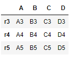
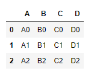
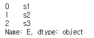
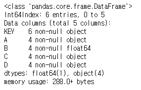
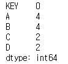
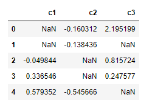
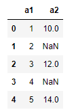

#### read_파일종류

* html : 구조적이지 않음

오늘 날씨는 흐림입니다. 

* xml -> json(dic) { 키 : 값, 키 : 값, ....} :xml은 구조적으로 무게가 무거워 이를 대신해 json을 많이 씀

<날씨>  

​				<오늘> 흐림 </오늘>

</날씨>

* pickle : 객체로 저장되어 있는 걸 읽어들일때 많이 쓰임.
* table : 표를 읽을 때 많이 쓰임


#### 데이터프레임 및 인덱스 관련 문법(pandas)

* csv 불러오기 (데이터 파일 불러오기 -> 데이터프레임)

```python
#read_csv() : 데이터 파일 불러오기 -> 데이터프레임
import pandas as pd
csv_test = pd.read_csv("test_csv_file.csv") 
# 코드 파일과 같은 위치에 있을때는 경로를 안쓰고 파일 이름을 써주면 됨
csv_test # 맨 왼쪽 진한 숫자들은 행 인덱스 번호
```


* csv 인덱스 설정

```python
# 인덱스 번호를 0부터 시작. 인덱스의 이름으로 써도됨
txt_text = pd.read_csv("test_text_file.txt", sep="|", index_col="ID") 
txt_text 
#맨 왼쪽진한 숫자는 행 인덱스(데이터를 구분하기 위한 구분자 역할), 위쪽 진한 글자는 열 인덱스
```


```python
text = pd.read_csv("text_without_column_name.txt", sep="|",header = None, 
                   names=['ID','A','B','C','D']) # header 가 없다고 지정
text
```


* 데이터 타입 및 정보

```python
type(text) # 데이터프레임(클래스)
# class : 건물설계도, object(객체) : 건물 
text.info() # 탐색적 분석 방법에서 항상 확인. 데이터의 정보를 확인할 수 있음
# pandas는 캐릭터가 없음. object : string(문자), int64 : integer(정수)
```


* 딕셔너리 생성

```python
data={'ID':['A1','A2','A3'],
     'X1' : [10,20,30],
     'X2' : [1.1, 2.2, 3.3]}
data
```

{'ID': ['A1', 'A2', 'A3'], 'X1': [10, 20, 30], 'X2': [1.1, 2.2, 3.3]}


* 행 이름 설정

```python
df = pd.DataFrame(data, index=['a1','a2','a3'])
df
```


* 데이터프레임 행 추가 

```python
# 데이터프레임에 행 추가(인덱스)
df2=df.reindex(['a1','a2','a3','a4'])
df2 # pandas:NaN(결측값), deep:NaN(inf -> 발산)
```


* 결측값 발생 이유
  * 정말 데이터가 없는 경우
  * 입력자가 실수로 데이터를 누락한 경우
  * 임의로 데이터를 결측값으로 처리하는 경우


* csv 저장하기

```python
df2.to_csv("df2.csv",sep=".",na_rep="NaN") # na_rep:NaN 자리에 쓸 텍스트를 입력할 수 있음
```


* 데이터프레임 생성

```python
import numpy as np
df1=pd.DataFrame(np.arange(12).reshape(3,4),
                index=['r0','r1','r2'],
                columns=['c0','c1','c2','c3'])
df1
```


* 데이터프레임 전치행렬

```python
df1.T
```


*  행과 열의 이름을 리스트로 추출

```python
df1.axes 
```


* 데이터 타입 확인

```python
df1.dtypes
```


* 데이터프레임 모양 확인

```python
df1.shape
(3,4)
df1.size
12
df1.values
```


* 데이터프레임 생성

```python
df2=pd.DataFrame({'c1':['a','a','b','b','c'],
                 'v1':np.arange(5),
                 'v2':np.random.randn(5) # 정규분포(randn) 난수 발생
                 }, 
                index=['r0','r1','r2','r3','r4']
                )
df2
```


※ Jupyter notebook은 print를 쓸 필요없지만, 여러개의 출력값을 보고싶을땐 print를 써야한다.

* 데이터 추출

```python
df2.ix[2:]
```


```python
df2.ix[2]
```


```python
df2.ix['r2']
# ix 사용시 행 인덱스 이름, 행 인덱스 번호 모두 사용가능
```


```python
# EDA
df2.head() # 데이터 행 6개 출력
df2.head(3)
df2.tail(3) # 맨 아래쪽 행 3개 출력
```


```python
# 열 이름 추출
df2.columns
# 열이름: Index(['c1', 'v1', 'v2'], dtype='object')
```

```python
df2['v1'] # 열 이름으로 추출
```


```python
df2[['v1']]
```


```python
type(df2['v1']) # series
type(df2[['v1']]) # dataframe
```

```python
# 변수 2개 이상을 추출하고자 할때는 [[]]로 쓰기
df2[['v1','v2']]
```


* 새로운 인덱스로 바꾸기

```python
newindex=['r0','r1','r2','r5','r6']
df2.reindex(newindex) # 인덱스를 재지정해주니 값이 NaN으로 출력
```


```python
df2=df2.reindex(newindex,fill_value=1)
```


```python
df2.info()
```


 	새로운 인덱스 값에 1을 넣었지만 원래의 데이터 타입이 문자이므로 문자로 들어가게됨. (자동 형변환)

```python
df2=df2.reindex(newindex,fill_value='missing')
df2.info()
```


​	새로운 인덱스 값에 의해 데이터 타입이 모두 문자로 변했음. (자동 형변환)

​	주로 결측값에는 NA을 씀.


* 날짜 범위 설정
  * 시계열 데이터 활용시, 인덱스로 쓸 수 있음

```python
dindex=pd.date_range('07/02/2019',periods=5, freq='D' ) # 월/일/년
dindex
```


```python
df2=pd.DataFrame({'c1':[1,2,3,4,5]}, index = dindex)
df2
```


* 새로운 인덱스로 바꾸기 (reindex)
  * 행의 개수가 달라도 새로운 행으로 추가됨

```py
dindex2=pd.date_range('06/30/2019',periods=10, freq='D')
dindex2
```


```python
df2.reindex(dindex2)
```


​	모든 연산의 기본이 float 이므로 값이 반환되면서 float으로 변환

```python
#df2.reindex(dindex2)
df2.reindex(dindex2,method='ffill')
# NaN이 발생하면 이전의 데이터를 참고하여 forward 방향으로 채워라
```


```python
df2.reindex(dindex2,method='bfill') 
# NaN이 발생하면 이전의 데이터를 참고하여 backward 방향으로 채워라
```


#### Pandas_merge, join, concatenate

※ 참고자료 : <http://pandas-docs.github.io/pandas-docs-travis/user_guide/merging.html>


- axis=0 : 행으로 합치기, axis=1 : 열로 합치기

```python
df1 = pd.DataFrame({'A': ['A0', 'A1', 'A2'],
    'B': ['B0', 'B1', 'B2'],
    'C': ['C0', 'C1', 'C2'],
    'D': ['D0', 'D1', 'D2']},
    index=[0, 1, 2])
df2 = pd.DataFrame({'A': ['A3', 'A4', 'A5'],
    'B': ['B3', 'B4', 'B5'],
    'C': ['C3', 'C4', 'C5'],
    'D': ['D3', 'D4', 'D5']},
    index=[3, 4, 5])
#df12a0 = pd.concat([df1,df2]) #default : axis = 0 (위아래로 합치기)
df12a0 = pd.concat([df1,df2], axis=0)
df12a0
```


```python
df3 = pd.DataFrame({'E': ['A6', 'A7', 'A8'],
    'F': ['B6', 'B7', 'B8'],
    'G': ['C6', 'C7', 'C8'],
    'H': ['D6', 'D7', 'D8']},
    index=[0, 1, 2])


df4 = pd.DataFrame({'A': ['A0', 'A1', 'A2'],
     'B': ['B0', 'B1', 'B2'],
     'C': ['C0', 'C1', 'C2'],
     'E': ['E0', 'E1', 'E2']},
     index=[0, 1, 3])

#pd.concat(axis=0) : default 값
df13a1=pd.concat([df1,df3],axis=1)
```


* join(default='outer')  =>  'inner' : 교집합으로 데이터 합치기 

```python
df1
```


```python
df4
```


```python
df14o=pd.concat([df1,df4]) # join=outer(default)
```


```python
df14i=pd.concat([df1,df4], join='inner')
df14i
```


```python
pd.concat([df1,df4], axis=1,join='outer')
```


```python
pd.concat([df1,df4], axis=1,join='inner') # 행의 교집합에 해당되는 행만 합쳐짐
```


* join_axes : 특정 데이터프레임 인덱스를 기준으로 합치고자 할때

```py
print(df1)
print(df4)
```


```python
df14ja1=pd.concat([df1,df4],axis=1,join_axes=[df1.index])
# df1의 인덱스를 기준으로 합치기
df14ja1
```


* ignore_index(default = False) : 인덱스 무시하기

```python
df5 = pd.DataFrame({'A': ['A0', 'A1', 'A2'],
     'B': ['B0', 'B1', 'B2'],
     'C': ['C0', 'C1', 'C2'],
     'D': ['D0', 'D1', 'D2']},
     index=['r0', 'r1', 'r2'])
df5
```


```python
df6 = pd.DataFrame({'A': ['A3', 'A4', 'A5'],
     'B': ['B3', 'B4', 'B5'],
     'C': ['C3', 'C4', 'C5'],
     'D': ['D3', 'D4', 'D5']},
     index=['r3', 'r4', 'r5'])
df6
```



```python
pd.concat([df5,df6]) # ignore_index=False (default)
```


```python
pd.concat([df5,df6], ignore_index=True) 
```


* keys : 계층적 index 구성

```python
df56wk=pd.concat([df5,df6],keys=['df5','df6'])
df56wk
```


```python
df56wk.ix['df5']
```


```python
 # 0,1번째 행 참조
df56wk.ix['df5'][0:2]
```


* 계층적 index 및 행 이름 설정

```python
print(df5)
print(df6)
pd.concat([df5,df6], keys=['df5','df6'], names=['dfname','rownum']) 
# 인수1개(인수는 ','로 구분)
```


* verify_integrity(False : default) : 중복 확인
  * 중복을 허락하고 싶지 않을때는 True로 설정

```python
print(df7)
print(df8)
pd.concat([df7,df8],verify_integrity=False)
```


```python
pd.concat([df7,df8],verify_integrity=True)
```

* 중복이 있으면 에러 발생


#### Data Frame + Series 

* concat(), append() : 데이터프레임 + 시리즈 합치기 => 데이터프레임

```python
df1 = pd.DataFrame({'A': ['A0', 'A1', 'A2'],
    'B': ['B0', 'B1', 'B2'],
    'C': ['C0', 'C1', 'C2'],
    'D': ['D0', 'D1', 'D2']},
    index=[0, 1, 2])
df1
```



```python
ser=pd.Series(['s1','s2','s3'], name='E') # 시리즈 만들기(값, 인덱스 이름)
ser
```



```python
pd.concat([df1,ser], axis=1, ignore_index=True)
```


```python
s1=pd.Series([3,4,5])
s2=pd.Series([3,4,5])
s3=pd.Series([3,4,5])
pd.concat([s1,s2,s3], axis = 1, keys=['c1','c2','c3'])
```


#### merge 함수

* how (left, right, inner(기본값), outer)
* on (병합 기준 변수)

```python
dfleft = pd.DataFrame({'KEY': ['K0', 'K1', 'K2', 'K3'],
    'A': ['A0', 'A1', 'A2', 'A3'],
    'B': ['B0', 'B1', 'B2', 'B3']})
dfleft
```


```python
dfright = pd.DataFrame({'KEY': ['K2', 'K3', 'K4', 'K5'],
    'C': ['C2', 'C3', 'C4', 'C5'],
    'D': ['D2', 'D3', 'D4', 'D5']})
dfright
```


```python
pd.merge(dfleft,dfright) # key 값을 기준으로 merge
```


```python
dfmnr=pd.merge(dfleft,dfright, on='KEY', how='left') # on='KEY' (default)
# left : 2개의 데이터프레임에서 왼쪽에 있는 데이터프레임을 기준으로 merge
```


```python
pd.merge(dfleft,dfright, on='KEY', how='inner') # on='KEY', how='inner' (default)
```


```python
pd.merge(dfleft,dfright, on='KEY', how='outer') 
```


```python
dfleft = pd.DataFrame({
    'A': ['A0', 'A1', 'A2', 'A3'],
    'B': ['B0', 'B1', 'B2', 'B3']},
    index=['K0','K1','K2','K3'])
dfleft
```


```python
dfright = pd.DataFrame({
    'C': ['C2', 'C3', 'C4', 'C5'],
    'D': ['D2', 'D3', 'D4', 'D5']},
    index=['K2', 'K3', 'K4', 'K5'])
dfright
```


```python
pd.merge(dfleft, dfright) # 기준으로 할 속성(KEY)이 없으므로 에러발생
# KEY 대신 index를 활용
pd.merge(dfleft, dfright,left_index=True,right_index=True, how ='left')
# 왼쪽, 오른쪽 프레임 모두 다 존재하는 인덱스에 대한 데이터 병합 수행
```


```python
dfleft.join(dfright, how='left') # dfleft 에 연결하라는 의미
```


```python
dfleft = pd.DataFrame({'KEY': ['K0', 'K1', 'K2', 'K3'],
    'A': ['A0', 'A1', 'A2', 'A3'],
    'B': [1.1, 2.2,3.3, 4.4]})
dfleft
```


```python
dfright = pd.DataFrame({'KEY': ['K2', 'K3', 'K4', 'K5'],
    'C': ['C2', 'C3', 'C4', 'C5'],
    'D': ['D2', 'D3', 'D4', 'D5']})
dfright
```


```python
dfa=pd.merge(dfleft, dfright, on='KEY', how='outer')
dfa
```


* null 값 확인

```python
pd.isnull(dfa) # dfa.isnull() => return 결과가 true, false로 출력
```


```python
pd.notnull(dfa) # null이면 True, 아니면 false
```


```python
# 문자값 대신 숫자갑 대입
dfleft = pd.DataFrame({'KEY': ['K0', 'K1', 'K2', 'K3'],
    'A': ['A0', 'A1', 'A2', 'A3'],
    'B': [1.1, 2.2,3.3, 4.4]})
dfleft
```


```python
dfright
```


```python
dfa.info()
```



​	데이터 타입 object -> float로 변경

```python
dfa
```


```python
dfa.ix[[0,1],['A','B']]=None # 여러 값을 추출할 때 [] 활용
dfa # 문자:None 숫자:NaN 으로 들어감, 문자가 "NaN"으로 들어가면 구별을 할 수 없으므로
```


```python
dfa.info()
```


```python
dfa.isnull()
```


```python
dfa.isnull().sum() # 중요구문
```



```python
dfa['A'].isnull().sum() # 중요구문
```

4

```python
dfa.notnull().sum() # 중요구문, null이 아닌 개수
```


```python
dfa.isnull().sum(1) # 1은 axis, 각 행 null의 개수
```


```python
# null의 개수에 대한 열(파생변수) 추가 
dfa['NaN_Num']=dfa.isnull().sum(1)
dfa
```


```python
dfa['NotNaN_Num']=dfa.notnull().sum(1)
dfa
```


```python
df=pd.DataFrame(np.arange(10).reshape(5,2),
               columns=['c1','c2'],
               index=['a','b','c','d','e'])
df
```


```python
# df의 b,e행 c1 열에 None, b,c 행 c2 None 대입
df.ix[[1,4],['c1']]=None
df.ix[[1,2],['c2']]=None
df
```


```python
df.sum() # Nan은 0으로 취급
df['c1'].sum()
```

10

```python
df['c1'].cumsum() # 누적합
```


```python
df.mean() # NaN은 제외, axis default 값:열
df.mean(1)
```


```python
df.std()
```


```python
df
```


```python
df['c3']=df['c1']+df['c2']
df
# 데이터프레임에서 컬럼간 연산시, 어느 하나라도 NaN이 존재하면 결과도 NaN이 됨
```


```python
df=pd.DataFrame(np.random.randn(5,3),
            columns=['c1','c2','c3'])
df
```


```python
df.ix[0,0]=None
df
```


```python
df.ix[1,['c1','c3']]=np.nan
df
```


```python
df.ix[0,0]=None
df.ix[1,['c1','c3']]=np.nan
df.ix[2,'c2']=np.nan
df.ix[3,'c2']=np.nan
df.ix[4,'c3']=np.nan
df
```


```python
df.fillna(0) # NaN 값에 0 대입
df.fillna('missing')
```


```python
df
```


```python
df.fillna(method='ffill') # bfill
```


```python
df.fillna(method='ffill',limit=1) 
```


```python
df
```



```python
df.mean()
```


```python
df.fillna(df.mean()) # 각 열의 평균값이 각 열의 NaN 자리에 채워짐
```


```python
df.fillna(df.mean()['c1']) # c1 열의 평균값으로 모든 NaN 자리 채워짐
```


```python
df2=pd.DataFrame({'a1':[1,2,3,4,5],
                 'a2':[10,11,12,13,14]})
df2.ix[[1,3],['a2']]=np.nan
df2
```



```python
# a3 열 추가
# a2 열이 NaN이면, a1열의 값으로 a3열을 채우고,
# a2열이 NaN이 아니면, a2열의 값으로 a3열을 채우세요
# a3:10, 2, 12, 4, 14
df2['a3'] = np.where(pd.notnull(df2['a2'])==True,df2['a2'],df2['a1'])
df2
```

