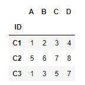

---

typora-copy-images-to: ..\..\..\images
---

#### read_파일종류

* html : 구조적이지 않음

오늘 날씨는 흐림입니다. 

* xml -> json(dic) { 키 : 값, 키 : 값, ....} :xml은 구조적으로 무게가 무거워 이를 대신해 json을 많이 씀

<날씨>  

​				<오늘> 흐림 </오늘>

</날씨>

* pickle : 객체로 저장되어 있는 걸 읽어들일때 많이 쓰임.
* table : 표를 읽을 때 많이 쓰임


#### pandas 문법 및 데이터 타입 (Jupyter Notebook)

* csv 불러오기 (데이터 파일 불러오기 -> 데이터프레임)

```python
#read_csv() : 데이터 파일 불러오기 -> 데이터프레임
import pandas as pd
csv_test = pd.read_csv("test_csv_file.csv") 
# 코드 파일과 같은 위치에 있을때는 경로를 안쓰고 파일 이름을 써주면 됨
csv_test # 맨 왼쪽 진한 숫자들은 행 인덱스 번호
```


* csv 인덱스 설정

```python
# 인덱스 번호를 0부터 시작. 인덱스의 이름으로 써도됨
txt_text = pd.read_csv("test_text_file.txt", sep="|", index_col="ID") 
txt_text 
#맨 왼쪽진한 숫자는 행 인덱스(데이터를 구분하기 위한 구분자 역할), 위쪽 진한 글자는 열 인덱스
```



```python
text = pd.read_csv("text_without_column_name.txt", sep="|",header = None, 
                   names=['ID','A','B','C','D']) # header 가 없다고 지정
text
```


* 데이터 타입 및 정보

```python
type(text) # 데이터프레임(클래스)
# class : 건물설계도, object(객체) : 건물 
text.info() # 탐색적 분석 방법에서 항상 확인. 데이터의 정보를 확인할 수 있음
# pandas는 캐릭터가 없음. object : string(문자), int64 : integer(정수)
```


* 딕셔너리 생성

```python
data={'ID':['A1','A2','A3'],
     'X1' : [10,20,30],
     'X2' : [1.1, 2.2, 3.3]}
data
```

{'ID': ['A1', 'A2', 'A3'], 'X1': [10, 20, 30], 'X2': [1.1, 2.2, 3.3]}


* 행 이름 설정

```python
df = pd.DataFrame(data, index=['a1','a2','a3'])
df
```


* 데이터프레임 행 추가 

```python
# 데이터프레임에 행 추가(인덱스)
df2=df.reindex(['a1','a2','a3','a4'])
df2 # pandas:NaN(결측값), deep:NaN(inf -> 발산)
```


* 결측값 발생 이유
  * 정말 데이터가 없는 경우
  * 입력자가 실수로 데이터를 누락한 경우
  * 임의로 데이터를 결측값으로 처리하는 경우


* csv 저장하기

```python
df2.to_csv("df2.csv",sep=".",na_rep="NaN") # na_rep:NaN 자리에 쓸 텍스트를 입력할 수 있음
```


* 데이터프레임 생성

```python
import numpy as np
df1=pd.DataFrame(np.arange(12).reshape(3,4),
                index=['r0','r1','r2'],
                columns=['c0','c1','c2','c3'])
df1
```


* 데이터프레임 전치행렬

```python
df1.T
```


*  행과 열의 이름을 리스트로 추출

```python
df1.axes 
```


* 데이터 타입 확인

```python
df1.dtypes
```


* 데이터프레임 모양 확인

```python
df1.shape
(3,4)
df1.size
12
df1.values
```


* 데이터프레임 생성

```python
df2=pd.DataFrame({'c1':['a','a','b','b','c'],
                 'v1':np.arange(5),
                 'v2':np.random.randn(5) # 정규분포(randn) 난수 발생
                 }, 
                index=['r0','r1','r2','r3','r4']
                )
df2
```


※ Jupyter notebook은 print를 쓸 필요없지만, 여러개의 출력값을 보고싶을땐 print를 써야한다.

* 데이터 추출

```python
df2.ix[2:]
```


```python
df2.ix[2]
```


```python
df2.ix['r2']
# ix 사용시 행 인덱스 이름, 행 인덱스 번호 모두 사용가능
```


```python
# EDA
df2.head() # 데이터 행 6개 출력
df2.head(3)
df2.tail(3) # 맨 아래쪽 행 3개 출력
```


```python
# 열 이름 추출
df2.columns
# 열이름: Index(['c1', 'v1', 'v2'], dtype='object')
```

```python
df2['v1'] # 열 이름으로 추출
```


```python
df2[['v1']]
```


```python
type(df2['v1']) # series
type(df2[['v1']]) # dataframe
```

```python
# 변수 2개 이상을 추출하고자 할때는 [[]]로 쓰기
df2[['v1','v2']]
```


* 새로운 인덱스로 바꾸기

```python
newindex=['r0','r1','r2','r5','r6']
df2.reindex(newindex) # 인덱스를 재지정해주니 값이 NaN으로 출력
```


```python
df2=df2.reindex(newindex,fill_value=1)
```


```python
df2.info()
```


 	새로운 인덱스 값에 1을 넣었지만 원래의 데이터 타입이 문자이므로 문자로 들어가게됨. (자동 형변환)

```python
df2=df2.reindex(newindex,fill_value='missing')
df2.info()
```


​	새로운 인덱스 값에 의해 데이터 타입이 모두 문자로 변했음. (자동 형변환)

​	주로 결측값에는 NA을 씀.


* 날짜 범위 설정
  * 시계열 데이터 활용시, 인덱스로 쓸 수 있음

```python
dindex=pd.date_range('07/02/2019',periods=5, freq='D' ) # 월/일/년
dindex
```


```python
df2=pd.DataFrame({'c1':[1,2,3,4,5]}, index = dindex)
df2
```


* 새로운 인덱스로 바꾸기 (reindex)
  * 행의 개수가 달라도 새로운 행으로 추가됨

```py
dindex2=pd.date_range('06/30/2019',periods=10, freq='D')
dindex2
```


```python
df2.reindex(dindex2)
```


​	모든 연산의 기본이 float 이므로 값이 반환되면서 float으로 변환

```python
#df2.reindex(dindex2)
df2.reindex(dindex2,method='ffill')
# NaN이 발생하면 이전의 데이터를 참고하여 forward 방향으로 채워라
```


```python
df2.reindex(dindex2,method='bfill') 
# NaN이 발생하면 이전의 데이터를 참고하여 backward 방향으로 채워라
```


