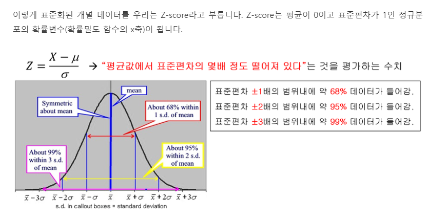

#### 취업 관련 정보

- 빅데이터 분석
  - 데이터 분석 (Pandas)
  - R / Python
  - 통계분석, 머신러닝 + 딥러닝
  - LG전자 인공지능연구소 - 자율주행, 가전제품
- 자연어처리(RNN), 영상처리(RNN, CNN)

* AI 관련 업무
  * 머신 + 딥러닝 + (GAN / 강화학습)

#### 과정

* 개인프로젝트 1개 이상
* 공동 프로젝트 1개 이상 (공모전)

* pandas & 통계 -> ML & 통계 & 선형대수 -> DL&통계 & 선형대수 -> cnn (이미지..) -> rnn(자연어(챗봇), 시계열 분석) -> (DP) -> gan/강화학습(Q)

  #하둡(자바) -> 스파크(스칼라,...)

  

* 캐글 -> 타이타닉 -> 데이터전처리/분석/시각화

-------------------------------------------

## 기초 통계

* 중심경향치 : 최빈수, 평균, 중앙값
* 정규분포 

모양이 다른 정규분포들( 평균, 표준편차가 다름) 을 직접적으로 비교하기 위해서는 표준화가 필요하고, 표준화한 정규분포를 표준정규분포라고 함

* 표준정규분포

표준화를 위해 정규분포를 선형변환(원래의 데이터에 연산을 한 것)를 함. 선형변환은 데이터의 분포의 형태가 변하지 않음. 평균으로부터 자신의 데이터가 얼마나 떨어져있는지 파악할 수 있는 분포

* Z-score (표준화)

1) 분자 부분 : 어떠한 개별 데이터가 평균으로부터 얼마나 떨어져있는지

2) 분포 부분 : 그 떨어진 정도가 그 집단의 표준편차의 몇 배 정도 떨어진지

* 변수 간의 척도(scale) 가 다르더라도 직접 비교하기 위해  표준화가 필요하고, 데이터 모델링 할때에도 표준화가 많이 사용됨

* 정규화 : (각 열의 요소값 - 각 열의 최소값) / (각 열의 최대값 - 각 열의 최소값)
  * 0~1 사이의 범위(딥러닝)

## 연습문제 (3일차)

- 이항변수화(모든 데이터를 0,1로) 변환(타이타닉)
- 캐글 -> 타이타닉 -> 호칭 -> 호칭별 건수 -> 소트 -> 상위 10개 호칭 조사
- 나이(age) -> 구간화 -> 구간별 건수 -> 소트 -> 건수 출력
- 관심 회사 -> 주식데이터 다운로드(1개월) -> 표준화/정규화(함수 직접 구현)
- 캐글 -> 타이타닉 -> 성별 -> 0/1 (이진화)

